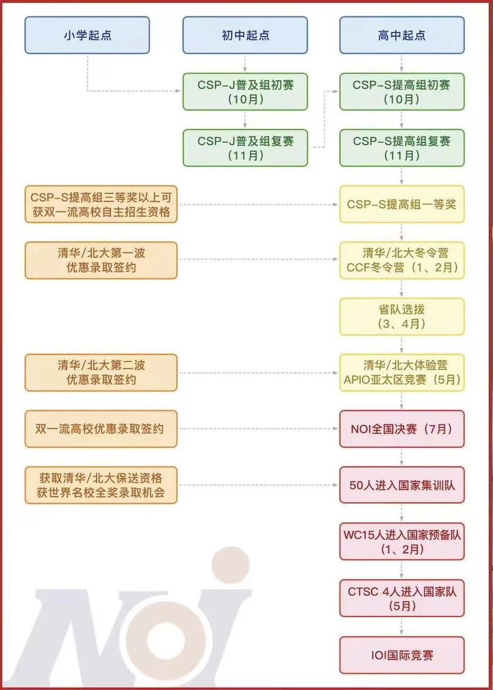

- 白名单

  白名单赛事指的是由教育部公布的面向6-18岁学生的竞赛活动。教育部办公厅关于公布2022—2025学年 面向中小学生的全国性竞赛活动的通知，即《2022—2025学年面向中小学生的全国性竞赛活动名单》，共44项。其中，"全国中学生信息学奥林匹克竞赛"和"蓝桥杯全国软件和信息技术专业人才大赛"。

- 信息学奥赛赛事

  级别和难度由低到高分别为：CSP-S/J＜NOIP＜NOI＜IOI。通过CSP的佼佼者，可以参加NOIP，NOIP的佼佼者，会被选拔去参加NOI，NOI的佼佼者，继续被选拔去参加IOI。

  - CSP（非专业级软件能力认证 Certified Software Professional）不是竞赛，是由中国计算机学会主办的计算机非专业级别的软件能力认证。认证包括CSP-J（Junior，入门级）和CSP-S（Senior，提高级）两个级别，认证内容包括算法设计能力和编程能力。CSP考试有两轮，报名参加第一轮认证成绩优异者可以进入第二轮。CSP-JS第一轮为集中笔试；第二轮为现场集中上机认证。一般来说，通过了CSP-S第二轮，并且第二轮的考试非0分，就可以参加NOIP。
  - NOIP（全国青少年信息学奥林匹克联赛 National Olympiad in Informatics in Provinces）分为普及组和提高组两个组别，普及组一般针对初中生，提高组一般针对高中生。
  - NOI（全国青少年信息学奥林匹克竞赛 National Olympiad in Informatics）NOI将从正式选手中选出成绩前50名，作为中国国家集训队，集训队队员将获得高校保送资格。
  - IOI（国际信息学奥林匹克竞赛 International Olympiad in Informatics）由中国计算机学会组织代表队，代表中国参加每年一次的IOI。中国是IOI创始国之一。IOI2000由中国主办，CCF承办。出国参赛得到中国科协和国家自然科学基金委的资助。

  

- 编程语言

  信息学竞赛的考察形式分为笔试和机试两种形式，一般初赛是笔试，复赛是机试，编程语言用的是C++。所以想参加信奥赛，C++必学。

- 规划备考

  - 4年级-6年级（C++） 4年级开始有了一定数学基础**，**C++会相对容易。五年级尝试打CSP-J，6年级拿到奖项。
  - 初一-初三（成为科技特长生） 在中考前拿到 CSP-S三等奖或以上。这个成绩就可以作为科技特长，取得重点高中的录取资格。最晚在初二要拿到CSP-J一等奖，到初三时CSP-S拿奖并晋级NOIP 。
  - 高一-高二。在高一冲入NOIP取得好成绩，争取降分20-60甚至一本线；NOIP入选省队参加NOI，获奖走强基计划甚至保送上双一流高校 。