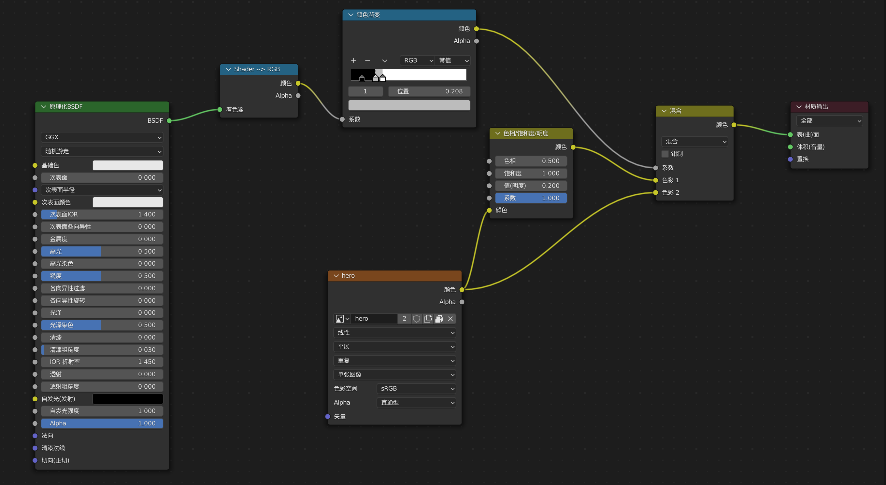

# 素材收集

# 建模

## 建模制作

- 参考图
- 雕刻

# UV 展开

# 材质

## 纹理绘制

- 上底色
- 绘制遮罩为各个部分上色
  - 边缘uv纹理通过**涂抹**上色

## 纹理贴图

# 着色

## 三渲二

- 选择eevee渲染器

  - 环境光遮蔽 AO 距离 3.67m

- 主体（0）

  

- 背光（1）

  

- 设置
  - 实体化修改器
    - 厚度 0.008 m
    - 法向 翻转
    - 材质 材质偏移 1（选择背光材质序号）
  - 自发光材质
    - 设置 背面剔除

# 绑定

## 指令

| 操作                                                         | 说明                   |
| ------------------------------------------------------------ | ---------------------- |
| 模型+shift+骨架                                              | 骨架形变，附带自动权重 |
| 骨架+shift+模型 ctrl+鼠标左键选择骨骼（绘制遮罩，顶点选择不选） | 权重绘制               |

# 动画

## 动画制作

- 物体约束

- 骨骼绑定

- 通过 **形态键** 变形

- 借助 mixamo
  - 导出模型 fbx 文件
    - 包括 limit to 选定的物体
    - 取消 烘培动画

  - 登录 mixamo
    - 上传 fbx 角色
    - 绑定基本位置，自动骨骼绑定
    - 选择动画
    - 导出绑定动画fbx 文件

  - 导入模型 fbx 文件

## 注意

- 模型的修改器，骨架要在细分前边，这样更加光滑自然

