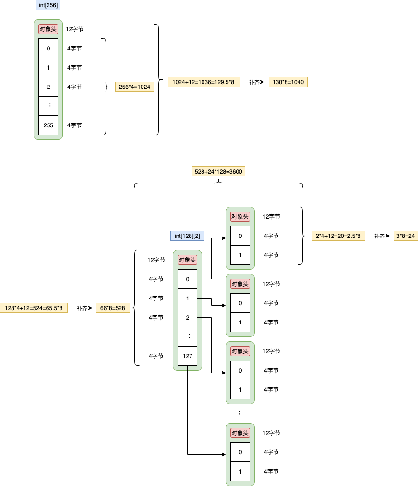

# JDK选择

在高性能硬件上部署程序，目前主要有两种方式

- 通过 64 位 JDK 来使用大内存；
- 使用若干个 32 位虚拟机建立逻辑集群来利用硬件资源。

## 使用 64 位 JDK 管理大内存

堆内存变大后，虽然垃圾收集的频率减少了，但每次垃圾回收的时间变长。 如果堆内存为 14 G，那么每次 Full GC 将长达数十秒。如果 Full GC 频繁发生，那么对于一个网站来说是无法忍受的。

对于用户交互性强、对停顿时间敏感的系统，可以给 Java 虚拟机分配超大堆的前提是有把握把应用程序的 Full GC 频率控制得足够低，至少要低到不会影响用户使用。

**可能面临的问题：**

- 内存回收导致的长时间停顿；
- 现阶段，64 位 JDK 的性能普遍比 32 位 JDK 低；
- 需要保证程序足够稳定，因为这种应用要是产生堆溢出几乎就无法产生堆转储快照（因为要产生超过 10GB 的 Dump 文件），哪怕产生了快照也几乎无法进行分析；
- 相同程序在 64 位 JDK 消耗的内存一般比 32 位 JDK 大，这是由于指针膨胀，以及数据类型对齐补白等因素导致的。

## 使用 32 位 JVM 建立逻辑集群

在一台物理机器上启动多个应用服务器进程，每个服务器进程分配不同端口， 然后在前端搭建一个负载均衡器，以反向代理的方式来分配访问请求。

考虑到在一台物理机器上建立逻辑集群的目的仅仅是为了尽可能利用硬件资源，并不需要关心状态保留、热转移之类的高可用性能需求， 也不需要保证每个虚拟机进程有绝对的均衡负载，因此使用无 Session 复制的亲合式集群是一个不错的选择。 我们仅仅需要保障集群具备亲合性，也就是均衡器按一定的规则算法（一般根据 SessionID 分配） 将一个固定的用户请求永远分配到固定的一个集群节点进行处理即可。

可能遇到的问题：

- 尽量避免节点竞争全局资源，如磁盘竞争，各个节点如果同时访问某个磁盘文件的话，很可能导致 IO 异常；
- 很难高效利用资源池，如连接池，一般都是在节点建立自己独立的连接池，这样有可能导致一些节点池满了而另外一些节点仍有较多空余；
- 各个节点受到 32 位的内存限制；
- 大量使用本地缓存的应用，在逻辑集群中会造成较大的内存浪费，因为每个逻辑节点都有一份缓存，这时候可以考虑把本地缓存改成集中式缓存。

# 对象占用大小

## 对象头和对象引用

- 64位JVM中，对象头占用12byte（Markword占8字节，CP开启指针压缩占4字节），以8字节对齐，一个空类的实例至少占用16字节。

- 32位JVM中，对象头占用8byte（Markword和CP各占4字节），以8字节对齐，一个空类的实例占用8字节。

因此，一个空类的实例64位是32位占用空间的一倍。

## 包装类型

32位jvm中，比原生数据类型消耗的内存多。如：

- Integer：int占用4字节；而Integer是对象需要占用8+4=12字节，按8字节对齐，总共需要16字节。
- Long：long占用8字节；而Long是对象需要占用8+8=16字节，按8字节对齐，总共需要16字节。

## 数组

64位jvm中，一维数组 int[256] 占用1040字节，二维数组 int\[128\]\[2\] 占用3600字节，每一个独立的数组都是一个对象。里面的有效存储空间是一样的，但3600比1040多了246%的额外开销。因此，尽量减少使用多维数组。

## 字符串

String对象的空间随着内部字符数组的增长而增长。String类的对象有24个字节的额外开销。

# 异常

## 栈

- StackOverFlowError
  -  当线程请求栈的深度超过当前 Java 虚拟机栈的最大深度的时候，就抛出 StackOverFlowError 错误。
- OutOfMemoryError
  -  Java 虚拟机栈的内存大小可以动态扩展， 如果虚拟机在动态扩展栈时无法申请到足够的内存空间，则抛出OutOfMemoryError异常
  -  **注意 HotSpot虚拟机的选择是不支持扩展**，所以除非在创建线程申请内存时就因无法获得足够内存而出现 OutOfMemoryError异常，否则在线程运行时是不会因为扩展而导致内存溢出的，只会因为栈容量无法容纳新的栈帧而导致StackOverflowError异常
- OutOfMemoryError：Unable to create new native thread
  - 程序创建的线程数量达到上限值的异常信息

## 堆

- java.lang.OutOfMemoryError: GC Overhead Limit Exceeded
  - 当 JVM 花太多时间执行垃圾回收并且只能回收很少的堆空间时，就会发生此错误。
- java.lang.OutOfMemoryError: Java heap space
  - 假如在创建新的对象时，堆内存中的空间不足以存放新创建的对象，就会引发此错误。（和配置的最大堆内存有关，且受制于物理内存大小。最大堆内存可通过`-Xmx`参数配置，若没有特别配置，将会使用默认值）
    - 超出预期的访问量/数据量（应用设计时，机器有容量限制）
    - 内存泄露

## 方法区

- OutOfMemoryError：PermGen space（1.6，1.7）
  - 加载到内存中的class数量太多或体积太大，超过PermGen的大小
- java.lang.OutOfMemoryError: MetaSpace（1.8）
  - 加载到内存中的class数量太多或体积太大，超过MetaSpace的大小

# 分析调优

## 高分配速率（High Allocation Rate）

分配速率表示单位时间内分配的内存量。通常使用MB/sec作为单位。上一次垃圾收集之后，与下一次GC开始之前的**年轻代使用量**，两者的差值除以时间，就是分配速率。

分配速率过高就会严重影响程序的性能，在JVM中可能会导致巨大的GC开销。最终效果是，影响Minor GC的次数和时间，进而影响吞吐量。

解决

- 在某些情况下，只要增加年轻代大小即可降低分配速率过高所造成的影响。增加年轻代空间并不会降低分配速率，但会减少GC的频率。如果每次GC后只有少量对象存活，minor GC 的暂停时间就不会明显增加。
- 对象缓存

## 过早提升（Premature Promotion）

提升效率用于衡量单位时间内从年轻代提升到老年代的数据量。一般使用MB/sec作为单位。

JVM会将长时间存活的对象从年轻代提升到老年代。根据分代假设，可能存在一种情况，老年代中不仅有存活时间长的对象，也可能存在存活时间短的对象。即对象存活的时间还不够长时就被提升到了老年代。Major GC不是为了频繁回收而设计的，但Major GC若需要清除生命短暂的对象，就会导致GC暂停时间过长，会严重影响系统的吞吐量。

过早提升表现

- 短时间内频繁 Full GC
- 每次 Full GC 后老年代的使用率都很低，在10~20%以下
- 提升速率接近分配速率

解决

- 增加年轻代大小或增加堆内存，Full GC的次数会减少，只是会对minor GC的持续时间产生影响
- 减少每次批处理的数量（业务层面）
- 优化数据结构，减少内存消耗

