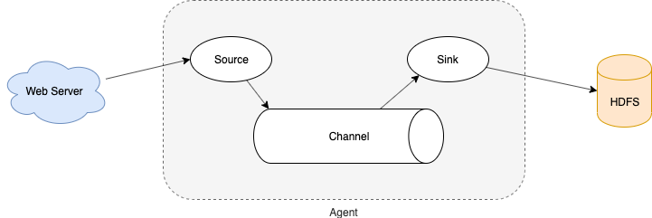

# 基本介绍

## 概述

Flume 是一个分布式、可靠、高可用的**海量日志采集、聚合和传输**的系统。

Flume 可以采集文件，socket数据包、文件、文件夹、kafka 等各种形式源数据，又可以将采集到的数据（下沉sink）输出到HDFS、hbase、hive、kafka等众多外部存储系统中。

一般的采集需求，通过对 Flume 的简单配置即可实现。Flume 针对特殊场景也具备良好的自定义扩展能力，因此，flume 可以适用于大部分的日常<font color=red>数据采集</font>场景。


## 运行机制

Flume分布式系统中最核心的角色是agent，flume采集系统就是由一个个agent所连接起来形成。每一个 agent 相当于一个数据传递员，内部有三个组件：

- Source：采集组件，用于跟数据源对接，以获取数据

- Sink：下沉组件，用于往下一级agent传递数据或者往最终存储系统传递数据

- Channel：传输通道组件，用于从source将数据传递到sink




# 实战

## 采集网络端口数据并控制台打印

### 配置

netcat-memory-logger.conf

```properties
# 定义这个agent中各组件的名字
a1.sources = r1
a1.sinks = k1
a1.channels = c1

# 描述和配置source组件：r1
a1.sources.r1.type = netcat
a1.sources.r1.bind = 192.168.2.102
a1.sources.r1.port = 44444

# 描述和配置sink组件：k1
a1.sinks.k1.type = logger

# 描述和配置channel组件，此处使用是内存缓存的方式
a1.channels.c1.type = memory
# 默认该通道中最大的可以存储的event数量
a1.channels.c1.capacity = 1000
# 每次最大可以从source中拿到或者送到sink中的event数量
# 注意：capacity > trasactionCapacity
a1.channels.c1.transactionCapacity = 100

# 描述和配置source channel sink之间的连接关系
a1.sources.r1.channels = c1
a1.sinks.k1.channel = c1
```


### 启动

```bash
# -c 指定flume自身的配置文件所在目录
# -f netcat-memory-logger.conf 指定描述的采集方案
flume-ng agent -c /bigdata/install/apache-flume-1.6.0-cdh5.14.2-bin/conf -f netcat-memory-logger.conf -n a1 -Dflume.root.logger=INFO,console
```


### 测试

```bash
# 安装telnet客户端模拟数据发送
sudo yum -y install telnet

# 测试
# control+]	回到telnet命令窗口
# quit 退出
telnet node03 44444
```


## 采集目录文件到HDFS

### 配置

spooldir.conf

```properties
# Name the components on this agent
a1.sources = r1
a1.sinks = k1
a1.channels = c1

# Describe/configure the source
# 注意，不能向监控目中重复放同名文件
a1.sources.r1.type = spooldir
a1.sources.r1.spoolDir = /home/hadoop/flumedatas/spooldir
a1.sources.r1.fileHeader = true

# Describe the sink
a1.sinks.k1.type = hdfs
a1.sinks.k1.hdfs.path = hdfs://node01:8020/test/flume/spooldir/files/%y-%m-%d/%H%M/
a1.sinks.k1.hdfs.filePrefix = events-

# ========
# 时间戳是否需要四舍五入，默认false，true影响所有基于时间的转义字符，除了%t
a1.sinks.k1.hdfs.round = true
# 时间戳四舍五入的倍数，小于当前时间
a1.sinks.k1.hdfs.roundValue = 10
# 时间戳四舍五入的单位，默认秒
a1.sinks.k1.hdfs.roundUnit = minute
# 以上为每隔10分钟产生一个文件
# ========

# ========
# 触发滚动文件等待时间（秒），默认30，0不会基于时间滚动文件
# a1.sinks.k1.hdfs.rollInterval = 3
a1.sinks.k1.hdfs.rollInterval = 0
# 触发滚动文件的文件大小（字节），默认1024，0不会基于文件大小滚动文件
# a1.sinks.k1.hdfs.rollSize = 20
a1.sinks.k1.hdfs.rollSize = 0
# 触发滚动文件的事件数量（最小传输单位），默认10，0不会基于事件数量滚动文件
# a1.sinks.k1.hdfs.rollCount = 5
a1.sinks.k1.hdfs.rollCount = 0
# ========

# ========
# 刷写到HDFS前的事件数量，默认100
a1.sinks.k1.hdfs.batchSize = 1
# ========

a1.sinks.k1.hdfs.useLocalTimeStamp = true
# 生成的文件类型，默认 SequenceFile，可用 DataStream 代替，为普通文本
a1.sinks.k1.hdfs.fileType = DataStream

# Use a channel which buffers events in memory
a1.channels.c1.type = memory
a1.channels.c1.capacity = 1000
a1.channels.c1.transactionCapacity = 100

# Bind the source and sink to the channel
a1.sources.r1.channels = c1
a1.sinks.k1.channel = c1
```


- Source：spooldir

  - 监视一个目录（<font color=red>flume部署到数据源一端</font>），**只要目录中出现新文件**，就会采集文件中的内容
- 采集完成的文件，会被agent自动添加一个后缀：COMPLETED
  - HDFS 上的文件以 .tmp 作为后缀，当 flume agent 关闭 或者 满足新生成文件时，去掉 .tmp 后缀
  - 所监视的目录中不允许重复出现相同文件名的文件（**出错后不会继续运行**）

- Sink：hdfs

  - round、roundValue、roundUnit

    控制多长时间生成一个文件，可以控制hdfs上小文件的数量。

  - rollInterval、rollSize、rollCount

    控制滚动生成文件的时间间隔、文件大小、事件数量，当全部设置为0时，不会基于此三项生成文件。


### 启动

```bash
flume-ng agent -c /bigdata/install/apache-flume-1.6.0-cdh5.14.2-bin/conf -f spooldir.conf -n a1 -Dflume.root.logger=INFO,console
```


### 测试

spooldir.sh

```bash
#!/bin/bash

i=0

while true
do
	echo $((++i)) >> /home/hadoop/flumedatas/spooldir/$i;
	sleep 10;
done
```


```bash
sh spooldir.sh
```


## 采集文件到HDFS

### 配置

taillog.conf

``` properties
agent1.sources = source1
agent1.sinks = sink1
agent1.channels = channel1

# Describe/configure tail -F source1
agent1.sources.source1.type = exec
agent1.sources.source1.command = tail -F /home/hadoop/flumedatas/taillog/access_log

# Describe sink1
agent1.sinks.sink1.type = hdfs
agent1.sinks.sink1.hdfs.path = hdfs://node01:8020/test/flume/taillog/%y-%m-%d/%H-%M
agent1.sinks.sink1.hdfs.filePrefix = access_log
agent1.sinks.sink1.hdfs.maxOpenFiles = 5000
agent1.sinks.sink1.hdfs.batchSize = 100
agent1.sinks.sink1.hdfs.fileType = DataStream
agent1.sinks.sink1.hdfs.writeFormat = Text

# 滚动生成新文件，hdfs.rollInterval没有设置，默认30s
agent1.sinks.sink1.hdfs.rollSize = 102400
agent1.sinks.sink1.hdfs.rollCount = 1000000

# 每10分钟一个文件夹，hdfs.round必须设置为true，时间戳四舍五入才会生效；否则1分钟一个文件夹
agent1.sinks.sink1.hdfs.round = true
agent1.sinks.sink1.hdfs.roundValue = 10
agent1.sinks.sink1.hdfs.roundUnit = minute

agent1.sinks.sink1.hdfs.useLocalTimeStamp = true

# Use a channel which buffers events in memory
agent1.channels.channel1.type = memory
agent1.channels.channel1.keep-alive = 120
agent1.channels.channel1.capacity = 500000
agent1.channels.channel1.transactionCapacity = 600

# Bind the source and sink to the channel
agent1.sources.source1.channels = channel1
agent1.sinks.sink1.channel = channel1
```


- tail -F
  - 首次启动时，只加载文件最后10行（命令执行 或 flume执行）
  - 常驻系统程序，监控文件末尾追加

- Sink：hdfs
  - 最下层文件夹是 `小时-分钟` ，也就是说每分钟生成一个文件夹（hdfs.round=false）。观察测试数据发现，每分钟会有两个小文件，是因为 `hdfs.rollInterval` 默认30秒滚动生成新文件。


### 启动

```bash
flume-ng agent -c /bigdata/install/apache-flume-1.6.0-cdh5.14.2-bin/conf -f taillog.conf -n agent1 -Dflume.root.logger=INFO,console
```


### 测试

taillog.sh

```shell
#!/bin/bash

while true
do
	date >> /home/hadoop/flumedatas/taillog/access_log;
	sleep 0.5;
done
```


```bash
sh taillog.sh
```


## 断点续传

### 配置

taildir.conf

```properties
# Name the components on this agent
a1.sources = r1
a1.sinks = k1
a1.channels = c1

# Describe/configure the source
a1.sources.r1.type = TAILDIR
# record the inode, the absolute path and the last position of each tailing file
a1.sources.r1.positionFile = /home/hadoop/flumedatas/taildir_position.json
# 可以有多个组（监控多个目录），以空格分隔，如：a1.sources.r1.filegroups = f1 f2
a1.sources.r1.filegroups = f1
a1.sources.r1.filegroups.f1 = /home/hadoop/flumedatas/taildir/.*log.*

# Describe the sink
a1.sinks.k1.type = hdfs
a1.sinks.k1.hdfs.path = hdfs://node01:8020/test/flume/taildir/files/%y-%m-%d/%H%M/
a1.sinks.k1.hdfs.filePrefix = events-

a1.sinks.k1.hdfs.round = true
a1.sinks.k1.hdfs.roundValue = 10
a1.sinks.k1.hdfs.roundUnit = minute

a1.sinks.k1.hdfs.rollInterval = 3
a1.sinks.k1.hdfs.rollSize = 5000
a1.sinks.k1.hdfs.rollCount = 50000

a1.sinks.k1.hdfs.batchSize = 5000
a1.sinks.k1.hdfs.useLocalTimeStamp = true
a1.sinks.k1.hdfs.fileType = DataStream

# Use a channel which buffers events in memory
a1.channels.c1.type = memory
a1.channels.c1.capacity = 1000
a1.channels.c1.transactionCapacity = 100

# Bind the source and sink to the channel
a1.sources.r1.channels = c1
a1.sinks.k1.channel = c1
```


- Sink：TAILDIR
  - 可以监控文件夹下的所有文件，也可以监控文件内容
  - 断点续传功能，原理是 taildir_position.json （自动生成）记录每一次生成事件的文件位置


### 启动

```bash
flume-ng agent -c /bigdata/install/apache-flume-1.6.0-cdh5.14.2-bin/conf -f taildir.conf -n a1 -Dflume.root.logger=INFO,console
```


### 测试

```bash
# > 新增文件写入内容
# >> 追加内容到文件末尾
echo "testlog1" >> /home/hadoop/flumedatas/taildir/file.log
echo "testlog2" >> /home/hadoop/flumedatas/taildir/file.log
```


## 级联Agent

### 安装

node03执行

```bash
scp -r apache-flume-1.6.0-cdh5.14.2-bin/ node02:$PWD
```


node02执行

配置/etc/profile

```bash
sudo vi /etc/profile

# 增加flume环境变量
export FLUME_HOME=/bigdata/install/apache-flume-1.6.0-cdh5.14.2-bin
export PATH=$PATH:$FLUME_HOME/bin

# 立即生效
source /etc/profile
```


### 配置

node02

tail-avro-avro-logger.conf

```properties
# Name the components on this agent
a1.sources = r1
a1.sinks = k1
a1.channels = c1

# Describe/configure the source
a1.sources.r1.type = exec
a1.sources.r1.command = tail -F /home/hadoop/flumedatas/taillog/access_log

# Describe the sink
# 数据发送
a1.sinks.k1.type = avro
a1.sinks.k1.hostname = node03
a1.sinks.k1.port = 4141
a1.sinks.k1.batch-size = 10

# Use a channel which buffers events in memory
a1.channels.c1.type = memory
a1.channels.c1.capacity = 1000
a1.channels.c1.transactionCapacity = 100

# Bind the source and sink to the channel
a1.sources.r1.channels = c1
a1.sinks.k1.channel = c1
```


node03

avro-hdfs.conf

```properties
# Name the components on this agent
a1.sources = r1
a1.sinks = k1
a1.channels = c1

# Describe/configure the source
# 数据接收
a1.sources.r1.type = avro
a1.sources.r1.bind = node03
a1.sources.r1.port = 4141

# Describe the sink
a1.sinks.k1.type = hdfs
a1.sinks.k1.hdfs.path = hdfs://node01:8020/test/flume/avro/hdfs/%y-%m-%d/%H%M/
a1.sinks.k1.hdfs.filePrefix = events-
a1.sinks.k1.hdfs.round = true
a1.sinks.k1.hdfs.roundValue = 10
a1.sinks.k1.hdfs.roundUnit = minute
a1.sinks.k1.hdfs.rollInterval = 3
a1.sinks.k1.hdfs.rollSize = 20
a1.sinks.k1.hdfs.rollCount = 5
a1.sinks.k1.hdfs.batchSize = 1
a1.sinks.k1.hdfs.useLocalTimeStamp = true
a1.sinks.k1.hdfs.fileType = DataStream

# Use a channel which buffers events in memory
a1.channels.c1.type = memory
a1.channels.c1.capacity = 1000
a1.channels.c1.transactionCapacity = 100

# Bind the source and sink to the channel
a1.sources.r1.channels = c1
a1.sinks.k1.channel = c1
```


### 启动

```bash
# node03
flume-ng agent -c /bigdata/install/apache-flume-1.6.0-cdh5.14.2-bin/conf -f avro-hdfs.conf -n a1 -Dflume.root.logger=INFO,console

# node02
flume-ng agent -c /bigdata/install/apache-flume-1.6.0-cdh5.14.2-bin/conf -f tail-avro-avro-logger.conf -n a1 -Dflume.root.logger=INFO,console
```


### 测试

node02

taillog.sh

```shell
while true
do
	date >> /home/hadoop/flumedatas/taillog/access_log;
	sleep 0.5;
done
```


```bash
sh taillog.sh
```


# failover 故障转移

Flume NG 本身提供了Failover机制，可以自动切换和恢复。

## 规划

| 主机   | 角色       | 角色       |
| ------ | ---------- | ---------- |
| node01 | agent1     | Web Server |
| node02 | collector1 | AgentMstr1 |
| node03 | collector2 | AgentMstr2 |


## 安装

node03执行

```bash
scp -r apache-flume-1.6.0-cdh5.14.2-bin/ node01:$PWD
```


node01执行

配置/etc/profile

```bash
sudo vi /etc/profile

# 增加flume环境变量
export FLUME_HOME=/bigdata/install/apache-flume-1.6.0-cdh5.14.2-bin
export PATH=$PATH:$FLUME_HOME/bin

# 立即生效
source /etc/profile
```


##配置

node01

agent.conf

```properties
# agent1 name
agent1.channels = c1
agent1.sources = r1
agent1.sinks = k1 k2

# set channel
agent1.channels.c1.type = memory
agent1.channels.c1.capacity = 1000
agent1.channels.c1.transactionCapacity = 100

# set sources
agent1.sources.r1.channels = c1
agent1.sources.r1.type = exec
agent1.sources.r1.command = tail -F /home/hadoop/flumedatas/taillogs/access_log

# 拦截器是简单的插件式组件，设置在source和channel之间
# 多个拦截器组成了 interceptor chain 按声明顺序调用
# 静态拦截器
# 在header中增加kv对
agent1.sources.r1.interceptors = i1 i2
agent1.sources.r1.interceptors.i1.type = static
agent1.sources.r1.interceptors.i1.key = Type
agent1.sources.r1.interceptors.i1.value = LOGIN
# 时间戳拦截器
# 在header中增加时间戳
agent1.sources.r1.interceptors.i2.type = timestamp

# set sink1
agent1.sinks.k1.channel = c1
agent1.sinks.k1.type = avro
agent1.sinks.k1.hostname = node02
agent1.sinks.k1.port = 52020

# set sink2
agent1.sinks.k2.channel = c1
agent1.sinks.k2.type = avro
agent1.sinks.k2.hostname = node03
agent1.sinks.k2.port = 52020

# set sink group
agent1.sinkgroups = g1
agent1.sinkgroups.g1.sinks = k1 k2
agent1.sinkgroups.g1.processor.type = failover
# 先向优先级高的发送event
# 注意：如果优先级相同，故障转移会失败
agent1.sinkgroups.g1.processor.priority.k1 = 10
agent1.sinkgroups.g1.processor.priority.k2 = 1
agent1.sinkgroups.g1.processor.maxpenalty = 10000
```


node02

collector.conf

```properties
# set Agent name
a1.sources = r1
a1.channels = c1
a1.sinks = k1

# set channel
a1.channels.c1.type = memory
a1.channels.c1.capacity = 1000
a1.channels.c1.transactionCapacity = 100

# set sources
a1.sources.r1.type = avro
a1.sources.r1.bind = node02
a1.sources.r1.port = 52020
a1.sources.r1.interceptors = i1
a1.sources.r1.interceptors.i1.type = static
a1.sources.r1.interceptors.i1.key = Collector
a1.sources.r1.interceptors.i1.value = node02
a1.sources.r1.channels = c1

# set sink
a1.sinks.k1.type=hdfs
a1.sinks.k1.hdfs.filePrefix=%Y-%m-%d
a1.sinks.k1.hdfs.path= hdfs://node01:8020/test/flume/failover/node02
a1.sinks.k1.hdfs.fileType=DataStream
a1.sinks.k1.hdfs.writeFormat=TEXT
a1.sinks.k1.hdfs.rollInterval=10
a1.sinks.k1.channel=c1
```


node03

collector.conf

```properties
# set Agent name
a1.sources = r1
a1.channels = c1
a1.sinks = k1

# set channel
a1.channels.c1.type = memory
a1.channels.c1.capacity = 1000
a1.channels.c1.transactionCapacity = 100

# set sources
a1.sources.r1.type = avro
a1.sources.r1.bind = node03
a1.sources.r1.port = 52020
a1.sources.r1.interceptors = i1
a1.sources.r1.interceptors.i1.type = static
a1.sources.r1.interceptors.i1.key = Collector
a1.sources.r1.interceptors.i1.value = node03
a1.sources.r1.channels = c1

# set sink
a1.sinks.k1.type=hdfs
a1.sinks.k1.hdfs.filePrefix=%Y-%m-%d
a1.sinks.k1.hdfs.path= hdfs://node01:8020/test/flume/failover/node03
a1.sinks.k1.hdfs.fileType=DataStream
a1.sinks.k1.hdfs.writeFormat=TEXT
a1.sinks.k1.hdfs.rollInterval=10
a1.sinks.k1.channel=c1
```


## 启动

``` shell
# node03 启动
flume-ng agent -n a1 -c /bigdata/install/apache-flume-1.6.0-cdh5.14.2-bin/conf -f collector.conf -Dflume.root.logger=DEBUG,console

# node02 启动
flume-ng agent -n a1 -c /bigdata/install/apache-flume-1.6.0-cdh5.14.2-bin/conf -f collector.conf -Dflume.root.logger=DEBUG,console

# node01 启动
flume-ng agent -n agent1 -c /bigdata/install/apache-flume-1.6.0-cdh5.14.2-bin/conf -f agent.conf -Dflume.root.logger=DEBUG,console
```


## 测试

``` shell
# 发送数据
echo "1" >> /home/hadoop/flumedatas/taillogs/access_log

# node02 收到数据（优先级高）

# 关闭 node02

# 发送数据
echo "2" >> /home/hadoop/flumedatas/taillogs/access_log

# node03 收到数据（故障转移）

# 恢复 node02

# 发送数据
echo "3" >> /home/hadoop/flumedatas/taillogs/access_log

# node02 收到数据（优先级高）
```


# load balance 负载均衡

负载均衡是用于解决一台机器（一个进程）无法解决所有请求而产生的一种算法。Load balancing Sink Processor 能够实现 load balance 功能。

## 规划

| 主机   | 名称   | 角色                           |
| ------ | ------ | ------------------------------ |
| node01 | client | 采集数据，发送到node02和node03 |
| node02 | server | 接收node01部分数据             |
| node03 | server | 接收node01部分数据             |


## 配置

node01

load_banlancer_client.conf

```properties
# agent name
a1.channels = c1
a1.sources = r1
a1.sinks = k1 k2

# set channel
a1.channels.c1.type = memory
a1.channels.c1.capacity = 1000
a1.channels.c1.transactionCapacity = 100

# set source
a1.sources.r1.channels = c1
a1.sources.r1.type = exec
a1.sources.r1.command = tail -F /home/hadoop/flumedatas/taillogs/access_log

# set sink1
a1.sinks.k1.channel = c1
a1.sinks.k1.type = avro
a1.sinks.k1.hostname = node02
a1.sinks.k1.port = 52020

# set sink2
a1.sinks.k2.channel = c1
a1.sinks.k2.type = avro
a1.sinks.k2.hostname = node03
a1.sinks.k2.port = 52020

# set sink group
a1.sinkgroups = g1
a1.sinkgroups.g1.sinks = k1 k2
a1.sinkgroups.g1.processor.type = load_balance
a1.sinkgroups.g1.processor.backoff = true
# 轮询
a1.sinkgroups.g1.processor.selector = round_robin
a1.sinkgroups.g1.processor.selector.maxTimeOut=10000
```


node02

load_banlancer_server.conf

```properties
# Name the components on this agent
a1.sources = r1
a1.sinks = k1
a1.channels = c1

# Describe/configure the source
a1.sources.r1.type = avro
a1.sources.r1.channels = c1
a1.sources.r1.bind = node02
a1.sources.r1.port = 52020

# Describe the sink
a1.sinks.k1.type = logger

# Use a channel which buffers events in memory
a1.channels.c1.type = memory
a1.channels.c1.capacity = 1000
a1.channels.c1.transactionCapacity = 100

# Bind the source and sink to the channel
a1.sources.r1.channels = c1
a1.sinks.k1.channel = c1
```


node03

load_banlancer_server.conf

```properties
# Name the components on this agent
a1.sources = r1
a1.sinks = k1
a1.channels = c1

# Describe/configure the source
a1.sources.r1.type = avro
a1.sources.r1.channels = c1
a1.sources.r1.bind = node03
a1.sources.r1.port = 52020

# Describe the sink
a1.sinks.k1.type = logger

# Use a channel which buffers events in memory
a1.channels.c1.type = memory
a1.channels.c1.capacity = 1000
a1.channels.c1.transactionCapacity = 100

# Bind the source and sink to the channel
a1.sources.r1.channels = c1
a1.sinks.k1.channel = c1
```


## 启动

```shell
# node03 启动
flume-ng agent -n a1 -c /bigdata/install/apache-flume-1.6.0-cdh5.14.2-bin/conf -f load_banlancer_server.conf -Dflume.root.logger=DEBUG,console

# node02 启动
flume-ng agent -n a1 -c /bigdata/install/apache-flume-1.6.0-cdh5.14.2-bin/conf -f load_banlancer_server.conf -Dflume.root.logger=DEBUG,console

# node01 启动
flume-ng agent -n a1 -c /bigdata/install/apache-flume-1.6.0-cdh5.14.2-bin/conf -f load_banlancer_client.conf -Dflume.root.logger=DEBUG,console
```


## 测试

```shell
# 轮询
# node02
echo "1" >> /home/hadoop/flumedatas/taillogs/access_log
# node03
echo "2" >> /home/hadoop/flumedatas/taillogs/access_log
# node02
echo "3" >> /home/hadoop/flumedatas/taillogs/access_log
# node03
echo "4" >> /home/hadoop/flumedatas/taillogs/access_log

# close node02

# node03 可以正常接收
# node03
echo "5" >> /home/hadoop/flumedatas/taillogs/access_log
echo "6" >> /home/hadoop/flumedatas/taillogs/access_log
echo "7" >> /home/hadoop/flumedatas/taillogs/access_log

# start node02

# node02 node03 可以正常接收
# node02
echo "8" >> /home/hadoop/flumedatas/taillogs/access_log
# node03
echo "9" >> /home/hadoop/flumedatas/taillogs/access_log
# node03
echo "10" >> /home/hadoop/flumedatas/taillogs/access_log
# node03
echo "11" >> /home/hadoop/flumedatas/taillogs/access_log
# node02
echo "12" >> /home/hadoop/flumedatas/taillogs/access_log
# node03
echo "13" >> /home/hadoop/flumedatas/taillogs/access_log
# node02
echo "14" >> /home/hadoop/flumedatas/taillogs/access_log
# node02
echo "15" >> /home/hadoop/flumedatas/taillogs/access_log
# node03
echo "16" >> /home/hadoop/flumedatas/taillogs/access_log
# node02
echo "17" >> /home/hadoop/flumedatas/taillogs/access_log
# node03
echo "18" >> /home/hadoop/flumedatas/taillogs/access_log
```


# 自定义服务组件

## 自定义Interceptor

### 需求

将数据第一位电话号码加密，第4位兴趣过滤

### 准备数据

```shell
vi user.txt

13901007610,male,30,sing,beijing
18600000035,male,40,dance,shanghai
13366666659,male,20,Swimming,wuhan
13801179888,female,18,dance,tianjin
18511111114,male,35,sing,beijing
13718428888,female,40,Foodie,shanghai
13901057088,male,50,Basketball,taiwan
13671057777,male,60,Bodybuilding,xianggang
```

### 开发

添加xml依赖

```xml
<!-- flume -->
<dependency>
	<groupId>org.apache.flume</groupId>
	<artifactId>flume-ng-core</artifactId>
</dependency>
```

UserInterceptor.java

```java
public class UserInterceptor implements Interceptor {
    private int encrypted_field_index;
    private int out_index;

    public UserInterceptor(int encrypted_field_index, int out_index) {
        this.encrypted_field_index = encrypted_field_index;
        this.out_index = out_index;
    }

    @Override
    public void initialize() {

    }

    @Override
    public Event intercept(Event event) {
        String line = new String(event.getBody(), Charsets.UTF_8);
        String newLine = "";
        String[] fields = line.split(",");

        for (int i = 0; i < fields.length; i++) {
            if (i == encrypted_field_index) {
                try {
                    newLine += md5(fields[i]) + ",";
                } catch (NoSuchAlgorithmException e) {
                    throw new RuntimeException(e);
                }
            } else if (i == out_index) {
                // do nothing
            } else {
                newLine += fields[i] + ",";
            }
        }

        newLine = newLine.substring(0, newLine.length() - 1);
        event.setBody(newLine.getBytes(Charsets.UTF_8));

        return event;
    }

    @Override
    public List<Event> intercept(List<Event> list) {
        List<Event> newList = new ArrayList();
        for (Event e : list) {
            Event test = intercept(e);
            if (test != null) {
                newList.add(test);
            }
        }
        return newList;
    }

    @Override
    public void close() {

    }

    private String md5(String plainText) throws NoSuchAlgorithmException {
        byte[] secretBytes = null;

        MessageDigest md5 = MessageDigest.getInstance("MD5");
        md5.update(plainText.getBytes());
        secretBytes = md5.digest();

        String result = new BigInteger(1, secretBytes).toString(16);

        for (int i = 0; i < 32 - result.length(); i++) {
            result = "0" + result;
        }

        return result;
    }

    public static class Builder implements Interceptor.Builder {
        private int encrypted_field_index;
        private int out_index;

        @Override
        public Interceptor build() {
            return new UserInterceptor(encrypted_field_index, out_index);
        }

        @Override
        public void configure(Context context) {
            encrypted_field_index = context.getInteger("encrypted_field_index");
            out_index = context.getInteger("out_index");
        }
    }
}
```

### 上传jar

```shell
# 自定义 interceptor 上传到 plugins.d/mysqlsource/lib
scp hadoop-flume-example-1.0-SNAPSHOT.jar hadoop@node03:/bigdata/install/apache-flume-1.6.0-cdh5.14.2-bin/plugins.d/mysqlsource/lib
```

### 配置

user.conf

```properties
# Name the components on this agent
a1.sources = r1
a1.sinks = k1
a1.channels = c1

# 配置source
a1.sources.r1.type = exec
a1.sources.r1.command = tail -F /home/hadoop/flumedatas/user/user.txt
a1.sources.r1.channels = c1
a1.sources.r1.interceptors =i1
# 自定义interceptor需要指定包名
a1.sources.r1.interceptors.i1.type = com.sciatta.hadoop.flume.example.interceptor.UserInterceptor$Builder
a1.sources.r1.interceptors.i1.encrypted_field_index=0
a1.sources.r1.interceptors.i1.out_index=3

# 配置channel
a1.channels.c1.type = memory
a1.channels.c1.capacity = 1000
a1.channels.c1.transactionCapacity = 100

# 配置sink
a1.sinks.k1.type = hdfs
a1.sinks.k1.channel = c1
a1.sinks.k1.hdfs.path = hdfs://node01:8020/test/flume/user/%Y-%m-%d/%H%M
a1.sinks.k1.hdfs.filePrefix = events-

a1.sinks.k1.hdfs.round = true
a1.sinks.k1.hdfs.roundValue = 10
a1.sinks.k1.hdfs.roundUnit = minute

a1.sinks.k1.hdfs.rollInterval = 5
a1.sinks.k1.hdfs.rollSize = 50
a1.sinks.k1.hdfs.rollCount = 10

a1.sinks.k1.hdfs.batchSize = 100
a1.sinks.k1.hdfs.useLocalTimeStamp = true
a1.sinks.k1.hdfs.fileType = DataStream
```

### 启动

```shell
flume-ng agent -n a1 -c /bigdata/install/apache-flume-1.6.0-cdh5.14.2-bin/conf -f user.conf -Dflume.root.logger=DEBUG,console
```


## 自定义Source

### 需求

自定义flume的source，实现从mysql数据库当中获取数据，将数据打印到控制台。

### 准备数据

```mysql
create database if not exists mysqlsource default character set utf8;

-- 拉取目标表位置信息
drop table if exists mysqlsource.flume_meta;
CREATE TABLE mysqlsource.flume_meta (
  source_tab varchar(255) NOT NULL,
  currentIndex varchar(255) NOT NULL,
  PRIMARY KEY (source_tab)
) ENGINE=InnoDB DEFAULT CHARSET=utf8;

-- 插入数据
insert into mysqlsource.flume_meta(source_tab,currentIndex) values ('student','4');

-- 拉取目标表
-- AUTO_INCREMENT 指定自增初始值
drop table if exists mysqlsource.student;
CREATE TABLE mysqlsource.student(
  id int(11) NOT NULL AUTO_INCREMENT,
  name varchar(255) NOT NULL,
  PRIMARY KEY (id)
) ENGINE=InnoDB AUTO_INCREMENT=5 DEFAULT CHARSET=utf8;

-- 向student表中添加测试数据
insert into mysqlsource.student(id,name) values (1,'zhangsan'),(2,'lisi'),(3,'wangwu'),(4,'zhaoliu');
```

### 开发

添加xml依赖

```xml
<!-- flume -->
<dependency>
	<groupId>org.apache.flume</groupId>
	<artifactId>flume-ng-core</artifactId>
</dependency>
<!-- mysql -->
<dependency>
	<groupId>mysql</groupId>
	<artifactId>mysql-connector-java</artifactId>
</dependency>
```

MySQLHelper.java

```java
public class MySQLHelper {
    private static final Logger LOG = LoggerFactory.getLogger(MySQLHelper.class);

    // 两次查询的时间间隔
    private int runQueryDelay;
    // 开始id
    private int startFrom;
    // 当前id
    private int currentIndex;

    // 要操作的表
    private String table;
    // 用户传入的查询的列
    private String columnsToSelect;

    // 为定义的变量赋值（默认值），可在flume任务的配置文件中修改
    private static final int DEFAULT_QUERY_DELAY = 10000;
    private static final int DEFAULT_START_VALUE = 0;
    private static final String DEFAULT_COLUMNS_SELECT = "*";

    private static Connection conn = null;
    private static PreparedStatement ps = null;

    private static String connectionURL, connectionUserName, connectionPassword;

    static {
        Properties p = new Properties();
        try {
            p.load(MySQLHelper.class.getClassLoader().getResourceAsStream("jdbc.properties"));
            connectionURL = p.getProperty("dbUrl");
            connectionUserName = p.getProperty("dbUser");
            connectionPassword = p.getProperty("dbPassword");
            // 加载数据库驱动
            Class.forName(p.getProperty("dbDriver"));
        } catch (Exception e) {
            LOG.error(e.toString());
        }
    }

    MySQLHelper(Context context) {
        // 有默认值参数：获取flume任务配置文件中的参数，读不到的采用默认值
        this.columnsToSelect = context.getString("columns.to.select", DEFAULT_COLUMNS_SELECT);
        this.runQueryDelay = context.getInteger("run.query.delay", DEFAULT_QUERY_DELAY);
        this.startFrom = context.getInteger("start.from", DEFAULT_START_VALUE);

        // 无默认值参数：获取flume任务配置文件中的参数
        this.table = context.getString("table");

        // 校验相应的配置信息，如果没有默认值的参数也没赋值，抛出异常
        checkMandatoryProperties();

        // 创建数据库连接
        conn = InitConnection(connectionURL, connectionUserName, connectionPassword);
    }

    MySQLHelper(Properties properties) {
        this.columnsToSelect = properties.getProperty("columns.to.select", DEFAULT_COLUMNS_SELECT);
        this.runQueryDelay = getIntegerFromProperties(properties, "run.query.delay", DEFAULT_QUERY_DELAY);
        this.startFrom = getIntegerFromProperties(properties, "start.from", DEFAULT_START_VALUE);

        // 无默认值参数：获取flume任务配置文件中的参数
        this.table = properties.getProperty("table");

        // 校验相应的配置信息，如果没有默认值的参数也没赋值，抛出异常
        checkMandatoryProperties();

        // 创建数据库连接
        conn = InitConnection(connectionURL, connectionUserName, connectionPassword);
    }

    List<List<Object>> executeQuery() {
        try {
            // 每次执行查询时都要重新生成sql，因为id不同
            String query = buildQuery();
            //  存放结果的集合
            List<List<Object>> results = new ArrayList<>();
            if (ps == null) {
                // 初始化PrepareStatement对象
                ps = conn.prepareStatement(query);
            }
            ResultSet result = ps.executeQuery(query);
            while (result.next()) {
                // 存放一条数据的集合（多个列）
                List<Object> row = new ArrayList<>();
                // 将返回结果放入集合
                for (int i = 1; i <= result.getMetaData().getColumnCount(); i++) {
                    row.add(result.getObject(i));
                }
                results.add(row);
            }
            LOG.info("execSql:" + query + "  resultSize:" + results.size());
            return results;
        } catch (SQLException e) {
            LOG.error(e.toString());
            // 重新连接
            conn = InitConnection(connectionURL, connectionUserName, connectionPassword);
        }
        return null;
    }

    void updateOffset2DB(int size) {
        //以source_tab做为KEY，如果不存在则插入，存在则更新（每个源表对应一条记录）
        String sql = "insert into flume_meta(source_tab,currentIndex) VALUES('"
                + this.table
                + "','" + (currentIndex += size)
                + "') on DUPLICATE key update currentIndex=values(currentIndex)";

        LOG.info("updateStatus Sql:" + sql);
        execSql(sql);
    }

    List<String> getAllRows(List<List<Object>> queryResult) {
        List<String> allRows = new ArrayList<>();
        if (queryResult == null || queryResult.isEmpty())
            return allRows;
        StringBuilder row = new StringBuilder();
        for (List<Object> rawRow : queryResult) {
            Object value;
            for (Object aRawRow : rawRow) {
                value = aRawRow;
                if (value == null) {
                    row.append(",");
                } else {
                    row.append(aRawRow.toString()).append(",");
                }
            }
            allRows.add(row.toString());
            row = new StringBuilder();
        }
        return allRows;
    }

    void close() {
        try {
            ps.close();
            conn.close();
        } catch (SQLException e) {
            e.printStackTrace();
        }
    }

    private int getIntegerFromProperties(Properties properties, String key, int defaultValue) {
        if (properties.getProperty(key) == null) {
            return defaultValue;
        }
        return Integer.parseInt(properties.getProperty(key));
    }

    private void checkMandatoryProperties() {
        if (table == null) {
            throw new ConfigurationException("property table not set");
        }
        if (connectionURL == null) {
            throw new ConfigurationException("connection.url property not set");
        }
        if (connectionUserName == null) {
            throw new ConfigurationException("connection.user property not set");
        }
        if (connectionPassword == null) {
            throw new ConfigurationException("connection.password property not set");
        }
    }

    private static Connection InitConnection(String url, String user, String pw) {
        try {
            Connection conn = DriverManager.getConnection(url, user, pw);
            if (conn == null)
                throw new SQLException();
            return conn;
        } catch (SQLException e) {
            e.printStackTrace();
        }
        return null;
    }

    private String buildQuery() {
        // 获取当前id
        currentIndex = getStatusDBIndex(startFrom);
        LOG.info(currentIndex + "");

        // 以id作为offset
        return "SELECT " + columnsToSelect + " FROM " + table + " where " +
                "id" + ">" + currentIndex;
    }

    private Integer getStatusDBIndex(int startFrom) {
        // 从 flume_meta 表中查询出当前的id，若有值，以此为准，否则，以传入参数 startFrom 为准
        String dbIndex = queryFirstColumn("select currentIndex from flume_meta where source_tab='" + table + "'");
        if (dbIndex != null) {
            return Integer.parseInt(dbIndex);
        }

        // 如果没有数据，则说明是第一次查询或者数据表中还没有存入数据，返回最初传入的值
        return startFrom;
    }

    private String queryFirstColumn(String sql) {
        ResultSet result;
        try {
            ps = conn.prepareStatement(sql);
            result = ps.executeQuery();
            while (result.next()) {
                return result.getString(1);
            }
        } catch (SQLException e) {
            e.printStackTrace();
        }
        return null;
    }

    private void execSql(String sql) {
        try {
            ps = conn.prepareStatement(sql);
            ps.execute();
        } catch (SQLException e) {
            e.printStackTrace();
        }
    }

    int getRunQueryDelay() {
        return runQueryDelay;
    }
}
```

MySQLSource.java

```java
public class MySQLSource extends AbstractSource implements Configurable, PollableSource {

    private static final Logger LOG = LoggerFactory.getLogger(MySQLSource.class);
    private MySQLHelper sqlSourceHelper;

    @Override
    public long getBackOffSleepIncrement() {
        return 0;
    }

    @Override
    public long getMaxBackOffSleepInterval() {
        return 0;
    }

    @Override
    public void configure(Context context) {
        // 初始化
        sqlSourceHelper = new MySQLHelper(context);
    }

    @Override
    public PollableSource.Status process() throws EventDeliveryException {
        try {
            List<Event> events = new ArrayList<>();
            HashMap<String, String> header = new HashMap<>();

            // 查询数据表
            List<List<Object>> result = sqlSourceHelper.executeQuery();

            // 如果有返回数据，则将数据封装为event
            if (!result.isEmpty()) {
                List<String> allRows = sqlSourceHelper.getAllRows(result);
                Event event;
                for (String row : allRows) {
                    event = new SimpleEvent();
                    event.setBody(row.getBytes());
                    event.setHeaders(header);
                    events.add(event);
                }

                // 将event写入channel
                this.getChannelProcessor().processEventBatch(events);

                // 更新数据表中的offset信息
                sqlSourceHelper.updateOffset2DB(result.size());
            }

            // 等待时长
            Thread.sleep(sqlSourceHelper.getRunQueryDelay());
            return Status.READY;

        } catch (InterruptedException e) {
            LOG.error("Error processing row：", e);
            return Status.BACKOFF;
        }
    }

    @Override
    public synchronized void stop() {
        LOG.info("Stopping sql source {} ...", getName());
        try {
            // 关闭资源
            sqlSourceHelper.close();
        } finally {
            super.stop();
        }
    }
}
```

jdbc.properties

```properties
dbUrl=jdbc:mysql://node03:3306/mysqlsource?useUnicode=true&characterEncoding=utf-8
dbUser=root
dbPassword=root
dbDriver=com.mysql.jdbc.Driver
```

### 上传jar

```shell
# 自定义source 上传到 plugins.d/mysqlsource/lib
scp hadoop-flume-example-1.0-SNAPSHOT.jar hadoop@node03:/bigdata/install/apache-flume-1.6.0-cdh5.14.2-bin/plugins.d/mysqlsource/lib

# 其依赖 上传到 plugins.d/mysqlsource/libext
scp mysql-connector-java-5.1.38.jar /bigdata/install/apache-flume-1.6.0-cdh5.14.2-bin/plugins.d/mysqlsource/libext
```

### 配置

mysqlsource.conf

```properties
# Name the components on this agent
a1.sources = r1
a1.sinks = k1
a1.channels = c1

# Describe/configure the source
# 自定义source需要指定包名
a1.sources.r1.type = com.sciatta.hadoop.flume.example.source.MySQLSource
a1.sources.r1.columns.to.select = *
a1.sources.r1.run.query.delay=20000
a1.sources.r1.start.from=0
a1.sources.r1.table = student

# Describe the channel
a1.channels.c1.type = memory
a1.channels.c1.capacity = 1000
a1.channels.c1.transactionCapacity = 100

# Describe the sink
a1.sinks.k1.type = logger

# Bind the source and sink to the channel
a1.sources.r1.channels = c1
a1.sinks.k1.channel = c1
```

### 启动

```shell
flume-ng agent -n a1 -c /bigdata/install/apache-flume-1.6.0-cdh5.14.2-bin/conf -f mysqlsource.conf -Dflume.root.logger=DEBUG,console 
```

### 测试

```mysql
-- 插入3条数据，offset更新为7
insert into mysqlsource.student(name) values ('rain');
insert into mysqlsource.student(name) values ('yoyo');
insert into mysqlsource.student(name) values ('lucky');

-- 插入2条数据，offset更新为9
insert into mysqlsource.student(name) values ('1');
insert into mysqlsource.student(name) values ('2');
```


## 自定义Sink

### 需求

自定义flume的sink，实现将数据过滤处理后写入到mysql数据库。

### 准备数据

```mysql
drop table if exists mysqlsource.flume2mysql;
CREATE TABLE mysqlsource.flume2mysql (
  id INT(11) NOT NULL AUTO_INCREMENT,
  createTime VARCHAR(64) NOT NULL,
  content VARCHAR(255) NOT NULL,
  PRIMARY KEY (id)
) ENGINE=INNODB DEFAULT CHARSET=utf8;
```

### 开发

MySQLSink.java

```java
public class MySQLSink extends AbstractSink implements Configurable {
    private static final Logger LOG = LoggerFactory.getLogger(MySQLSink.class);

    private String connectionURL = "";
    private String connectionUserName = "";
    private String connectionPassword = "";
    private String tableName = "";

    Connection con = null;

    @Override
    public void configure(Context context) {
        Properties p = new Properties();
        try {
            p.load(MySQLHelper.class.getClassLoader().getResourceAsStream("jdbc.properties"));

            // 从properties中获得
            connectionURL = p.getProperty("dbUrl");
            connectionUserName = p.getProperty("dbUser");
            connectionPassword = p.getProperty("dbPassword");

            // 从flume配置中获得
            tableName = context.getString("table");

            // 加载数据库驱动
            Class.forName(p.getProperty("dbDriver"));
        } catch (Exception e) {
            LOG.error(e.toString());
        }
    }

    @Override
    public synchronized void start() {
        try {
            con = DriverManager.getConnection(connectionURL, connectionUserName, connectionPassword);
            super.start();
            LOG.info("start ok! connection=" + con);
        } catch (Exception ex) {
            ex.printStackTrace();
        }
    }

    @Override
    public synchronized void stop() {
        try {
            con.close();
            LOG.info("stop ok!");
        } catch (SQLException e) {
            e.printStackTrace();
        }
        super.stop();
    }

    @Override
    public Status process() {
        Status status;

        // Start transaction
        Channel ch = getChannel();
        Transaction txn = ch.getTransaction();
        txn.begin();
        try {
            Event event = ch.take();

            if (event != null) {
                // 获取body中的数据
                String body = new String(event.getBody(), StandardCharsets.UTF_8);

                // 如果日志中有以下关键字的不需要保存，过滤掉
                if (body.contains("delete") || body.contains("drop") || body.contains("alert")) {
                    status = Status.BACKOFF;
                } else {
                    // 存入Mysql
                    SimpleDateFormat df = new SimpleDateFormat("yyyy-MM-dd HH:mm:ss");
                    String date = df.format(new Date());

                    String sql = String.format("insert into %s (createTime, content) values (?, ?)", tableName);

                    PreparedStatement stmt = con.prepareStatement(sql);
                    stmt.setString(1, date);
                    stmt.setString(2, body);
                    stmt.execute();
                    stmt.close();

                    status = Status.READY;
                }
            } else {
                status = Status.BACKOFF;
            }

            txn.commit();
        } catch (Throwable t) {
            txn.rollback();
            t.getCause().printStackTrace();
            status = Status.BACKOFF;
        } finally {
            txn.close();
        }

        return status;
    }

}
```

### 上传jar

```shell
# 自定义 sink 上传到 plugins.d/mysqlsource/lib
scp hadoop-flume-example-1.0-SNAPSHOT.jar hadoop@node03:/bigdata/install/apache-flume-1.6.0-cdh5.14.2-bin/plugins.d/mysqlsource/lib

# 其依赖 上传到 plugins.d/mysqlsource/libext
scp mysql-connector-java-5.1.38.jar /bigdata/install/apache-flume-1.6.0-cdh5.14.2-bin/plugins.d/mysqlsource/libext
```

### 配置

mysqlsink.conf

```properties
a1.sources = r1
a1.sinks = k1
a1.channels = c1

# 配置source
a1.sources.r1.type = exec
a1.sources.r1.command = tail -F /home/hadoop/flumedatas/taillog/access_log
a1.sources.r1.channels = c1

# 配置channel
a1.channels.c1.type = memory
a1.channels.c1.capacity = 1000
a1.channels.c1.transactionCapacity = 100

# 配置sink
a1.sinks.k1.channel = c1
# 自定义sink需要指定包名
a1.sinks.k1.type = com.sciatta.hadoop.flume.example.sink.MySQLSink
a1.sinks.k1.table=flume2mysql
```

### 启动

```shell
flume-ng agent -n a1 -c /bigdata/install/apache-flume-1.6.0-cdh5.14.2-bin/conf -f mysqlsink.conf -Dflume.root.logger=DEBUG,console
```

### 测试

```shell
echo "hello" >> /home/hadoop/flumedatas/taillog/access_log
echo "flume" >> /home/hadoop/flumedatas/taillog/access_log
```


