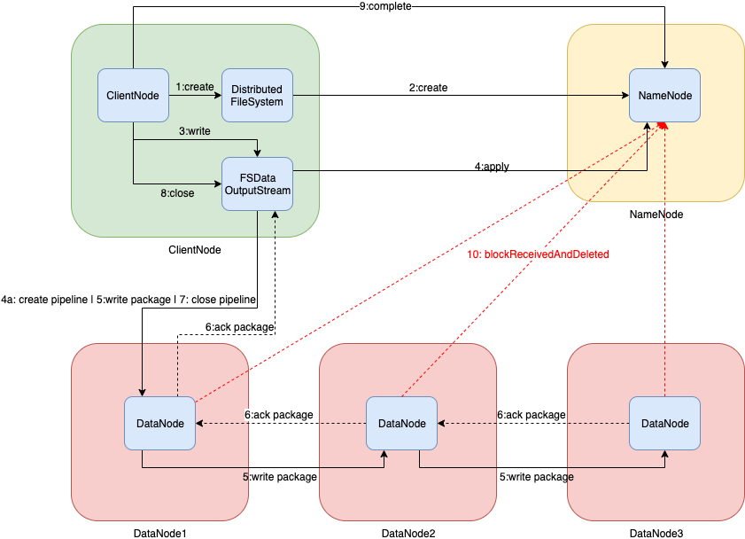
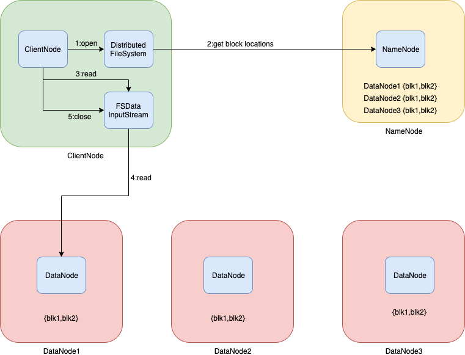
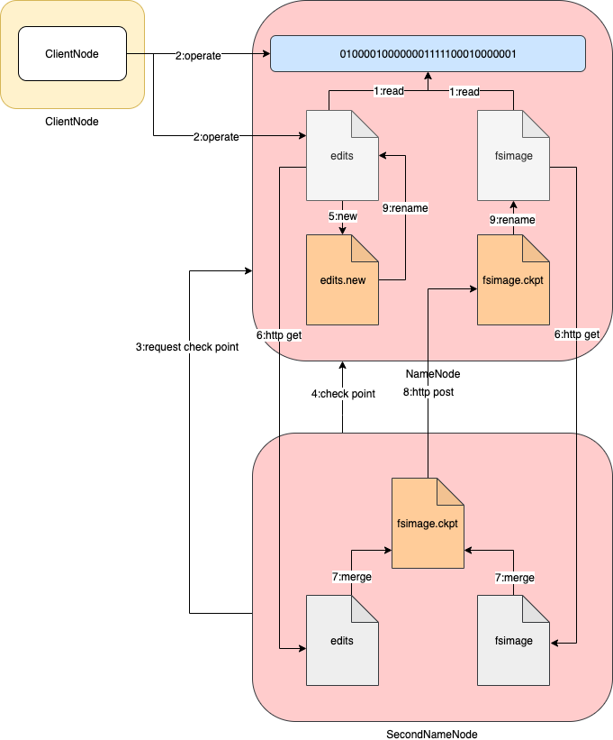
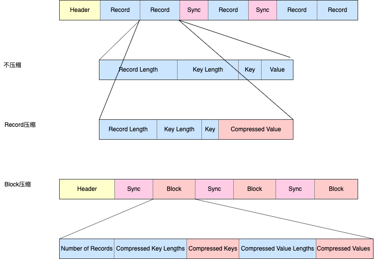

# hdfs优缺点

## 优点

- 高容错性

1. 数据自动保存多个副本；
2. 某一个副本丢失后，可以自动恢复。

- 适合批处理

1. 它是通过移动计算而不是移动数据；
2. 它会把数据位置暴露给计算框架。

- 适合大数据处理

1. 数据规模，可以处理数据规模达到GB、TB、甚至PB级别的数据；
2. 文件规模，能够处理百万级别规模以上的文件数量；
3. 节点规模：能够处理10K节点的规模。

- 流式数据访问

1. 一次写入，多次读取，不能修改，只能追加；
2. 它能保证数据的一致性。

- 可构建在廉价机器上，通过多副本机制，提高可靠性

1. 它通过多副本机制，提高可靠性；
2. 它提供了容错和恢复机制。比如某一个副本丢失，可以通过其它副本来恢复。

## 缺点

- 不适合低延时数据访问，比如毫秒级的数据访问

1. 不适合毫秒级的数据访问；

2. 它适合高吞吐率的场景，就是在某一时间内写入大量的数据。

- 无法高效的对大量小文件进行存储

1. 存储大量小文件，会占用NameNode大量内存存储元数据。但NameNode的内存总是有限的；
2. 小文件存储的寻址时间会超过读取时间，违反了HDFS的设计目标。

- 不支持并发写入、文件随机修改

1. 一个文件只能有一个线程写，不允许多个线程同时写；
2. 仅支持数据append，不支持文件的随机修改。


# hdfs写入流程

## 概述




写入本地file文件，假设文件200M，则共有2个块，block1为128M（hdfs默认块大小为128M），block2为72M。默认三个副本。

1. ClientNode向HDFS写入数据，先调用DistributedFileSystem的 `create` 方法获取FSDataOutputStream。
2. DistributedFileSystem调用NameNode的 `create` 方法，发出文件创建请求。NameNode对待上传文件名称和路径做检验，如上传文件是否已存在同名目录，文件是否已经存在，递归创建文件的父目录（如不存在）等。并将操作记录在edits文件中。
3. ClientNode调用FSDataOutputStream向输出流输出数据（假设先写block1）。
4. FSDataOutputStream调用NameNode的 `addBlock` 方法申请block1的blockId和block要存储在哪几个DataNode（假设DataNode1，DataNode2和DataNode3）。若pipeline还没有建立，则根据位置信息建立pipeline。
5. 同返回的第一个DataNode节点DataNode1建立socket连接，向其发送package。同时，此package会保存一份到ackqueue确认队列中。

   - 写数据时先将数据写到一个校验块chunk中，写满512字节，对chunk计算校验和checksum值（4字节）。
   - 以带校验和的checksum为单位向本地缓存输出数据（本地缓存占9个chunk），本地缓存满了向package输入数据，一个package占64kb。
   - 当package写满后，将package写入dataqueue数据队列中。
   - 将package从dataqueue数据对列中取出，沿pipeline发送到DataNode1，DataNode1保存，然后将package发送到DataNode2，DataNode2保存，再向DataNode3发送package。DataNode3接收到package，然后保存。
6. package到达DataNode3后做校验，将校验结果逆着pipeline回传给ClientNode。

   - DataNode3将校验结果传给DataNode2，DataNode2做校验后将校验结果传给DataNode1，DataNode1做校验后将校验结果传给ClientNode。
   - ClientNode根据校验结果判断，如果”成功“，则将ackqueue确认队列中的package删除；如果”失败“，则将ackqueue确认队列中的package取出，重新放入到dataqueue数据队列末尾，等待重新沿pipeline发送。
7. 当block1的所有package发送完毕，即DataNode1、DataNode2和DataNode3都存在block1的完整副本，ClientNode关闭同DataNode建立的pipeline。如果文件仍存在未发送的block2，则继续执行4、5和6。直到文件所有数据传输完成。

8. 全部数据输出完成，调用FSDataOutputStream的 `close` 方法。
9. ClientNode调用NameNode的 `complete` 方法，通知NameNode全部数据输出完成。
10. 三个DataNode周期性（默认5分钟）分别调用NameNode的 `blockReceivedAndDeleted`方法，增量报送数据块状态。NameNode会更新内存中DataNode和block的关系。


## 容错

假设当前构建的pipeline是DataNode1、DataNode2和DataNode3。当数据传输过程中，DataNode2中断无法响应，则当前pipeline中断，需要重建。

1. 先将ackqueue中的所有package取出放回到dataqueue末尾。
2. ClientNode调用NameNode的 `updateBlockForPipeline` 方法，为当前block生成新的版本，如ts1（本质是时间戳），然后将故障DataNode2从pipeline中删除。
3. FSDataOutputStream调用NameNode的 `getAdditionalDataNode` 方法，由NameNode分配新的DataNode，假设是DataNode4。
4. FSDataOutputStream把DataNode1、DataNode3和DataNode4建立新的pipeline，DataNode1和DataNode3上的block版本设置为ts1，通知DataNode1或DataNode3将block拷贝到DataNode4。
5. 新的pipeline创建好后，FSDataOutputStream调用NameNode的 `updataPipeline` 方法更新NameNode元数据。之后，按照正常的写入流程完成数据输出。
6. 后续，当DataNode2从故障中恢复。DataNode2向NameNode报送所有block信息，NameNode发现block为旧版本（非ts1），则通过DataNode2的心跳返回通知DataNode2将此旧版本的block删除。


# hdfs读取流程

## 概述




获取file文件，假设文件200M，则共有2个块，block1为128M（hdfs默认块大小为128M），block2为72M。默认三个副本。

1. ClientNode调用DistributedFileSystem的 `open` 方法获取FSDataInputStream。
2. DistributedFileSystem向NameNode发出请求获取file文件的元数据，包括所有块所在的DataNode的位置信息。
3. ClientNode调用FSDataInputStream获取数据流。
4. FSDataInputStream调用就近DanaNode获取block1。DanaNode开始传输数据给客户端，从磁盘里面读取数据输入流，以Packet为单位来做校验。ClientNode以Packet为单位接收数据，先在本地缓存，然后写入目标文件。
   - 文件仍存在未读取的block2，则继续执行4。直到文件所有数据读取完成。
5. 全部数据接收完成，关闭数据流FSDataInputStream。


# NN和SNN功能剖析

## 概述

NameNode对集群中元数据进行管理，外围节点需要频繁随机存取元数据。

如何支持快速随机存取？因此需要把元数据存储在内存中。但内存中的数据在服务器断电后就会丢失，所以内存中的元数据需要被持久化。

持久化哪里？持久化到文件系统中，存储为fsimage文件。随着时间的流逝，fsimage文件会变得越来越庞大，同时对内存和fsimage元数据的增、删、改、查操作，fsimage文件的大小就会成为存取速度的瓶颈。

如何优化？引入edits日志文件。fsimage为某一时间节点的全量元数据，而edits日志为最新元数据。也就是说，Namenode同时对内存和edits日志进行操作。

之后又会出现edits日志越来越大，以及如何同fsimage合并的问题？系统引入了SecondNameNode，其负责将edits日志和fsimage合并，然后将最新的fsimage推送给NameNode，而NameNode则是向最新生成的edits日志文件写入元数据。


## 工作机制




1. 如果NameNode是首次启动，则需要格式化HDFS，生成fsimage和edits；否则，启动时读取fsimage和edits到内存中初始化元数据。

2. ClientNode向NameNode发起元数据操作请求（增删改查），NameNode将元数据先写入edits（<font color=red>防止NameNode挂掉，内存中元数据丢失导致客户端无法访问数据</font>），再写入内存中。

3. SecondNameNode向NameNode定时发起请求确认是否需要checkpoint。如果满足到达设置定时时间间隔或edits文件写满，则发起checkpoint请求；否则，继续等待。

   - checkpoint需满足条件：
     - 时间达到一个小时fsimage与edits就会进行合并  `dfs.namenode.checkpoint.period 3600s`
     - hdfs操作达到1000000次也会进行合并  `dfs.namenode.checkpoint.txns 1000000`

   - 检查间隔

     - 每隔多长时间检查一次hdfs  `dfs.namenode.checkpoint.check.period 60s`

4. 请求执行check point。
5. NameNode滚动生成新的edits.new文件，后续ClientNode对元数据操作请求都记录到edits.new文件中。
6. SecondNameNode通过http get获取NameNode滚动前的edits和fsimage文件。
7. SecondNameNode将fsimage读入内存，逐条执行edits，合并生成fsimage.ckpt文件。
8. SecondNameNode通过http post将fsimage.ckpt文件发送到NameNode上。
9. NameNode将fsimage.ckpt改名为fsimage（此文件为此刻全量元数据，待后续NameNode重启加载），将edits.new改名为edits。同时，会更新fstime。


# DataNode工作机制和数据存储

## 工作机制

- 一个数据块在DataNode上以文件形式存储在磁盘上，包括两个文件：一个是数据本身，一个是元数据包括数据块的长度，数据块的校验和，以及时间戳。
- DataNode启动后向NameNode注册，通过后则周期性（6小时）的向NameNode上报所有的块信息。
- 心跳是每3秒一次，心跳返回结果带有NameNode给该DataNode的命令。如复制块数据到另一台机器，或删除某个数据块。如果超过10分钟没有收到某个DataNode的心跳，则认为该节点不可用。
- 集群运行中可以安全加入和退出一些机器。


## 数据完整性

- 当Client读取DataNode上block的时候，会计算checksum。如果计算后的checksum，与block创建时值不一样，说明block已经损坏。这时Client需要读取其他DataNode上的block。
- DataNode在其文件创建后周期验证checksum。


## 掉线参数设置

DataNode进程死亡或者网络故障造成DataNode无法与NameNode通信，NameNode不会立即把该节点判定为死亡，要经过一段时间，这段时间暂称作超时时长。HDFS默认的超时时长为10分钟+30秒。如果定义超时时间为timeout，则超时时长的计算公式为：

timeout  = 2 * dfs.namenode.heartbeat.recheck-interval + 10 * dfs.heartbeat.interval

```xml
dfs.namenode.heartbeat.recheck-interval 300000ms
dfs.heartbeat.interval 3s
```


# 小文件治理

## 概述

hdfs中文件以block存储在DataNode中，而所有文件的元数据全部存储在NameNode的内存中。无论文件大小，都会占用NameNode元数据的内存存储空间，大约占用150K左右。所以，系统中如果有大量小文件的话，会出现DataNode的磁盘容量没有充分利用，而NameNode的内存却被大量消耗，然而NameNode的内存是有容量限制的。所以，需要对小文件治理。

- 占用NameNode的内存空间
- 索引文件过大使得索引速度变慢


## HAR方案

本质启动MapReduce，因此需要首先启动Yarn。

- 创建归档文件

```bash
# -archiveName 档案名称
# -p 父目录
# <src>* 相对于父目录的相对路径
# <dest> 存储档案名称的路径
hadoop archive -archiveName data.har -p /main data data1 data2 /main

# 源文件不会删除
```


- 查看归档文件

```bash
# 显示归档包含文件
# 归档文件的类型是d，即目录
# -R 递归列出目录内容
hdfs dfs -ls -R /main/data.har

# 显示归档包含实际内容
hdfs dfs -ls -R har:///main/data.har
```


- 解压归档文件

```bash
# -p  如果目录已经存在，不会失败
hdfs dfs -mkdir -p /main/out
hdfs dfs -cp har:///main/data.har/* /main/out
```


## SequenceFile方案

- SequenceFile是由record构成（二进制），每个record是由键值对构成，其中文件名作为record的key，而文件内容作为record的value。Record间随机插入Sync，方便定位到Record的边界。

- SequenceFile是可以分割的，所以可以利用MapReduce切分，独立运算。

- HAR不支持压缩，而SequenceFile支持压缩。支持两类压缩：

  - Record压缩
  - Block压缩，一次性压缩多条Record作为一个Block；每个Block开始处都需要插入Sync
  - 当不指定压缩算法时，默认使用zlib压缩
  - 无论是否压缩，采用何种算法，均可使用 `hdfs dfs -text` 命令查看文件内容

  <font color=red>一般情况下，以Block压缩为最好选择</font>。因为一个Block包含多条Record，利用Record间的相似性进行压缩，压缩效率更高。




- 把已有小文件转存为SequenceFile较慢，相比先写小文件，再写SequenceFile而言，直接将数据写入SequenceFile是更好的选择，省去小文件作为中间媒介。


## CombineTextInputFormat方案

可以将多个小文件合并为一个逻辑split，对应一个MapTask进行处理，避免启动大量MapTask


## JVM重用方案

对于大量小文件，开启JVM重用可以减少45%运行时间。通过参数 `mapreduce.job.jvm.numtasks` 控制，默认1，即一个JVM运行一个task；当设置为-1时，则没有限制；一般可设置在10~20之间。