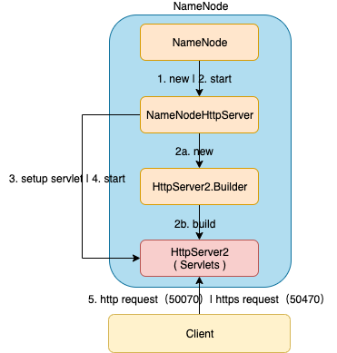
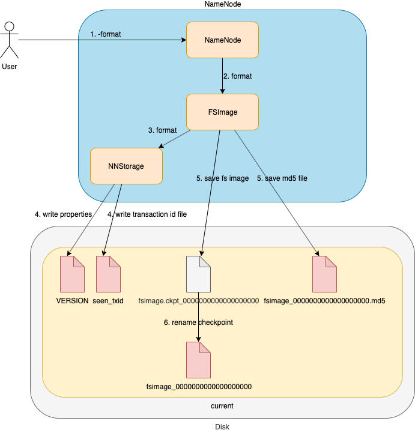
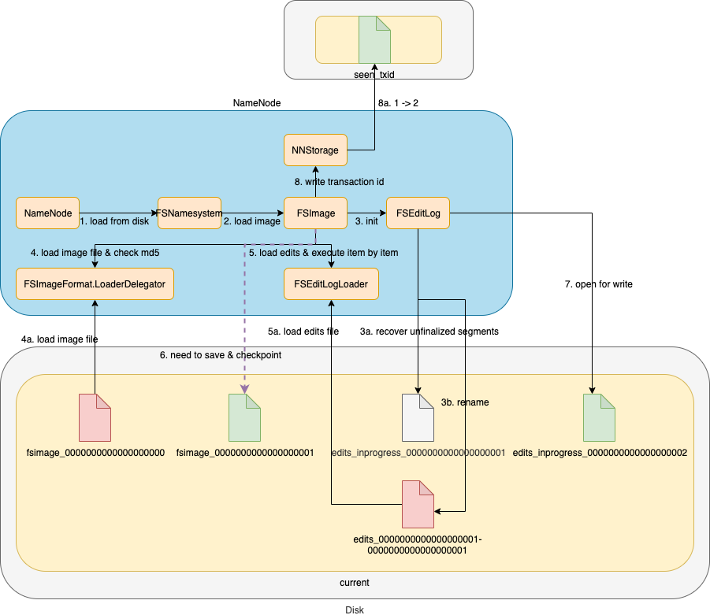
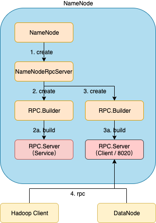
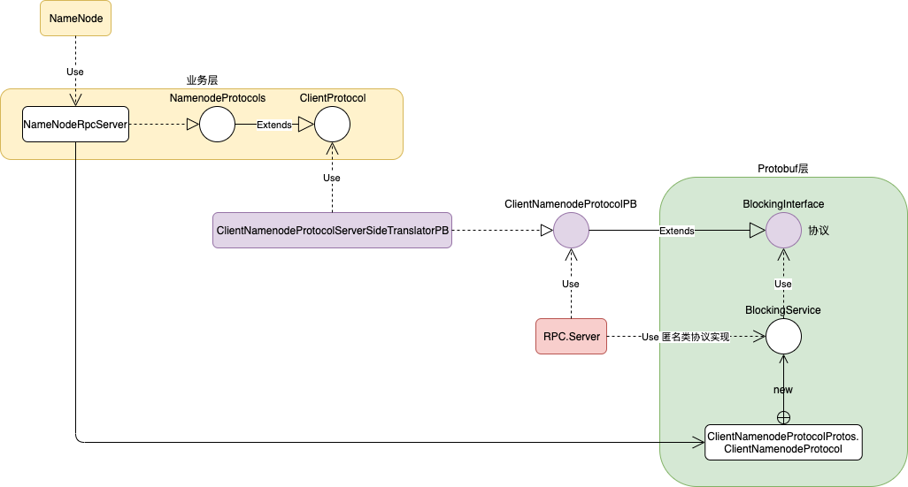
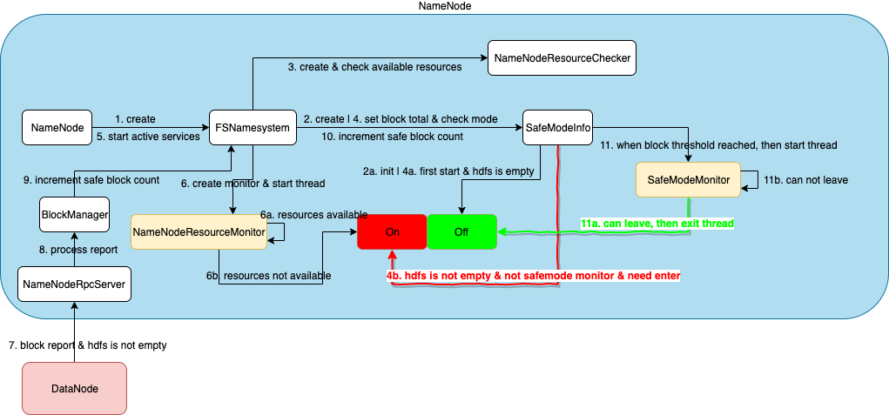
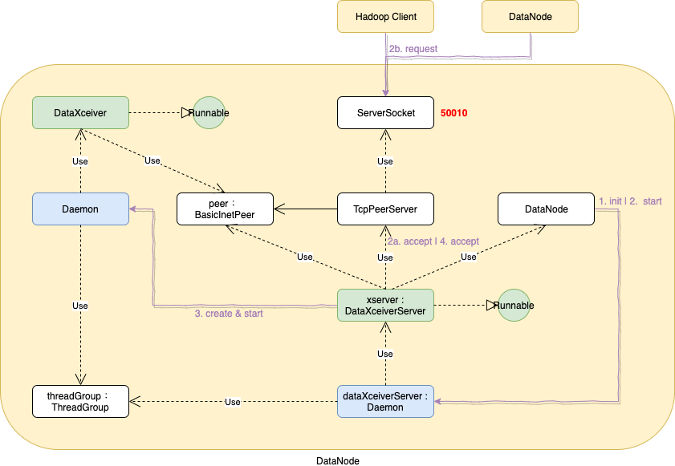
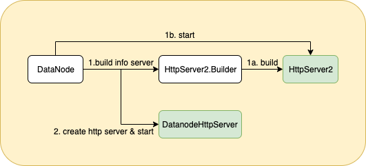
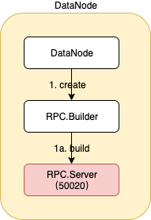
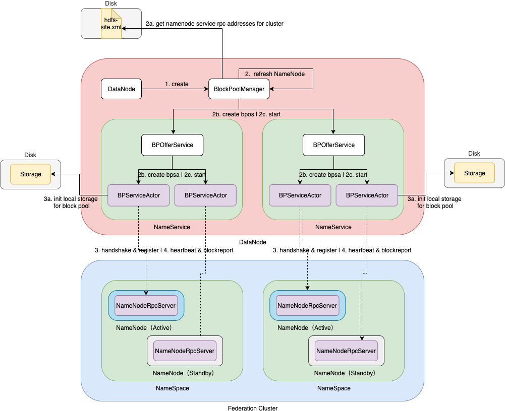

# 编译源码

在Mac OS环境下编译hadoop2.7.0

## 下载源码

```shell
git clone https://github.com/sciatta/hadoop.git
```


## 切换到目标版本

```shell
cd hadoop
git checkout -b work-2.7.0 release-2.7.0
```


## 安装依赖

### JDK

```shell
# 安装
jdk-8u231-macosx-x64.dmg

# 配置环境变量
# Mac使用的是iTerm2
vi ~/.zshrc

export JAVA_HOME=/Library/Java/JavaVirtualMachines/jdk1.8.0_231.jdk/Contents/Home
export PATH=$JAVA_HOME/bin:$PATH

# 立即生效
source ~/.zshrc
```

### Maven

```shell
# 安装
apache-maven-3.0.5-bin.tar.gz

tar -zxvf apache-maven-3.0.5-bin.tar.gz -C ../install/

# 配置环境变量
export MAVEN_HOME=/Users/yangxiaoyu/work/install/apache-maven-3.0.5
export PATH=$MAVEN_HOME/bin:$PATH

# 立即生效
source ~/.zshrc

# 修改镜像地址
cd /Users/yangxiaoyu/work/install/apache-maven-3.0.5/conf
vi settings.xml
# 增加
<mirror>
    <id>aliyunmaven</id>
    <mirrorOf>*</mirrorOf>
    <name>阿里云公共仓库</name>
    <url>https://maven.aliyun.com/repository/public</url>
</mirror>
```

### ProtocolBuffer 2.5.0

```shell
# 安装
protobuf-2.5.0.tar.gz

tar -zxvf protobuf-2.5.0.tar.gz -C ../install/

# 执行
cd /Users/yangxiaoyu/work/install/protobuf-2.5.0
./configure

# 编译
make && make install

# 验证安装情况
# libprotoc 2.5.0
protoc --version
```

### cmake

```shell
# 安装
brew install cmake
```

### openssl

```shell
# 安装
brew install openssl

# 配置环境变量
# hadoop2.7.0不支持高版本openssl@1.1/1.1.1g
export OPENSSL_ROOT_DIR=/usr/local/Cellar/openssl/1.0.2n
export OPENSSL_INCLUDE_DIR=/usr/local/Cellar/openssl/1.0.2n/include

# 立即生效
source ~/.zshrc
```


## 编译

```shell
# 编译
# -P 执行profile
mvn package -Pdist,native -DskipTests -Dtar

# 成功后生成文件
/Users/yangxiaoyu/work/bigdata/project/hadoop/hadoop-dist/target/hadoop-2.7.0.tar.gz

# 编译指定模块
mvn package -Pnative -DskipTests -pl hadoop-hdfs-project/hadoop-hdfs
```


# 项目配置

基于IEDA开发环境

## 导入项目

`open | 打开hadoop项目目录` 成功后自动识别Maven模块。

## 修正项目

### 修正hadoop-streaming引用错误conf问题

修改hadoop-streaming模块

- 将hadoop-yarn-server-resourcemanager模块下的conf文件夹转移到hadoop-streaming模块下

- 修改pom.xml

  ```xml
  <testResource>
    <!-- 修改相对路径 -->
  	<directory>${basedir}/conf</directory>
  	<includes>
  		<include>capacity-scheduler.xml</include>
  	</includes>
  	<filtering>false</filtering>
  </testResource>
  ```


### 修正Debug无法找到类的问题

`Run | Edit Configurations... | Application | NameNode`

选择 Include dependencies with “Provided” scope


### 修正hadoop-hdfs模块无法正常打印log4j日志

target/classes目录下新建log4j.properties

```properties
log4j.rootLogger=info,stdout
log4j.threshhold=ALL
log4j.appender.stdout=org.apache.log4j.ConsoleAppender
log4j.appender.stdout.layout=org.apache.log4j.PatternLayout
log4j.appender.stdout.layout.ConversionPattern=%d{ISO8601} %-5p %c{2} (%F:%M(%L)) - %m%n
```


### 修正hadoop-hdfs模块自定义用户配置

- target/classes目录下新建hdfs-site.xml

  ```xml
  <?xml version="1.0" encoding="UTF-8"?>
  <?xml-stylesheet type="text/xsl" href="configuration.xsl"?>
  
  <configuration>
      <property>
          <name>dfs.namenode.http-address</name>
          <value>localhost:50070</value>
          <description>
              The address and the base port where the dfs namenode web ui will listen on.
          </description>
      </property>
  </configuration>
  ```

- target/classes目录下新建core-site.xml

  ```xml
  <?xml version="1.0" encoding="UTF-8"?>
  <?xml-stylesheet type="text/xsl" href="configuration.xsl"?>
  
  <configuration>
      <property>
          <name>fs.defaultFS</name>
          <value>hdfs://localhost:8020</value>
          <description>The name of the default file system.  A URI whose
              scheme and authority determine the FileSystem implementation.  The
              uri's scheme determines the config property (fs.SCHEME.impl) naming
              the FileSystem implementation class.  The uri's authority is used to
              determine the host, port, etc. for a filesystem.</description>
      </property>
  </configuration>
  ```


### 修正类路径无法找到webapps/hdfs

将src/main/webapps复制一份到target/classes目录


### 修正NameNodeRpcServer找不到类ClientNamenodeProtocol的问题

因为ClientNamenodeProtocol所在的类ClientNamenodeProtocolProtos过大，idea无法加载。

`Help | Edit Custom Properties... | Create`

idea.properties

```properties
idea.max.intellisense.filesize=5000
```

重启idea。


# 启动脚本

## start-dfs.sh

在主节点执行 `start-dfs.sh` ，分别可在主节点启动NameNode，以及在配置的从节点启动DataNode

- 包含 `hadoop-config.sh` 导出环境配置变量
  - 包含 `hadoop-layout.sh`
  - 包含 `hadoop-env.sh` 导出环境变量，如：JAVA_HOME，可以避免ssh登录后执行的JAVA_HOME不正确的问题
  - 消费选项
    - `--config`
    - `--loglevel`
    - `--hosts` 或 `--hostnames`

- <font color=red>启动NameNode</font>

  - 调用 `hadoop-daemons.sh` ，传入参数

    ```shell
    # hostnames是NameNode节点名称
    --config "$HADOOP_CONF_DIR" \
    --hostnames "$NAMENODES" \
    --script "$bin/hdfs" start namenode $nameStartOpt
    ```

- <font color=red>启动DataNode</font>
  - 调用 `hadoop-daemons.sh` ，传入参数

    ```shell
    --config "$HADOOP_CONF_DIR" \
    --script "$bin/hdfs" start datanode $dataStartOpt
    ```


### hadoop-daemons.sh

- 包含 `hadoop-config.sh` 

  - 对于启动NameNode会消费 `--hostnames` 解析出NameNode的节点名称，赋予变量HADOOP_SLAVE_NAMES

- 调用 `slaves.sh` ，传入参数

  ```shell
  # 命令间加 \; ssh登录后，才可以正常执行命令
  --config $HADOOP_CONF_DIR cd "$HADOOP_PREFIX" \; "$bin/hadoop-daemon.sh" --config $HADOOP_CONF_DIR "$@"
  ```


### slaves.sh

- 包含 `hadoop-config.sh` 

- 包含 `hadoop-env.sh` 

- 获取节点（NameNode或DataNode）名称并遍历，<font color=red>ssh远程登录后</font>，执行 `cd` 命令 并 调用 `hadoop-daemon.sh`，传入参数

  ```shell
  # $@不包含消费的参数
  --config $HADOOP_CONF_DIR "$@"
  ```

  - 对于启动NameNode，通过HADOOP_SLAVE_NAMES，获取NameNode节点名称
  - 对于启动DataNode，通过slaves文件获取DataNode节点名称


### hadoop-daemon.sh

- 包含 `hadoop-config.sh` 

- 消费选项

  - `--script`

- 包含 `hadoop-env.sh` 

- 启动

  - NameNode

    - 调用 `hdfs` ，传入参数

      ```shell
      --config $HADOOP_CONF_DIR $command "$@"
      ```

  - DataNode（同NameNode）

- 停止

  - NameNode
    - kill
  - DataNode（同NameNode）


###hdfs

- 包含 `hadoop-config.sh` 
- NameNode
  - 入口类 `org.apache.hadoop.hdfs.server.namenode.NameNode` ，启动NameNode服务
- DataNode
  - 入口类 `org.apache.hadoop.hdfs.server.datanode.DataNode` ，启动DataNode服务


# NameNode

## NameNodeHttpServer

对外提供HTTP服务，用户可以通过浏览器访问元数据、文件和日志等。



1. NameNode创建NameNodeHttpServer实例

2. NameNode调用NameNodeHttpServer的start方法

   - 创建HttpServer2.Builder，由其构建HttpServer2，创建嵌入式Jetty服务

3. NameNodeHttpServer为HttpServer2配置相关servlet

   - /startupProgress 对应 StartupProgressServlet.class
   - /getDelegationToken 对应 GetDelegationTokenServlet.class
   - /renewDelegationToken 对应 RenewDelegationTokenServlet.class
   - /cancelDelegationToken 对应 CancelDelegationTokenServlet.class
   - /fsck 对应 FsckServlet.class
   - /imagetransfer 对应 ImageServlet.class
   - /listPaths/* 对应 ListPathsServlet.class
   - /data/* 对应 FileDataServlet.class
   - /fileChecksum/* 对应 FileChecksumServlets.RedirectServlet.class
   - /contentSummary/* 对应 ContentSummaryServlet.class

   <font color=red>注意：此处可以扩展自定义servlet服务。</font>

4. 启动HttpServer2服务

5. 外部用户可以通过http协议访问50070端口或https协议访问50470端口，来获取web服务器提供的servlet服务


## FSNamesystem

### 目录结构


### 格式化



### 加载镜像



## RpcServer

### 启动



1. NameNode创建NameNodeRpcServer，设置RPC Protocol引擎，关联业务层和Protobuf层
2. NameNodeRpcServer创建RPC.Builder，绑定Protocol接口、实现、主机名和端口，构建<font color=red>Service端</font>的RPC.Server，主要监听来自DataNode的请求

   - 从 `hdfs-site.xml` 的参数 `dfs.namenode.servicerpc-address` 获取主机名和端口号。如无法获取，则不会构建Service端的RPC.Server。
3. NameNodeRpcServer创建RPC.Builder，绑定Protocol接口、实现、主机名和端口，构建<font color=red>Client端</font>的RPC.Server，主要监听来自Hadoop客户端的请求

   - 从 `core-site.xml` 的参数 `fs.defaultFS` 获取主机名和端口号。
4. Hadoop客户端和DataNode可以配置 `core-site.xml` 的参数 `fs.defaultFS` 指定具体的主机名和端口号，rpc访问NameNode服务。
   - Datanode
     - 启动：握手、注册
     - 运行：心跳、数据块汇报


### 核心类结构



1. NameNodeProtocols继承自ClientProtocol，是业务层接口，NameNodeRpcServer是其实现类，封装业务层的业务逻辑。
2. 底层Rpc框架使用的是protobuf，由框架自动生成实现BlockingService接口的匿名类，其依赖于BlockingInterface接口的实现类。
3. ClientNamenodeProtocolPB继承BlockingInterface接口，ClientNamenodeProtocolServerSideTranslatorPB是其实现类，其依赖业务层接口ClientProtocol的实现，起到了连接业务层和Protobuf层的作用。
4. 构建RPC.Server，绑定ClientNamenodeProtocolPB接口和BlockingService接口的实现类。
5. RPC.Server收到请求并调用的是<font color=red>ClientNamenodeProtocolPB接口</font>的方法，则将请求委托给相应BlockingService接口的实现类，接着将请求委托给ClientNamenodeProtocolServerSideTranslatorPB，最后将请求委托给NameNodeRpcServer完成NameNode端的业务处理。


## SafeMode



1. NameNode从磁盘加载初始化FSNamesystem

2. 在初始化FSNamesystem实例过程中，会实例化SafeModeInfo，初始化参数：

   - threshold阈值，控制BlockSafe数量。默认0.999。
   - datanodeThreshold阈值，控制DataNode是Active状态的数量。默认0。
   - extension，控制当到达数据块阈值限制，需要达到的稳定时间限制，才会判断是否可以退出SafeMode。默认0。
   - safeReplication，控制BlockSafe的最小副本数。默认1。

   此时 `reached=-1` ，即SafeMode是 `off` 状态。

3. 调用FSNamesystem的startCommonServices方法创建NameNodeResourceChecker实例，初始化参数：

   - volumes，NN存放edits的本地目录，以及其他需要检查的卷。
   - duReserved，控制待检查卷的最小磁盘容量。默认100M。
   - minimumRedundantVolumes，控制最小冗余卷。默认1。

   参数初始化完毕后，对待检查卷进行校验是否存在足够的磁盘空间，以防止edits无法写入导致数据丢失。

4. 调用FSNamesystem的setBlockTotal方法从元数据获取COMPLETE状态的Block数量 `blockTotal` ，以及要达到阈值的数据块数为 `blockTotal*threshold` ，然后调用**checkMode**方法检查SafeMode转态。

   <font color=red>进入安全模式的条件：</font>

   - 数据块阈值不等于0，并且DataNode报送数据块数小于要到达阈值的数据块数
   - DataNode阈值不为0，并且Active状态DataNode数小于DataNode阈值数
   - NN资源不可用

   如果不是首次启动hdfs，并且满足进入安全模式的条件，此时进入安全模式  `reached=0` ，即SafeMode是 `on` 状态。

   <font color=red>离开安全模式的条件：</font>

   - 没有处于安全模式（hdfs is empty），即首次启动，因为还没有数据块产生，所以不满足进入安全模式的条件，此时退出安全模式 `reached=-1` ，即SafeMode是 `off` 状态。
   - 处于安全模式，extension等待时间小于等于0，即不需要等待数据块报送稳定时间，立即退出SafeMode
   - 处于安全模式，extension大于0，阈值小于等于0，即不需要等待DataNode报送，立即退出SafeMode

5. NameNode调用FSNamesystem的startActiveServices方法，调用链 `NameNode->ActiveState.enterState->NameNodeHAContext.startActiveServices->FSNamesystem.startActiveServices()`

6. FSNamesystem创建并启动**NameNodeResourceMonitor**线程，其作用就是对待检查卷进行校验是否存在足够的磁盘空间。

   - 如果有充足磁盘空间，则休眠一段时间后（默认5000ms），持续检查。
   - 如果没有足够磁盘空间，则<font color=red>永久</font>进入安全模式  `reached=0` ，即SafeMode是 `on` 状态。

7. DataNode启动后向NameNode注册，通过RPC服务调用NameNodeRpcServer的blockReport方法报送所有Block

8. NameNodeRpcServer调用BlockManager的processReport方法，累加BlockSafe。遍历所有副本，只统计副本状态是FINALIZED。<font color=red>注意：DataNode向NameNode报送所有Block，NameNode处理的过程是有写锁的，因此会阻塞同时间其他DataNode的报送</font>。

9. BlockManager调用FSNamesystem的incrementSafeBlockCount方法，传入此时该block的副本数

10. FSNamesystem调用SafeModeInfo的incrementSafeBlockCount方法，传入此时该block的副本数，如果此时的副本数满足 `safeReplication` ，则累加报送数据块数BlockSafe。同时，调用**checkMode**方法检查是否满足退出安全模式条件。如果不满足，则继续等待其他DataNode报送Block

11. 一旦checkMode方法检查当前不满足进入安全模式的条件，则会设置 `reached` 为不满足进入安全模式的时间。然后启动**SafeModeMonitor**线程监控是否可以离开安全模式。其作用就是如果数据块报送没有到达extension稳定时间限制，则不允许离开安全模式。

    - 当数据块报送到达稳定时间限制，并且不满足进入安全模式条件，则可以退出安全模式 `reached=-1` ，即SafeMode是 `off` 状态。同时，SafeModeMonitor线程退出。
    - 否则，线程持续运行检查。


# DataNode

## DataXceiver

DataNode维护了一个server socket，用于同 Hadoop Client 或 其他 DataNode 读写数据



1. DataNode初始化守护线程Daemon实例dataXceiverServer，其执行的工作任务是DataXceiverServer实例xserver，此工作任务线程常驻内存
2. DataNode启动守护线程dataXceiverServer
   - 工作任务xserver开始运行，xserver调用TcpPeerServer实例peerServer的accept方法，其委托ServerSocket监听50010端口，等待Hadoop Client请求而阻塞
   - Hadoop Client 或 其他 DataNode 向DataNode发送数据，peerServer将ServerSocket返回的socket封装为BasicInetPeer实例peer传递给xserver
3. xserver将请求peer分配守护线程并启动，其执行的工作任务是DataXceiver实例，负责读写数据
4. xserver继续调用peerServer的accept方法


## HttpServer

向集群内部提供http服务




1. DataNode通过HttpServer2.Builder构建HttpServer2，HttpServer2对jetty封装，提供web容器功能，其端口由系统动态生成。配置内部servlet
   - /streamFile/* 对应 StreamFile
   - /getFileChecksum/* 对应 FileChecksumServlets.GetServlet
   - /blockScannerReport 对应 BlockScanner.Servlet
2. DataNode创建DatanodeHttpServer，DatanodeHttpServer对netty封装，提供并发性更高的网络通信框架，其http端口是50075，https端口是50475。


## IpcServer



DataNode通过RPC.Builder创建RPC.Server实例ipcServer，默认50020端口。


## BlockPoolManager

BlockPoolManager负责管理DataNode的BPOfferService对象，所有操作BPOfferService对象的操作必须通过BlockPoolManager类。BPOfferService的BPServiceActor线程负责同NameNode握手、注册、心跳以及数据块汇报。DataNode可以通过同对应NameNode握手返回相应namespace信息初始化对应blockpool的本地storage。



1. DataNode创建BlockPoolManager，其管理DataNode的BPOfferService对象
2. BlockPoolManager刷新NameNode
   - 以此格式 `<ns id, <nn id, socket ddress>>` 通过**配置文件**获取集群NameNode通信地址，其中配置文件中NameService的参数为
     - `dfs.nameservices` 获取NameService配置nsid
     - `dfs.ha.namenodes.nsid` 获取NameService下NameNode节点配置nnid，包括active和standby两个NameNode配置
     - `dfs.namenode.rpc-address.nsid.nnid` 获取指定NameNode节点的rpc通信地址
   - 以配置为基准，BlockPoolManager遍历nameservice分别创建BPOfferService，BPOfferService遍历NameService下配置的NameNode节点分别创建BPServiceActor，其最终负责同 active 或 standby NameNode 进行rpc访问
   - 启动所有BPServiceActor线程
3. BPServiceActor线程首次运行，同NameNode握手和注册
   - 同NameNode握手获取namespace，比较版本信息；此时，DataNode就可以初始化blockpoolid对应的storage
   - 向NameNode注册
4. BPServiceActor线程持续运行，向NameNode定时发送心跳和数据块汇报
   - 默认每3秒一次向NameNode发送心跳，NameNode回传需要DataNode执行的命令
   - 数据块汇报
     - 增量数据块报送，包括三种状态的数据块：1、正在接收；2、已接收；3、删除。默认5分钟报送一次；若报送不成功，则不需要等待，下一次直接报送
     - 全量数据块报送，NameNode回传需要DataNode执行的命令。默认6小时一次全量数据块报送
     - 缓冲数据块报送，NameNode回传需要DataNode执行的命令。默认10秒一次缓存数据块报送


