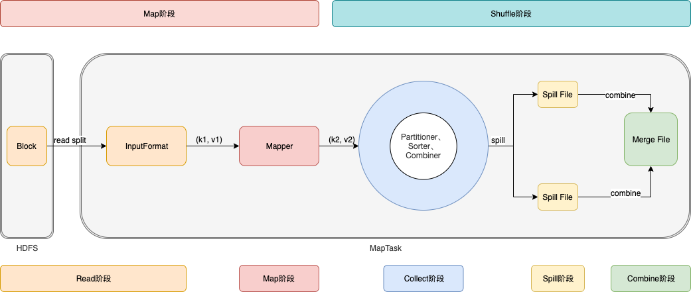
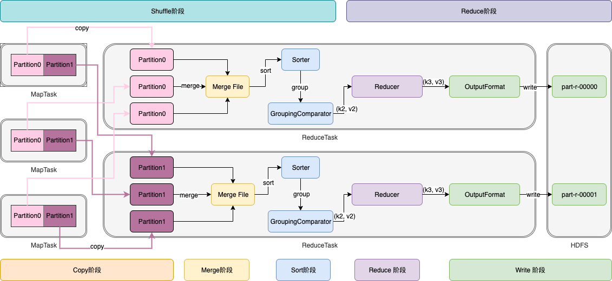

# 概述

MapReduce的核心思想是“<font color=red>分而治之</font>”，把大任务分解为小任务并行计算。Map负责“分”，即把复杂的任务分解为若干个“简单的任务”来并行处理。<font color=red>可以进行拆分的前提是这些小任务可以并行计算，彼此间几乎没有依赖关系</font>。Reduce负责“合”，即对Map阶段的结果进行全局汇总。


# 编程模型

## Map阶段

**第一步：InputFormat**

设置InputFormat类，以split作为输入单位，将数据切分成 (key, value) 输出。本质是把大任务拆分为互相独立的小任务。如TextInputFormat，输入的是split（默认大小和block一样），输出的key是行偏移位置，value是每行的内容。

| InputFormat             | 描述                                                         |
| ----------------------- | ------------------------------------------------------------ |
| TextInputFormat         | 1、默认将每个block作为一个split；2、输出的key是行偏移位置，value是每行的内容 |
| CombineTextInputFormat  | 1、解决小文件导致过多split的问题。涉及到虚拟存储和切片过程，可以自定义split大小；2、输出的key是行偏移位置，value是每行的内容 |
| KeyValueTextInputFormat | 1、默认将每个block作为一个split；2、以自定义分隔符进行分割，输出相应的key和value；注意默认情况下分隔符只会取第一个字符 |
| NLineInputFormat        | 1、以输入文件的N行作为一个split；2、输出的key是行偏移位置，value是每行的内容 |

InputFormat输入格式类

- InputSplit输入分片类：InputFormat输入格式类将输入文件分成一个个分片InputSplit；每个MapTask对应一个split分片
- RecordReader记录读取器类：：读取分片数据，一行记录生成一个键值对


**第二步：MapTask**

自定义map逻辑，对输入的 (key, value) 进行处理，转换成新的 (key, value) 进行输出。本质是把小任务拆分为最小可计算任务。例如统计单词数量，MapTask输入的key是行偏移位置，value是每行的内容。可以进一步拆分单行的内容，输出的key是一个单词，value是1。后面把所有相同单词的value累加，即为一个单词出现的数量。最后汇总所有单词即可。


## Shuffle阶段

**第三步：Partition**

对输入的 (key, value) 进行分区。<font color ="red">满足条件的key</font>划分到一个分区中，一个分区发送到一个ReduceTask。

如果指定6个分区，而ReduceTask的个数是3，则会出现异常；

如果指定6个分区，而ReduceTask的个数是9，则后3个ReduceTask没有数据输入。


**第四步：Order**

排序是MapReduce框架中最重要的操作之一。

MapTask和ReduceTask均会对数据<font color=red>按照key</font>进行排序。该操作属于Hadoop的默认行为。任何应用程序中的数据均会被排序，而不管逻辑上是否需要。默认排序是按照字典顺序排序，且实现该排序的方法是快速排序。

对于MapTask，它会将处理的结果暂时放到环形缓冲区中，当环形缓冲区使用率达到一定阈值后，再对缓冲区中的数据进行一次快速排序，并将这些有序数据溢写到磁盘上，而当数据处理完毕后，它会对磁盘上所有文件进行归并排序。

对于ReduceTask，它从每个MapTask上远程拷贝相应的数据文件，如果文件大小超过一定阈值，则溢写磁盘上，否则存储在内存中。如果磁盘上文件数目达到一定阈值，则进行一次归并排序以生成一个更大文件；如果内存中文件大小或者数目超过一定阈值，则进行一次合并后将数据溢写到磁盘上。当所有数据拷贝完毕后，ReduceTask统一对内存和磁盘上的所有数据进行一次归并排序。

各种排序的分类：

- 部分排序

MapReduce根据输入记录的键对数据集排序。保证输出的每个文件内部有序

- 全排序

最终输出结果只有一个文件，且文件内部有序。实现方式是只设置一个ReduceTask。但该方法在处理大型文件时效率极低，因为一台机器处理所有文件，完全丧失了MapReduce所提供的并行架构

- 辅助排序

在Reduce端对key进行分组。应用于：在接收的key为bean对象时，想让一个或几个字段相同（全部字段比较不相同）的key进入到同一个reduce方法时，可以采用分组排序。

- 二次排序

在自定义排序过程中，如果compareTo中的判断条件为两个即为二次排序。


**第五步：Combine**

对分区后的数据进行规约(combine操作)，降低数据的网络拷贝（可选步骤）

Combiner的父类是Reducer，区别在于Combiner是在MapTask节点运行，而Reduce在ReduceTask节点运行，接收全局所有MapTask的输出结果。Combiner的意义在于对MapTask的输出做局部汇总，减少网络传输量。但Combiner应用的前提是不影响最终的业务逻辑。


**第六步：Group**

对排序后的数据进行分组，将<font color="red">相同key</font>的value放到一个集合当中。

GroupingComparator是MapReduce当中reduce端的一个功能组件，主要的作用是决定哪些数据作为一组，调用一次reduce的逻辑，默认是每个不同的key作为多个不同的组，每个组调用一次reduce逻辑，我们可以自定义GroupingComparator实现不同的key作为同一个组，调用一次reduce逻辑。


## Reduce阶段

**第七步：ReduceTask**

自定义Reduce逻辑，对输入的 (key, value) 进行处理，转换成新的 (key, value) 进行输出


**第八步：OutputFormat**

设置Outputformat将输出的 (key, value) 保存到文件中


# MapTask工作机制

## MapTask个数

**MapTask的并行度是由什么决定的？**

在MapReduce中<font color=red>每个MapTask处理一个切片split的数据量</font>，注意block是hdfs系统存储数据的单位，而切片是每个MapTask处理数据量单位。

block：hdfs在物理上把文件数据切分成一块一块。

split：是逻辑上对输入进行切片，并不会影响磁盘文件。

- <font color=red>一个job的Map阶段的并行度是由客户端提交job时的切片数决定的</font>
- 每一个切片分配一个MapTask并行处理
- 默认情况下，切片大小和block大小相等
- 切片时不考虑数据整体，而是针对单个文件单独切片

切片大小的计算公式：`Math.max(minSize, Math.min(maxSize, blockSize));` 其中，

`mapreduce.input.fileinputformat.split.minsize=1` 

`mapreduce.input.fileinputformat.split.maxsize= Long.MAXValue` 

block的默认大小是128M，所以split的默认大小是128M，同block的大小一致。

如果要控制split的数量，则只需要改变minsize或maxsize就可以改变切片的大小。如果自定义split大于128M，minsize要大于128M；如果自定义split小于128M，maxsize要小于128M。


**如果有1000个小文件，每个文件在1K-100M之间，默认情况下有1000个block，1000个split，1000个MapTask并行处理，效率如何？**

默认情况下，使用的TextInputFormat按照文件规划切片，不管文件多小（小于128M）都会作为一个单独的切片，启动一个MapTask处理。而启动MapTask所消耗的资源要远大于计算，因此采用TextInputFormat效率极低。<font color=red>通过CombineTextInputFormat来控制小文件的切片数量，可以在逻辑上将多个小文件规划到一个切片中，从而控制MapTask的数量</font>。

CombineTextInputFormat切片机制：

`CombineTextInputFormat.setMaxInputSplitSize(job, 4194304);` // 4m

切片过程包括虚拟存储和切片两步：

- 虚拟存储：将所有小文件依次同`MaxInputSplitSize`参数作比较，使得最后划分的逻辑块都不大于`MaxInputSplitSize`

1. 小于参数，则直接作为一个逻辑块
2. 大于参数，且不大于2倍参数，则均分作为两个逻辑块（防止出现太小的切片）
3. 大于2倍参数，则先按`MaxInputSplitSize`参数切割一个逻辑块，剩下的继续1、2、3步判断

如：`MaxInputSplitSize`设置为4M，输入文件大小为8.02M，满足3，则先划分一个4M的逻辑块，剩下人4.02继续判断；4.02满足2，则均分为两个2.01M的逻辑块。

- 切片：将所有虚拟存储逻辑块依次同`MaxInputSplitSize`参数作比较，<font color=red>使得最后划分的切片接近`MaxInputSplitSize`</font>

1. 如果大于等于 `MaxInputSplitSize` ，则作为一个切片。继续下一个逻辑块开始判断
2. 如果小于 ` MaxInputSplitSize` ，则同下一个虚拟存储逻辑块一起作为一个切片。继续1、2步判断，直到满足条件1或所有虚拟存储逻辑块合并完成

如：`MaxInputSplitSize`设置为4M，有4个小文件大小：1.7M、5.1M、3.4M以及6.8M

虚拟存储为6个逻辑块：1.7M、（2.55M+2.55M）、3.4M、（3.4M+3.4M）

合并为3个切片：（1.7M+2.55M=4.25M）、（2.55M+3.4M=5.95M）、（3.4M+3.4M=6.8M）

测试场景 `MaxInputSplitSize` = 4M

| 测试用例          | 虚拟存储               | 切片                                                         | MapTask |
| ----------------- | ---------------------- | ------------------------------------------------------------ | ------- |
| 10个文件：0.1K    | 10个0.1k的逻辑块       | 1k（<font color=red>只有一个切片，因为所有文件合并后仍小于4M</font>） | 1       |
| 2个文件：8.1M、8K | （4M+2.05M+2.05M）、8K | 4M、（2.05M+2.05M）、8K                                      | 3       |


## 工作机制




Read阶段：InputFormat以split作为输入单位，将数据切分成 (k1, v1) 输出。

Map阶段：将 (k1, v1) 交给用户编写map()函数处理，并产生 (k2, v2) 输出。

Collect阶段：在用户编写map()函数中，当数据处理完成后，一般会调用OutputCollector.collect()输出结果。在该函数内部，<font color=red>它会将生成的 (k2, v2) 分区（调用Partitioner），并写入一个环形内存缓冲区中</font>。

Spill阶段：即“溢写”，当环形缓冲区满80%后，MapTask会将数据写到本地磁盘上，生成一个临时文件。需要注意的是，<font color=red>将数据写入本地磁盘之前，先要对数据进行一次本地排序，并在必要时对数据进行合并、压缩等操作</font>。

- 利用快速排序算法对缓存区内的数据进行排序，排序方式是，先按照分区编号Partition进行排序，然后按照key进行排序。这样，经过排序后，数据以分区为单位聚集在一起，且同一分区内所有数据按照key有序。

- 按照分区编号由小到大依次将每个分区中的数据写入任务工作目录下的临时文件output/spillN.out（N表示当前溢写次数）中。如果用户设置了Combiner，则写入文件之前，对每个分区中的数据进行一次聚集操作。

- 将分区数据的元信息写到内存索引数据结构SpillRecord中，其中每个分区的元信息包括在临时文件中的偏移量、压缩前数据大小和压缩后数据大小。如果当前内存索引大小超过1MB，则将内存索引写到文件output/spillN.out.index中。

Combine阶段：当所有数据处理完成后，MapTask对所有临时文件进行一次合并，以确保最终只会生成一个数据文件。

- 当所有数据处理完后，MapTask会将所有临时文件合并成一个大文件，并保存到文件output/file.out中，同时生成相应的索引文件output/file.out.index。
  - 在合并溢写文件时，如果至少有3个溢写文件，并且设置了map端combine的话，会在合并的过程中触发combine操作；
  - 但是若只有2个或1个溢写文件，则不触发combine操作（因为combine操作，本质上是一个reduce，需要启动JVM虚拟机，有一定的开销）

- 在进行文件合并过程中，MapTask以分区为单位进行合并。对于某个分区，它将采用多轮递归合并的方式。每轮合并io.sort.factor（默认10）个文件，并将产生的文件重新加入待合并列表中，对文件排序后，重复以上过程，直到最终得到一个大文件。

- <font color=red>让每个MapTask最终只生成一个数据文件，可避免同时打开大量文件和同时读取大量小文件产生的随机读取带来的开销</font>。


# ReduceTask工作机制

## ReduceTask个数

ReduceTask的并行度同样影响整个Job的执行并发度和执行效率，但与MapTask的并发数由切片数决定不同，ReduceTask数量的决定是可以直接手动设置：

```java
// 默认值是1，手动设置为4
job.setNumReduceTasks(4);

// 可以设置为0，不需要ReduceTask处理
job.setNumReduceTasks(0);
```


## 工作机制




Copy阶段：ReduceTask启动线程从各个MapTask上远程拷贝一片数据，并针对某一片数据，如果其大小超过一定阈值，则写到磁盘上，否则直接放到内存中。

Merge阶段：在远程拷贝数据的同时，ReduceTask启动了两个后台线程对内存和磁盘上的文件进行合并，以防止内存使用过多或磁盘上文件过多。

Sort：按照MapReduce语义，用户编写reduce()函数输入数据是按key进行聚集的一组数据。为了将key相同的数据聚在一起，Hadoop采用了基于排序的策略。由于各个MapTask已经实现对自己的处理结果进行了局部排序，因此，ReduceTask只需对所有数据进行一次归并排序即可。<font color=red>注意，Merge和Sort两个阶段，交替进行</font>。

Reduce阶段：按照key排序的数据，调用GroupingComparator对数据分组，使得相同key的不同value放到一个集合中，每一组数据 (k2, v2) 只调用一次reduce()函数，输出 (k3, v3) 。

Write阶段：最后由OutputFormat将计算结果写到HDFS上。一个ReduceTask对应一个文件。


# Shuffle中的数据压缩

## 压缩算法

在shuffle阶段，从map阶段输出的数据，都要通过网络拷贝发送到reduce阶段。这一过程，涉及到大量的网络IO，如果数据能够进行压缩，那么数据的发送量就会少很多。

hadoop支持的压缩算法

| 压缩格式 | 工具  | 算法    | 文件扩展名 | 是否可切分 |
| -------- | ----- | ------- | ---------- | ---------- |
| DEFLATE  | 无    | DEFLATE | .deflate   | 否         |
| Gzip     | gzip  | DEFLATE | .gz        | 否         |
| bzip2    | bzip2 | bzip2   | bz2        | 是         |
| LZO      | lzop  | LZO     | .lzo       | 否         |
| LZ4      | 无    | LZ4     | .lz4       | 否         |
| Snappy   | 无    | Snappy  | .snappy    | 否         |

各种压缩算法对应使用的java类

| 压缩格式 | java类                                     |
| -------- | ------------------------------------------ |
| DEFLATE  | org.apache.hadoop.io.compress.DeFaultCodec |
| Gzip     | org.apache.hadoop.io.compress.GZipCodec    |
| bzip2    | org.apache.hadoop.io.compress.BZip2Codec   |
| LZO      | com.hadoop.compression.lzo.LzopCodec       |
| LZ4      | org.apache.hadoop.io.compress.Lz4Codec     |
| Snappy   | org.apache.hadoop.io.compress.SnappyCodec  |

常见的压缩速率比较

| 压缩算法                      | 原始文件大小 | 压缩后的文件大小 | 压缩速度 | 解压缩速度 |
| ----------------------------- | ------------ | ---------------- | -------- | ---------- |
| gzip                          | 8.3GB        | 1.8GB            | 17.5MB/s | 58MB/s     |
| bzip2                         | 8.3GB        | 1.1GB            | 2.4MB/s  | 9.5MB/s    |
| LZO-bset                      | 8.3GB        | 2GB              | 4MB/s    | 60.6MB/s   |
| <font color=red>LZO</font>    | 8.3GB        | 2.9GB            | 135 MB/s | 410 MB/s   |
| <font color=red>snappy</font> | 8.3GB        | 1.8GB            | 172MB/s  | 409MB/s    |

常用的压缩算法主要有 `LZO` 和 `snappy` 等。


## 启用压缩

- 编码中设置

Map阶段压缩

```java
Configuration configuration = new Configuration();
configuration.set("mapreduce.map.output.compress","true");
configuration.set("mapreduce.map.output.compress.codec","org.apache.hadoop.io.compress.SnappyCodec");
```

Reduce阶段压缩

```java
configuration.set("mapreduce.output.fileoutputformat.compress","true");
configuration.set("mapreduce.output.fileoutputformat.compress.type","RECORD");
configuration.set("mapreduce.output.fileoutputformat.compress.codec","org.apache.hadoop.io.compress.SnappyCodec");
```


- 修改mapred-site.xml（全局）

Map阶段压缩

```xml
<property>
	<name>mapreduce.map.output.compress</name>
	<value>true</value>
</property>
<property>
	<name>mapreduce.map.output.compress.codec</name>
	<value>org.apache.hadoop.io.compress.SnappyCodec</value>
</property>

```

Reduce阶段压缩

```xml
<property>       
	<name>mapreduce.output.fileoutputformat.compress</name>
	<value>true</value>
</property>
<property>        
	<name>mapreduce.output.fileoutputformat.compress.type</name>
	<value>RECORD</value>
</property>
<property>        
	<name>mapreduce.output.fileoutputformat.compress.codec</name>
	<value>org.apache.hadoop.io.compress.SnappyCodec</value> 
</property>
```

注意，所有节点都需要修改mapred-site.xml。修改后，重启集群生效。


# 数据倾斜

## 什么是数据倾斜

- 数据中不可避免地会出现离群值（outlier），并导致数据倾斜。这些离群值会显著地拖慢MapReduce的执行。
- 常见的数据倾斜有以下几类：

  - 数据频率倾斜——某一个区域的数据量要远远大于其他区域。比如某一个key对应的键值对远远大于其他键的键值对。
  - 数据大小倾斜——部分记录的大小远远大于平均值。
- 在map端和reduce端都有可能发生数据倾斜。

  - <font color=red>在map端的数据倾斜可以考虑使用combine：导致磁盘IO和网络IO过大</font>
  - <font color=red>在reduce端的数据倾斜常常来源于MapReduce的默认分区器：ReduceTask繁忙空闲严重不均</font>
- 数据倾斜会导致map和reduce的任务执行时间大为延长，也会让需要缓存数据集的操作消耗更多的内存资源。


## 如何诊断哪些键存在数据倾斜

- 发现倾斜数据之后，有必要诊断造成数据倾斜的那些键。有一个简便方法就是在代码里实现追踪每个键的**最大值**。
- 为了减少追踪量，可以设置数据量阀值，只追踪那些数据量大于阀值的键，并输出到日志中。
- 运行作业后就可以从日志中判断发生倾斜的键以及倾斜程度；跟踪倾斜数据是了解数据的重要一步，也是设计MapReduce作业的重要基础


## 解决数据倾斜

- Reduce数据倾斜一般是指map的输出数据中存在数据频率倾斜的状况，即部分输出键的数据量远远大于其它的输出键
- <font color=red>如何减小reduce端数据倾斜的性能损失？常用方式有：</font>
  - 自定义分区
    - 基于输出键的背景知识进行自定义分区。
    - 例如，如果map输出键的单词来源于一本书。其中大部分必然是省略词（stopword）。那么就可以将自定义分区将这部分省略词发送给固定的一部分reduce实例。而将其他的都发送给剩余的reduce实例。
  - Combine
    - 使用Combine可以大量地减小数据频率倾斜和数据大小倾斜。
    - combine的目的就是在Map端聚合并精简数据。
  - 抽样和范围分区
    - Hadoop默认的分区器是HashPartitioner，基于map输出键的哈希值分区。这仅在数据分布比较均匀时比较好。在有数据倾斜时就很有问题。
    - 使用分区器需要首先了解数据的特性。`TotalOrderPartitioner` 中，可以通过对原始数据进行抽样得到的结果集来**预设分区边界值**。
    - `TotalOrderPartitioner` 中的范围分区器可以通过预设的分区边界值进行分区。因此它也可以很好地用在矫正数据中的部分键的数据倾斜问题。
  - 数据大小倾斜的自定义策略
    - 在map端或reduce端的数据大小倾斜都会对缓存造成较大的影响，乃至导致OutOfMemoryError异常。可以设置`mapreduce.input.linerecordreader.line.maxlength` 来限制RecordReader读取的最大长度。RecordReader在TextInputFormat和KeyValueTextInputFormat类中使用。默认长度没有上限。


## MapReduce中的join操作

Order订单表

| id   | date     | pid   | amount |
| ---- | -------- | ----- | ------ |
| 1001 | 20150710 | P0003 | 2      |
| 1002 | 20150710 | P0002 | 3      |
| 1002 | 20150710 | P0003 | 3      |

Product产品表

| id    | name    | categoryid | price |
| ----- | ------- | ---------- | ----- |
| P0001 | xiaomi  | 1000       | 2000  |
| P0002 | apple   | 1000       | 5000  |
| P0003 | samsung | 1000       | 3000  |

产品表和订单表是一对多关系，即一个产品可以属于多个订单，而一个订单只能有一个产品（唯一产品id，多个相同产品由amount字段确定）。两张表的数据以文件形式存储在hdfs上，且数据量非常大。现需要用MapReduce程序来实现SQL查询运算。

```sql
select o.id,o.date,p.name,p.categoryid,p.price from order o join product p on o.pid = p.id   
```


- reduce端的join操作

两张表首先会划分为多个split输入，启动split数量的MapTask。把两张表的产品id放到Mapper的key中，把产品记录或订单记录放在Mapper的value中。经过Shuffle阶段，会将与产品id关联的订单和产品记录放到一个集合中作为value送到Reducer中，然后遍历集合将订单和产品合并。

假设，产品表相对较小，而在订单表中99%的订单都包含一种相同产品，对于多个并行计算的ReduceTask，则会出现99%的数据发送到同一个ReduceTask，造成其非常繁忙，而其他启动的ReduceTask则有可能出现空闲。 这就是<font color=red>数据倾斜</font> 问题。并行计算力无法充分利用。为解决问题，可以自定义Partitioner，将数据尽量均匀的分区到不同的ReduceTask。注意，之所以出现数据倾斜，是由于在reduce端出现的问题，因此可以省略reduce一步，直接在map端完成数据的合并工作。即map端的join操作。


- map端的join操作

适用于关联小表情况，在程序初始化时保存全局hdfs缓存文件路径，后续在mapper启动时一次读取小表数据放入缓存。这样，就可以在map阶段join操作，完全利用MapTask的并发算力，快速完成join操作。

注意，在不设置ReduceTask的情况下，默认仍有一个ReduceTask，可以观察输出文件 `part-r-00000` 第二位是r，表示由ReduceTask输出；因为所有逻辑都在MapTask中完成，不需要ReduceTask，因此设置 `job.setNumReduceTasks(0);` ，可以观察输出文件 `part-m-00000`  第二位是m，表示由MapTask输出。
