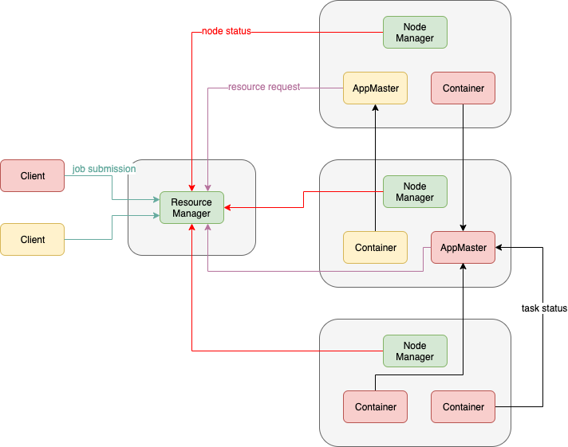
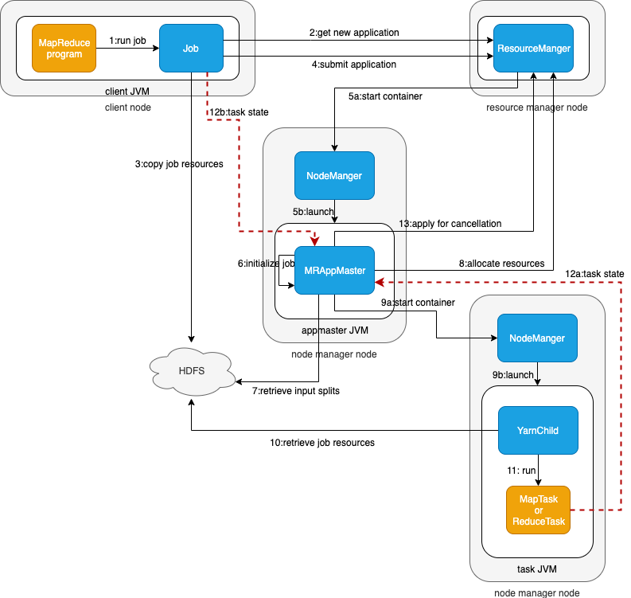

# YARN架构

YARN 的全称是 Yet Another Resource Negotiator，YARN 是经典的主从 Master/Slave 结构，在整个框架中，ResourceManager 为 Master，NodeManager 为 Slave。



## ResourceManager（RM）

RM 是一个全局的资源管理器，负责整个系统的资源管理和分配，主要有两个组件构成：

- 调度器：Scheduler；

调度器根据容量、􏳴队列等限制条件（如某个队列分配一定的资源，最多执行一定数量的作业等），将系统中的资源分配给各个正在运行的应用程序。􏰣<font color=red>要注意的是，该调度器是一个纯调度器，它不再从事任何与应用程序有关的工作</font>，比如不负责重新启动（因应用程序失败或者硬件故障导致的失败），这些均交由应用程序相关的 ApplicationMaster 完成。调度器仅根据各个应用程序的资源需求进行资源分配，而资源分配单位用一个抽象概念 **资源容器(Resource Container，也即 Container)**，Container 是一个动态资源分配单位，它将内存、CPU、磁盘、网络等资源封装在一起，从而限定每个任务使用的资源量。此外，该调度器是一个可插拔的组件，用户可根据自己的需求设计新的调度器，YARN 提供了多种直接可用的调度器，比如 Fair Scheduler 和 Capacity Schedule 等。


- 应用程序管理器：Applications Manager，ASM。

应用程序管理器负责管理整个系统中所有应用程序，包括应用程序提交、与调度器协商资源以启动 AM、监控 AM 运行状态并在失败时重新启动它等。


## NodeManager（NM）

NM 是每个节点上运行的资源和任务管理器。

1. 它会定时向 RM 汇报本节点上的资源使用情况和各个 Container 的运行状态；
2. 它接收并处理来自 AM 和 RM 的请求（Container 启动/停止）。


## ApplicationMaster（AM）

提交的每个作业都会包含<font color=red>一个</font> AM，主要功能包括：

1. 与 RM 协商以获取资源（用 container 表示）；
2. 将得到的任务进一步分配给内部的任务；
3. 与 NM 通信以启动/停止任务；
4. <font color=red>监控所有任务的运行状态</font>，当任务有失败时，重新为任务申请资源并重启任务。

MapReduce 就是原生支持 ON YARN 的一种框架，可以在 YARN 上运行 MapReduce 作业。有很多分布式应用都开发了对应的应用程序框架，用于在 YARN 上运行任务，例如 Spark，Storm、Flink 等。


## Container

Container 是 YARN 中的资源抽象，它封装了某个节点上的多维度资源，如内存、CPU、磁盘、网络等，以及环境变量、启动命令等任务运行相关的信息。当 AM 向 RM 申请资源时，RM 为 AM 返回的资源便是用 Container 表示的。 YARN 会为每个任务分配一个 Container 且该任务只能使用该 Container 中描述的资源。


# 作业提交流程




1. client 调用 job.waitForCompletion 方法，向整个集群提交 MapReduce 作业 。 
2. 新的作业ID（应用ID）和 资源提交路径 由 RM 分配。
3. client 核实作业的输出，<font color=red>计算</font>输入的split，将作业的资源（包括Jar包、配置文件、split信息）拷贝给 HDFS。
4. client 调用 RM 的 submitApplication() 来提交作业。
5. 当 RM 收到 submitApplication() 的请求时，就将该请求发给 scheduler，scheduler 分配 container，并与对应的 NM 通信，要求其在这个 container 中启动 AM。
6. MapReduce 作业的 AM 是一个主类为 MRAppMaster 的 Java 应用，其通过构造一些 bookkeeping 对象来监控作业的进度，得到任务的进度和完成报告。
7. MRAppMaster 通过 HDFS 得到由 client 计算好的输入 split。然后为每个输入 split 创建 MapTask，根据 `mapreduce.job.reduces` 创建 ReduceTask。
8. 如果作业很小，AM会选择在其自己的 JVM 中运行任务；如果不是小作业，那么 AM 向 RM 请求 container 来运行所有的 MapTask 和 ReduceTask。请求是通过心跳来传输的，包括每个 MapTask 的数据位置（如存放输入split的主机名和机架）。scheduler 利用这些信息来调度任务，尽量将任务分配给存储数据的节点，或退而分配给同机架的其他节点。
9. 当一个任务由 RM 调度分配一个 container 后，AM与该 NM 通信，要求其在这个 container 中启动任务。其中，任务是一个主类为 YarnChild 的 Java 应用执行。
10. YarnChild 在运行任务之前首先本地化任务需要的资源，如作业配置、JAR文件、以及HDFS的所有文件。将任务启动命令写到一个脚本中，并通过运行该脚本启动任务。
11. YarnChild 运行 MapTask 或 ReduceTask。YarnChild运行在一个专用的JVM中，但是YARN不支持JVM重用。
12. YARN中的任务将其进度和状态返回给AM，以让AM随时掌握各个任务的运行状态，从而可以在任务失败时重新启动任务。同时，client通过 `mapreduce.client.progressmonitor.pollinterval` 向AM请求进度更新，向用户展示。
13. 应用程序运行完成后，AM 向 RM 请求注销并关闭自己。


# 容错

对于分布式系统，不论是调度系统还是其他系统，容错机制都是非常必要的，YARN 需要容错的地方，有以下四个地方：

1. ApplicationMaster 容错：ResourceManager 会和 ApplicationMaster 保持通信，一旦发现 ApplicationMaster 失败或者超时，会为其重新分配资源并重启。重启后 ApplicationMaster 的运行状态需要自己恢复，如 MRAppMaster 会把相关状态记录到 HDFS 上，重启后从 HDFS 读取运行状态恢复；
2. NodeManager 容错：NodeManager 如果超时，则 ResourceManager 会认为它失败，将其上的所有 container 标记为失败并通知相应的 ApplicationMaster，由 AM 决定如何处理（可以重新分配资源运行某一个任务，也可以整个作业失败，重新运行所有任务）；
3. container 容错：如果 ApplicationMaster 在一定时间内未启动分配的 container，RM 会将其收回；如果 Container 运行失败，RM 会通知对应的 AM 由其处理；
4. ResourceManager 容错：RM 采用 HA 机制。


# 任务调度器

资源调度器是YARN最核心的组件之一，是一个插拔式的服务组件，负责整个集群资源的管理和分配。YARN提供了三种可用的资源调度器：FIFO、Capacity Scheduler、Fair Scheduler。


## 先进先出调度器（FIFO Scheduler）

FIFO 是最简单的资源调度策略，提交的作业按照<font color=red>提交时间先后顺序或者根据优先级次序</font>将其放入线性队列相应的位置，在资源调度时，**按照队列的先后顺序、先进先出地进行调度和资源分配**。很明显这种调度器过于简单，在实际的生产中，应用不是很多，毕竟需要调度的作业是有不同优先级的。


## 容量调度器（Capacity Scheduler）

容量调度器是 Yahoo 为 Hadoop 开发的多用户调度器，应用于用户量众多的应用场景，与公平调度器相比，其更强调资源在<font color=red>用户</font>之间而非作业之间的公平性。<font color=red>即不同队列（用户）的任务可同时运行，而在同一个队列中的任务遵循FIFO</font>。

容量调度器有以下几点特点：

1. **容量保证**：管理员可为每个队列设置资源最低保证和资源使用上限，而所有提交到该队列的应用程序共享这些资源；
2. **灵活性**：如果一个队列资源有剩余，可以暂时共享给那些需要资源的队列，而一旦该队列有新的应用程序提交，则其他队列释放的资源会归还给该队列；
3. **多重租赁**：支持多用户共享集群和多应用程序同时运行，为防止单个应用程序、用户或者队列独占集群中的资源，管理员可为之增加多重约束；
4. **安全保证**：每个队列有严格的 ACL 列表规定它访问用户，每个用户可指定哪些用户允许查看自己应用程序的运行状态或者控制应用程序；
5. **动态更新配置文件**：管理员可以根据需要动态修改各种配置参数。

举例：

root

​	— dev 60%

​		— spark 50%

​		— hadoop 50%

​	— prod 40%

假设job1提交到队列dev.spark，此时prod队列没有任务，dev.hadoop队列也没有任务。如果运行job需要的资源占30%够用，直接运行即可；否则，会弹性的先占用dev.hadoop队列的容量，占到60%容量资源；如仍然不够，则继续弹性占用prod队列容量。为了防止dev队列占用太多资源，可以为其设置上限，如75%。

Apache版本默认使用容量调度器。


## 公平调度器（Fair Scheduler）

公平调度器强调每一个队列资源对其内部作业公平共享。

公平调度器有以下几个特点：

1. **支持抢占式调度**，即如果某个队列长时间未能被分配到公平共享量的资源，则调度器可以杀死过多分配资源的队列的任务，以空出资源供这个队列使用；
2. **强调作业之间的公平性**：在每个队列中，公平调度器默认使用公平策略来实现资源分配，这种公平策略是最大最小公平算法的一种具体实现，可以尽可能保证作业间的资源分配公平性；
3. **负载均衡**：公平调度器提供了一个基于任务数目的负载均衡机制，该机制尽可能将系统中的任务均匀分配到给各个节点上；
4. **调度策略配置灵活**：允许管理员为每个队列单独设置调度策略；
5. **提高小应用程序响应时间**：由于采用了最大最小公平算法，小作业可以快速获得资源并运行完成。

举例：

A、B、C三个队列，每个队列中的作业按照优先级分配资源，优先级越高分配的资源越多，但都可以分配到资源，以确保公平。此时<font color=red>每个队列中会有多个作业同时运行</font>。

CDH版本默认使用公平调度器。


 # 配置多用户资源隔离

## 配置

- 修改yarn-site.xml

node01执行

```xml
<!-- 指定任务调度使用fairScheduler的调度方式 -->
<property>
    <name>yarn.resourcemanager.scheduler.class</name>
    <value>org.apache.hadoop.yarn.server.resourcemanager.scheduler.fair.FairScheduler</value>
</property>

<!-- 指定任务调度的配置文件路径 -->
<property>
	<name>yarn.scheduler.fair.allocation.file</name>
	<value>/bigdata/install/hadoop-2.6.0-cdh5.14.2/etc/hadoop/fair-scheduler.xml</value>
</property>

<!-- 是否启用资源抢占，如果启用，那么当该队列资源使用 yarn.scheduler.fair.preemption.cluster-utilization-threshold 过多比例的时候，就从其他空闲队列抢占资源 -->
<property>
	<name>yarn.scheduler.fair.preemption</name>
	<value>true</value>
</property>
<property>
	<name>yarn.scheduler.fair.preemption.cluster-utilization-threshold</name>
	<value>0.8f</value>
</property>

<!-- 默认提交到default队列  -->
<property>
	<name>yarn.scheduler.fair.user-as-default-queue</name>
	<value>true</value>
	<description>default is True</description>
</property>

<!-- 如果提交一个任务不存在对应队列，是否允许创建一个新的队列，设置false不允许  -->
<property>
	<name>yarn.scheduler.fair.allow-undeclared-pools</name>
	<value>false</value>
	<description>default is True</description>
</property>
```


- 添加fair-scheduler.xml

node01执行

```xml
<?xml version="1.0"?>
<allocations>
<!-- users max running apps  -->
<userMaxAppsDefault>30</userMaxAppsDefault>
<!-- 定义队列  -->
<queue name="root">
	<minResources>512mb,4vcores</minResources>
	<maxResources>102400mb,100vcores</maxResources>
	<maxRunningApps>100</maxRunningApps>
	<weight>1.0</weight>
	<schedulingMode>fair</schedulingMode>
	<aclSubmitApps> </aclSubmitApps>
	<aclAdministerApps> </aclAdministerApps>

	<queue name="default">
		<minResources>512mb,4vcores</minResources>
		<maxResources>30720mb,30vcores</maxResources>
		<maxRunningApps>100</maxRunningApps>
		<schedulingMode>fair</schedulingMode>
		<weight>1.0</weight>
		<!-- 所有任务如果不指定任务队列，都提交到default队列 -->
		<aclSubmitApps>*</aclSubmitApps>
	</queue>
    
	<queue name="hadoop">
		<minResources>512mb,4vcores</minResources>
		<maxResources>20480mb,20vcores</maxResources>
		<maxRunningApps>100</maxRunningApps>
		<schedulingMode>fair</schedulingMode>
    <!-- 资源池权重-->
		<weight>2.0</weight>
    <!-- 允许提交任务的用户名和组；
             格式为：用户名 用户组
             当有多个用户时候，格式为：用户名1,用户名2 用户名1所属组,用户名2所属组 -->
		<aclSubmitApps>hadoop hadoop</aclSubmitApps>
    <!-- 允许管理任务的用户名和组；格式同上 -->
		<aclAdministerApps>hadoop hadoop</aclAdministerApps>
	</queue>
    
	<queue name="develop">
		<minResources>512mb,4vcores</minResources>
		<maxResources>20480mb,20vcores</maxResources>
		<maxRunningApps>100</maxRunningApps>
		<schedulingMode>fair</schedulingMode>
		<weight>1.0</weight>
		<aclSubmitApps>develop develop</aclSubmitApps>
		<aclAdministerApps>develop develop</aclAdministerApps>
	</queue>
    
	<queue name="test">
		<minResources>512mb,4vcores</minResources>
		<maxResources>20480mb,20vcores</maxResources>
		<maxRunningApps>100</maxRunningApps>
		<schedulingMode>fair</schedulingMode>
		<weight>1.5</weight>
		<aclSubmitApps>test,hadoop,develop test</aclSubmitApps>
		<aclAdministerApps>test group_businessC,supergroup</aclAdministerApps>
	</queue>
</queue>
</allocations>
```


## 分发

node01执行

```bash
cd /bigdata/install/hadoop-2.6.0-cdh5.14.2/etc/hadoop
scp yarn-site.xml fair-scheduler.xml node02:$PWD
scp yarn-site.xml fair-scheduler.xml node03:$PWD
```


## 重启YARN集群

```bash
stop-yarn.sh
start-yarn.sh
```


## 修改作业的提交队列

当前用户和用户组是hadoop hadoop

```java
// 不设置队列时，使用当前系统用户和用户组提交队列，提交至队列root.hadoop

// 不可提交至队列root.develop(也可以简写成develop) ，因为其限制用户和用户组是develop develop
// configuration.set("mapred.job.queue.name", "develop");
```


当前用户和用户组是develop develop

```java
// 可提交至队列root.develop
configuration.set("mapred.job.queue.name", "develop");
```

