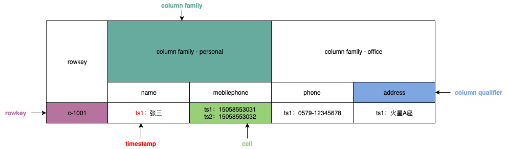
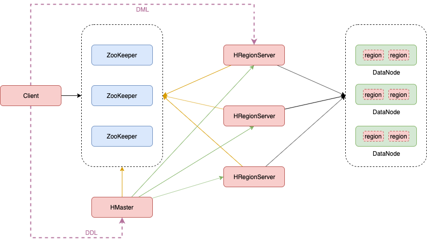
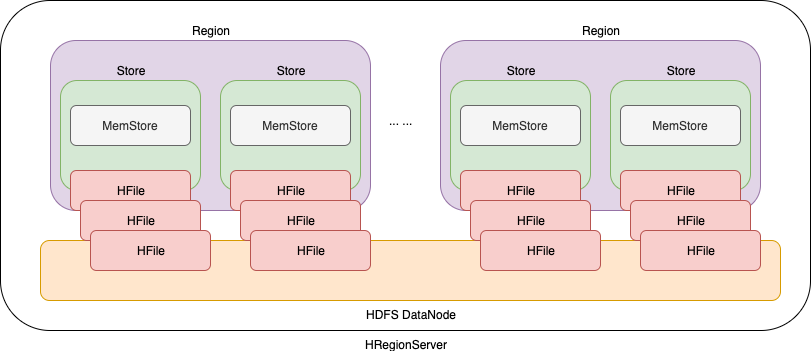
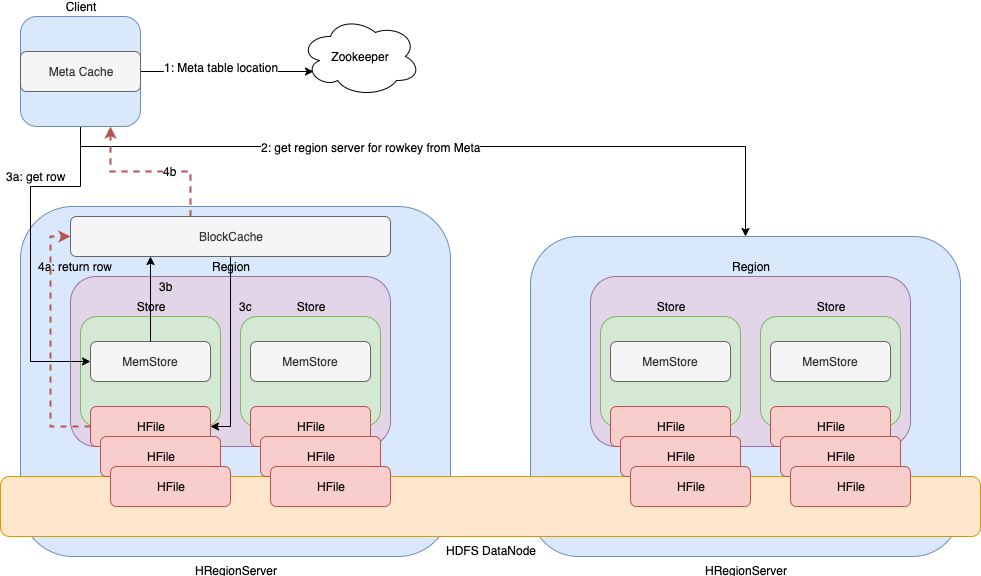
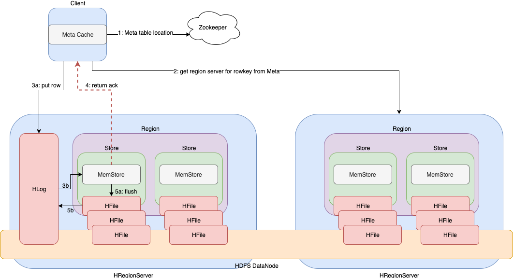

# 核心概念

## 概念

- HBase基于Google的BigTable论文，是建立的HDFS之上，提供**高可靠性**、**高性能**、**列存储**、**可伸缩**、**实时读写**的分布式数据库系统。
- 在需要<font color=red>实时读写随机访问</font>超大规模数据集时，可以使用HBase。


## 特点

- **海量存储**
  - 可以存储大批量的数据
- **列式存储**
  - HBase表的数据是基于列族进行存储的，列族是在列的方向上的划分
- **极易扩展**
  - 底层依赖HDFS，当磁盘空间不足的时候，只需要动态增加DataNode节点就可以了
  - 可以通过增加服务器来对集群的存储进行扩容
- **高并发**
  - 支持高并发的读写请求
- **稀疏**
  - 稀疏主要是针对HBase列的灵活性，在列族中，你可以指定任意多的列，在列数据为空的情况下，是不会占用存储空间的
- **数据的多版本**
  - HBase表中的数据可以有多个版本值，默认情况下是根据版本号去区分，版本号就是插入数据的时间戳
- **数据类型单一**
  - 所有的数据在HBase中是以字节数组进行存储


# 数据模型




- rowkey 行键
  - table的主键，table中的记录按照rowkey的字典序进行排序
  - rowkey可以是任意字符串，最大长度是 64KB，实际应用中长度一般为 10-100bytes。


- column family 列族
  - HBase表中的每个colum都归属于某个column family
  - column family是表的schema的一部分（而column不是），即建表时至少指定一个列族


- timestamp 时间戳
  - 可以对表中的cell多次赋值，每次赋值操作的timestamp可看成cell值的版本号version numbe
  - 一个cell可以有多个版本的值


- column qualifier 列限定
  - 列限定是表的某一列族下的一个列，用 `列族名:列名` 表示
  - 属于某一个column family，类似于mysql当中创建的具体的列


- cell 单元格
  - 根据 `{rowkey, column(=family+qualifier), timestamp}` 可以映射到一个对应的cell，cell是HBase存储数据的具体地址
  - cell中的数据是没有类型的，全部是以<font color=red>字节数组</font>进行存储


# 整体架构




## Client

- Client是操作HBase集群的入口
  - 对于管理类的操作，如表的增、删、改，Client通过RPC与HMaster通信完成
  - 对于表数据的读写操作，Client通过RPC与HRegionServer通信读写数据
- Client类型
  - HBase shell
  - Java编程接口
  - Thrift、Avro、Rest等


## ZooKeeper集群

- 实现了HMaster的高可用，多HMaster间进行主备选举

- 保存了HBase的元数据信息meta表，提供了HBase表中region寻址入口数据
- 对HMaster和HRegionServer实现了监控
- <font color=red>ZooKeeper如何协调HMaster和HRegionServer工作？</font>

多HMaster会竞争创建ephemeral节点，而Zookeeper决定谁是第一个作为在线的HMaster，保证线上只有一个 HMaster。在线HMaster（**active HMaster**）会给Zookeeper发送心跳，不在线的待机HMaster（**inactive HMaster**）会监听active HMaster可能出现的故障并随时准备上线。

每个HRegionServer都会创建一个`ephemeral` 节点。HMaster会监控这些节点来发现可用的HRegionServer，同样它也会监控这些节点是否出现故障。

如果有一个HRegionServer或者HMastet出现故障或各种原因导致发送心跳失败，它们与Zookeeper的session就会过期，这个ephemeral节点就会被删除下线，监听者们就会收到这个消息。Active HMaster监听的是HRegionServer下线的消息，然后会恢复故障的HRegionServer以及它所负责的Region数据。而Inactive HMaster关心的则是active HMaster下线的消息，然后竞争上线变成active HMaster。


## HMaster

- HBase集群也是主从架构，HMaster是主角色

- 负责Table的管理工作，管理Client对Table的增删改操作

- 负责Region的管理工作
  - 在Region分裂后，负责将新Region分配到指定的HRegionServer
  - 管理HRegionServer间的负载均衡，迁移region分布
  - 当HRegionServer宕机后，负责将其上的region迁移
- 监控集群中所有HRegionServer（从Zookeeper获取通知信息）


## HRegionServer

- HRegionServer是从角色，负责管理一系列的Region（大约可以管理1000个Region）

- 响应Client的读写数据请求，通常情况下HRegionServer同DataNode同机部署，这样就可以实现数据的本地化
- 切分在运行过程中变大的Region


## Region

- HBase集群中<font color=red>分布式存储的最小单元</font>
- 一个Region对应一个Table表的部分数据，也可以是全部数据；Table表根据rowkey的范围被水平拆分为多个Region，每个Region都包含了这个Region的start key和end key之间的所有行，然后被分配给集群中的HRegionServer来管理


# HBase shell 命令

```bash
# 进入 hbase shell 交互客户端
hbase shell
```


## 基本命令

### help 显示帮助

```bash
# 显示帮助
help

# 查看具体命令的帮助
help 'create'
```


### exit 退出

```bash
# 退出shell
exit

# 当输入语法错误，导致client不工作
>`
```


### create 创建表

```bash
# 创建user表，info和data列族
# 默认一个版本
create 'user', 'info', 'data'

# 创建user1表，同时指定列族的版本数
create 'user1', {NAME => 'info', VERSIONS => 3}, {NAME => 'data'}
```


### put 插入和更新单行数据

```bash
# 插入数据
# row key为rk0001，列族info中添加名为name的列，值为zhangsan
# column qualifier 在插入数据时指定
put 'user', 'rk0001', 'info:name', 'zhangsan'
put 'user', 'rk0001', 'info:gender', 'female'
put 'user', 'rk0001', 'info:age', 20
put 'user', 'rk0001', 'data:pic', 'picture'

put 'user', 'rk0002', 'info:name', 'fanbingbing'
put 'user', 'rk0002', 'info:gender', 'female'
put 'user', 'rk0002', 'info:nationality', '中国'

# 更新数据
# cell有数据则更新，无数据则插入；本质还是插入数据，只不过查询数据时，显示最新版本号的数据
put 'user', 'rk0001', 'info:name', 'lisi'
```


### get 查询单行数据

```bash
# 获取user表中row key为rk0001的所有 cell 信息
get 'user', 'rk0001'

# 过滤列族
get 'user', 'rk0001', 'info'
get 'user', 'rk0001', 'info', 'data'
get 'user', 'rk0001', {COLUMN => ['info', 'data']}

# 过滤列
get 'user', 'rk0001', 'info:age'
get 'user', 'rk0001', 'info:age', "info:name"
get 'user', 'rk0001', {COLUMN => ['info:name', 'data:pic']}

# 过滤值
get 'user', 'rk0001', {FILTER => "ValueFilter(=, 'binary:zhangsan')"}
# 过滤值包含中文
get 'user', 'rk0002', {FILTER => "ValueFilter(=, 'binary:中国')"}

# 过滤列限定名称
# 列名称包含a
get 'user', 'rk0001', {FILTER => "QualifierFilter(=,'substring:a')"}
```


### scan 全表扫描

- scan 'user'    全表扫描
- scan 'user', {COLUMNS => 'info', STARTROW => 'rk0001', ENDROW => 'rk0003'}    范围扫描

```bash
# 查看user表的所有数据
# 全表扫描
scan 'user'

# 过滤列族
scan 'user', {COLUMNS => 'info'}
# RAW => true 已被标记为删除，但还没有被删除
# 不能包含列限定
scan 'user', {COLUMNS => 'info', RAW => true, VERSIONS => 5}
scan 'user', {COLUMNS => ['info', 'data']}

# 过滤列
scan 'user', {COLUMNS => 'info:name'}
scan 'user', {COLUMNS => ['info:name', 'data:pic']}
# 版本最新的5个
scan 'user', {COLUMNS => 'info:name', VERSIONS => 5}

# 过滤列限定名称
scan 'user', {COLUMNS => ['info', 'data'], FILTER => "(QualifierFilter(=,'substring:a'))"}

# 指定行键范围 [rk0001, rk0003)
# 范围匹配，范围 -> Region
scan 'user', {COLUMNS => 'info', STARTROW => 'rk0001', ENDROW => 'rk0003'}

# row key 模糊查询
scan 'user', {FILTER => "PrefixFilter('rk')"}

# 指定时间戳范围 [1581477006014, 1581477079033) 
scan 'user', {TIMERANGE => [1581477006014, 1581477079033]}
```


### delete 删除数据

```bash
# 注意当有多个版本时，自上向下逐个删除（逻辑删除，标记类型为Delete）；如一个cell有三个版本：ts3、ts2、ts1，第一次删除ts3版本，get查询时会显示ts2版本的数据
# 可以通过 RAW => true 查询标记为删除，但没有被物理删除的数据
delete 'user', 'rk0001', 'info:name'

# 指定删除版本号
delete 'user', 'rk0001', 'info:name', 1581489923991
```


## 管理命令

### status 显示服务器状态

```bash
status 'node01'
```


### whoami 显示当前用户

```bash
whoami
```


### list 显示数据库

```bash
list
```


### count 统计表行数据

```bash
count 'user'
```


### describe 显示表结构信息

```bash
describe 'user'
```


### exists 显示表是否存在

```bash
exists 'user'
```


### is_enabled 显示表是否启用 / is_disabled 显示表是否禁用

```bash
# 显示表是否启用
is_enabled 'user'

# 显示表是否禁用
is_disabled 'user'
```


### alter 修改表结构

```bash
# 增加列族
alter 'user', NAME => 'data'
# 等价
alter 'user', 'data'

# 删除指定列族
alter 'user', NAME => 'data', METHOD => 'delete' 
alter 'user', 'delete' => 'data'

# 修改列族
# 列族info版本数修改为5
alter 'user', NAME => 'info', VERSIONS => 5
```


### enable 启用表 / disable 禁用表

```bash
# 禁用表
disable 'user'

# 启用表
enable 'user'
```


### drop 删除表

```bash
# 先禁用，再删除
disable 'user1'
drop 'user1'
```


### truncate 清空表数据

```bash
# 禁用表 -> 删除表 -> 创建表
truncate 'user'
```


# 核心原理

## HBase数据存储原理




- Region
  - 一个HRegionServer负责管理多个Region
  - 初始情况下，一个表只有一个Region或直接对表预分区。当随着数据增大，一个Region会分裂为两个Region
  - 一个Region只对应一个表，而一个表可以有多个Region


- Store

  - 一个Region包含多个Store，而一个column family对应一个Store
  - 如果一个表中只有一个column family，那么Region中只会有一个Store；如果一个表有N个column family，那么Region中会有N个Store

  

  <font color=red>为什么column family不应设置过多，最少一个，最多不超过两个？</font>

  1. 当列族过多且数据不均或均匀时，Region分裂，不同的列族会分裂到多个Region上造成某一列族数据过少，导致查询此列族上的数据可能会跨越多个Region，查询效率降低。
  2. 每一个列族都有一个MemoStore，导致内存消耗过多。
  3. 当一个Region中的Store刷写缓存或压缩时，其他Store会跟着一同操作，导致IO频繁。


- MemStore
  - 一个Store仅包含一个MemStore
  - 写缓存。在写入数据时，会先写入MemStore缓存，当MemoStore达到某一个阈值后，会把数据刷写到磁盘


- HFile
  - 一个Store包含多个HFile。其中，StoreFile是HFile的抽象，最后是以HFile数据结构（有序KeyValue）存储在HDFS上
  - 当每次MemStore超过一个阈值时，就会溢写到磁盘，对应就是生成一个HFile文件


## HBase读数据流程




1. Client与Zookeeper连接，获取Meta表的位置信息，即Meta表存储在哪一个HRegionServer上。

   - HBase集群只有一张Meta表（B Tree），此表只有一个Region。<font color=red>保存了系统中所有Region的位置信息</font>。结构如下：

     Key：table, region start key, region id
     Value：region server

   - 可以通过 `scan 'hbase:meta'` 来查看Meta表信息

2. Client与Meta表所在的HRegionServer连接，进而获取请求rowkey所在Region的位置信息。
  
  - 在Client缓存Meta表的位置信息，以及rowkey所在Region的位置信息，后续请求直接使用Meta Cache即可。除非Region迁移导致缓存失效，则需要重新获取相关位置信息并更新Client的Meta Cache。

3. Client同rowkey所在Region的HRegionServer连接，查找并定位所在的Region。首先在MemStore查找数据；如果没有，再从BlockCache上查找；如果没有，再到HFile上进行查找。
   - MemStore 写缓存  ——  写入MemoStore，但还未刷写到磁盘
   - BlockCache 读缓存，是 LRU（Least Recently Used）缓存  ——  已刷写到磁盘，近期读取过
- HFile 数据持久化  ——  近期未读取，从持久化数据文件读取，同时放到BlockCache一份
   
4. 从HFile读取到数据后，先写入到BlockCache中加快后续查找，然后再将结果返回给Client。


## HBase写数据流程




1. Client与Zookeeper连接，获取Meta表的位置信息，即Meta表存储在哪一个HRegionServer上。
2. Client与Meta表所在的HRegionServer连接，进而获取请求rowkey所在Region的位置信息。（写/更新数据，需要找到所在region的startkey范围）
3. Client同rowkey所在Region的HRegionServer连接，查找并定位所在的Region。首先在HLog上预写日志，然后写入MemStore缓存。
   - HLog也称为WAL，意为Write ahead log。类似mysql中的binlog，用来做灾难恢复时用，HLog记录数据的所有变更，相当于MemStore的一份快照。一旦MemStore数据丢失，就可以从HLog中恢复。
   - 预写日志和写入MemStore的顺序不可调换，否则内存数据一旦丢失将无法恢复。
   - HLog以SequenceFile的形式存储，修改和删除数据本质都是增加，并且是在文件末尾顺序追加，因此磁盘响应速度很快，同时也可以解决HRegionServer崩溃导致MemStore数据丢失的问题。

4. 返回Client确认写入成功。之后便可以查询此数据。
5. 当MemStore达到阈值后，会将数据刷写到磁盘持久化，生成相应的HFile文件。同时，将HLog中的历史数据删除。


## HBase的flush机制

MemStore 中累积了足够多的的数据后，整个<font color=red>有序数据集</font>就会被写入一个新的 HFile 文件到 HDFS 上。**HBase 为每个 Column Family 都创建一个 HFile**，里面存储了具体的 **Cell**，也即 KeyValue 数据。随着时间推移，HFile 会不断产生，因为 KeyValue 会不断地从 MemStore 中被刷写到硬盘上。

注意这也是为什么 HBase 要限制 Column Family 数量的一个原因。每个 Column Family 都有一个 MemStore；如果Region的一个 MemStore 满了，该Region的所有的 MemStore 都会被刷写到硬盘。<font color=red>注意，刷写磁盘的基本单元是Region</font>。

同时，它也会记录最后写入的数据的**最大序列号**（**sequence number**），这样系统就能知道目前为止哪些数据已经被持久化了。最大序列号是一个 meta 信息，被存储在每个 HFile 中，来表示持久化进行到哪条数据了，应该从哪里继续。当 Region 启动时，这些序列号会被读取，取其中最大的一个，作为基础序列号，后面的新的数据更新就会在该值的基础上递增产生新的序列号。这个序列号还可以用于从HLog中的什么位置开始恢复数据。


### flush触发条件

#### MemoStore级别限制

- 当<font color=red>Region中任意一个MemStore</font>的大小达到了上限（hbase.hregion.memstore.flush.size，默认128MB），会触发MemStore刷新。

```xml
<property>
	<name>hbase.hregion.memstore.flush.size</name>
	<value>134217728</value>
</property>
```


  #### region级别限制

- 当<font color=red>Region中所有MemoStore</font>的大小总和达到了上限（hbase.hregion.memstore.block.multiplier * hbase.hregion.memstore.flush.size，默认 2* 128M = 256M），会触发MemStore刷新。

```xml
<property>
	<name>hbase.hregion.memstore.flush.size</name>
	<value>134217728</value>
</property>
<property>
	<name>hbase.hregion.memstore.block.multiplier</name>
	<value>2</value>
</property>   
```


#### Region Server级别限制

- 当<font color=red>HRegionServer中所有MemStore</font>的大小总和超过低水位阈值hbase.regionserver.global.memstore.size.lower.limit*hbase.regionserver.global.memstore.size（前者默认值0.95），HRegionServer开始强制flush；首先刷新MemStore最大的Region，再执行次大的，依次执行。
- 如写入速度大于flush的速度，导致总MemStore大小超过高水位阈值hbase.regionserver.global.memstore.size（默认为JVM内存的40%），此时HRegionServer会阻塞更新并强制执行flush，直到总MemStore大小低于低水位阈值。

```xml
<property>
	<name>hbase.regionserver.global.memstore.size.lower.limit</name>
	<value>0.95</value>
</property>
<property>
	<name>hbase.regionserver.global.memstore.size</name>
	<value>0.4</value>
</property>
```


#### HLog数量上限

- 当一个HRegionServer中HLog数量达到上限（可通过参数hbase.regionserver.maxlogs配置）时，系统会选取最早的一个 HLog对应的一个或多个Region进行flush。


#### 定期刷新

- 默认周期为1小时，确保MemStore不会长时间没有持久化。为避免所有的MemStore在同一时间都进行flush导致的问题，定期的flush操作有20000左右的随机延时。


#### 手动flush

- 用户可以通过shell命令 `flush ‘tablename’` 或者 `flush ‘region name’` 分别对一个表或者一个Region进行flush。


### flush 流程

为了减少flush过程对读写的影响，将整个flush过程分为三个阶段：

- prepare阶段（写阻塞，内存操作，时间短）：遍历当前Region中所有的MemStore，将MemStore中当前数据集CellSkipListSet做一个**快照snapshot**；然后再新建一个CellSkipListSet。后期写入的数据都会写入新的CellSkipListSet中。prepare阶段需要加锁updateLock对**写请求阻塞**，结束之后会释放该锁。因为此阶段没有任何费时操作，因此持锁时间很短。

- flush阶段（涉及到磁盘IO，耗时）：遍历所有MemStore，将prepare阶段生成的snapshot持久化为**临时文件**，临时文件会统一放到目录.tmp下。这个过程因为涉及到磁盘IO操作，因此相对比较耗时。
- commit阶段（耗时）：遍历所有MemStore，将flush阶段生成的临时文件移到指定的ColumnFamily目录下，针对HFile生成对应的storefile和Reader，把storefile添加到HStore的storefiles列表中，最后再**清空**prepare阶段生成的snapshot。


## HBase的compact机制

hbase为了防止小文件过多，以保证查询效率，hbase需要在必要的时候将这些小的store file合并成相对较大的store file，这个过程就称之为compaction。在hbase中主要存在两种类型的compaction合并：

- minor compaction 小合并

- major compaction 大合并


###minor compaction 小合并

- 将Store中多个HFile合并为一个HFile

  在这个过程中会选取一些小的、相邻的StoreFile将他们合并成一个更大的StoreFile，对于TTL过期数据、更新的数据、删除的数据仅仅只是做了标记，并没有进行物理删除。一次Minor Compaction的结果是更少并且更大的StoreFile。**这种合并的触发频率很高**。

- minor compaction触发条件由以下几个参数共同决定

  ```xml
  <!--表示至少需要三个满足条件的store file时，minor compaction才会启动-->
  <property>
  	<name>hbase.hstore.compactionThreshold</name>
  	<value>3</value>
  </property>
  
  <!--表示一次minor compaction中最多选取10个store file-->
  <property>
  	<name>hbase.hstore.compaction.max</name>
  	<value>10</value>
  </property>
  
  <!--默认值为128m，表示文件大小小于该值的store file一定会加入到minor compaction的store file中-->
  <property>
  	<name>hbase.hstore.compaction.min.size</name>
  	<value>134217728</value>
  </property>
  
  <!--默认值为LONG.MAX_VALUE，表示文件大小大于该值的store file一定会被minor compaction排除-->
  <property>
  	<name>hbase.hstore.compaction.max.size</name>
  	<value>9223372036854775807</value>
  </property>
  ```

  

###major compaction 大合并

* 合并Store中所有的HFile为一个HFile

  将所有的StoreFile合并成一个StoreFile，这个过程<font color=red>还会清理三类无意义数据：被删除的数据、TTL（time to live）过期数据、版本号超过设定版本号的数据</font>。**合并频率比较低**，默认**7天**执行一次，并且**性能消耗非常大**（会遍历所有数据）。建议生产关闭，在应用空闲时间手动触发，防止出现在业务高峰期。

* major compaction触发时间条件

  ~~~xml
  <!--默认值为7天进行一次大合并，生产关闭设置为0-->
  <property>
  	<name>hbase.hregion.majorcompaction</name>
  	<value>604800000</value>
  </property>
  ~~~

* 手动触发

  ~~~bash
  # 使用major_compact命令
  major_compact ‘tableName’
  ~~~


## Region分裂

### 分裂流程

一开始每个 table 默认只有一个 Region。当一个 Region 逐渐变得大时，大小大于 `hbase.hregion.max.filesize` ，会分裂（**split**）成两个子 Region，<font color=red>每个子 Region 都包含了原来 Region 一半的数据</font>，这两个子 Region 并行地在原来这个 HRegionServer 上创建，这个分裂动作会被报告给 HMaster。出于负载均衡的目的，HMaster 可能会将新的 Region 迁移给其它 HRegionServer。


```xml
<!--最大HStoreFile大小。若某个列族的HStoreFile增长达到这个值，这个Hegion会被切割成两个。 默认: 10G-->
<property>
	<name>hbase.hregion.max.filesize</name>
	<value>10737418240</value>
</property>
```


**Splitting** 一开始是发生在同一台 HRegionServer 上的，但是出于负载均衡的原因，HMaster 可能会将新的 Region **迁移** （<font color=red>注意是逻辑上的迁移，即将某个Region给另一个HRegionServer管理</font>）到其他 HRegionServer，这会导致此时迁移到的HRegionServer需要访问离它比较远的 HDFS 数据，直到 **major compaction** 的到来，它会将那些远方的数据重新移回到离HRegionServer节点附近的地方。


### 分裂策略

#### 手动指定

当一个table刚被创建的时候，Hbase默认分配一个Region给table。也就是说这个时候，所有的读写请求都会访问到同一个HRegionServer的同一个Region中，这个时候就达不到负载均衡的效果，集群中的其他HRegionServer就可能会处于空闲的状态。解决这个问题可以用**pre-splitting**，在创建table的时候就配置生成多个Region。

##### 为什么要预分区？

* 增加数据读写效率
* 负载均衡，防止数据倾斜
* 方便集群容灾调度Region
* 优化Map数量


##### 预分区原理

每一个Region维护着startRowKey与endRowKey，如果加入的数据符合某个Region维护的rowKey范围，则该数据交给这个Region维护。


##### 手动指定预分区

- 方式一

  ```ruby 
  create 'person','info1','info2',SPLITS => ['1000','2000','3000','4000']
  ```

  共有5个Region

  | name    | start key | end key | range        |
  | ------- | --------- | ------- | ------------ |
  | Region1 |           | 1000    | [, 1000)     |
  | Region2 | 1000      | 2000    | [1000, 2000) |
  | Region3 | 2000      | 3000    | [2000, 3000) |
  | Region4 | 3000      | 4000    | [3000, 4000) |
  | Region5 | 4000      |         | [4000, )     |

  注意：

  1. 首行的`start key`和尾行的`end key`是空串，表示一张表的开始和结束位置
  2. Region的rowkey范围包括start key，不包括end key，符合左闭右开

- 方式二

  将分区规则创建于文件中

  ```bash
  cd /bigdata/install
  vi splits
  
  # 文件内容
  aaa
  bbb
  ccc
  ddd
  ```

  shell执行命令

  ```ruby
  create 'student', 'info', SPLITS_FILE => '/bigdata/install/splits'
  ```

- 方式三

  HexStringSplit会将数据从 “00000000” 到 “FFFFFFFF” 之间的数据长度按照**n等分**之后算出每一段开始rowkey和结束rowkey，以此作为拆分点。

  ```ruby
  create 'mytable', 'base_info', 'extra_info', {NUMREGIONS => 15, SPLITALGO => 'HexStringSplit'}
  ```


#### 系统自动

##### ConstantSizeRegionSplitPolicy

- 0.94版本前，HBase region的默认切分策略

- 当region中**最大的store**大小超过某个阈值(hbase.hregion.max.filesize=10G)之后就会触发切分，一个region等分为2个region。
- 但是在生产线上这种切分策略却有相当大的弊端：
  - 切分策略对于大表和小表（指HFile文件大小）没有明显的区分。
  - 阈值(hbase.hregion.max.filesize)设置较大对大表比较友好，但是小表就有可能不会触发分裂，极端情况下可能就1个，形成热点，这对业务来说并不是什么好事。
  - 如果设置较小则对小表友好，但一个大表就会在整个集群产生大量的region，这对于集群的管理、资源使用、failover来说都不是一件好事。


##### IncreasingToUpperBoundRegionSplitPolicy

- 0.94版本~2.0版本默认切分策略

- 总体看和ConstantSizeRegionSplitPolicy思路相同

  - 一个region中最大的store大小大于设置阈值就会触发切分。
  - 但是这个阈值并不像ConstantSizeRegionSplitPolicy是一个固定的值，而是会在一定条件下不断调整，调整规则和region所属表在当前regionserver上的region个数有关系.

- region split阈值的计算公式是：

  - 设regioncount：是<font color=red>region所属表在当前regionserver上的region的个数</font>

  - 阈值 = regioncount^3 * 128M * 2，当然阈值并不会无限增长，最大不超过MaxRegionFileSize（10G）；当<font color=red>region中最大的store</font>的大小达到该阈值的时候进行region split

  - 例如：
    第一次split阈值 = 1^3 * 256 = 256MB 
    第二次split阈值 = 2^3 * 256 = 2048MB（当两个中的一个region率先超过2048MB，则此region触发split）
    第三次split阈值 = 3^3 * 256 = 6912MB 
    第四次split阈值 = 4^3 * 256 = 16384MB > 10GB，因此取较小的值10GB 
    后面每次split的size都是10GB了

    也就是说前三次触发切分的阈值比较适合小表，避免热点问题，分发给三个HRegionServer管理。当满足第四次切分条件时，就需要满足大表条件。

  - 特点

    - 相比ConstantSizeRegionSplitPolicy，可以自适应大表、小表；
    - 在集群规模比较大的情况下，对大表的表现比较优秀
    - 但是，它并不完美，小表可能产生大量的小region，分散在各regionserver上（大合并后Region会迁移到其他的HRegionServer上）


##### SteppingSplitPolicy

- 2.0版本默认切分策略
- 相比 IncreasingToUpperBoundRegionSplitPolicy 简单了一些
- region切分的阈值依然和待分裂region所属表在当前regionserver上的region个数有关系
  - 如果region个数等于1，切分阈值为flush size 128M * 2
  - 否则为MaxRegionFileSize。
- 这种切分策略对于大集群中的大表、小表会比 IncreasingToUpperBoundRegionSplitPolicy 更加友好，小表不会再产生大量的小region，而是适可而止。


##### KeyPrefixRegionSplitPolicy

  - 根据rowKey的前缀对数据进行分区，这里是指定rowKey的前多少位作为前缀，比如rowKey都是16位的，指定前5位是前缀，那么前5位相同的rowKey在相同的region中。


##### DelimitedKeyPrefixRegionSplitPolicy

  - 保证相同前缀的数据在同一个region中，例如rowKey的格式为：userid_eventtype_eventid，指定的delimiter为 _ ，则split的的时候会确保userid相同的数据在同一个region中。


##### DisabledRegionSplitPolicy

  * 不启用自动拆分， 需要指定手动拆分


## Region合并

Region的合并不是为了性能，而是出于维护的目的。如删除了大量的数据，这个时候每个Region都变得很小，存储多个Region浪费资源，这个时候可以把Region合并起来，进而可以减少一些Region服务器节点。


### 通过Merge类Region

- 创建一张hbase表

  ```ruby
  create 'test', 'info1', SPLITS => ['1000','2000','3000']
  ```

- 关闭集群 `stop-hbase.sh`

- 执行命令

  ```bash
  hbase org.apache.hadoop.hbase.util.Merge test region1 region2
  ```


### 通过online命令热合并Region

- 与冷合并不同的是，online_merge的传参是Region的hash值，而Region的hash值就是Region名称最后两个.之间的字符串部分

- hbase shell 执行命令

  ```ruby
  merge_region 'region1_hash', 'region2_hash'
  ```

  

# 系统集成

## 与MapReduce集成

利用MapReduce的分布式计算，提高数据导入HBase表效率

1. 与HRegionServer交互，通过集成HBase框架的TableMapper和TableReducer实现。

   - HBase表到HBase表
   - Hdfs文件到HBase表

   写入HBase数据时，同直接调用API写数据流程类似，仍需要占用HRegionServer大量资源。

   

2. 不与HRegionServer交互，通过MapReduce直接将数据输出为HBase识别的HFile文件格式，然后再通过<font color=red>BulkLoad</font>的方式加载到HBase表中。

   - <font color=red>hadoop jar 在集群运行程序时可能会找不到hbase类</font>，则需要做如下配置

     一次生效（建议）

     ```bash
     export HBASE_HOME=/bigdata/install/hbase-1.2.0-cdh5.14.2/
     export HADOOP_HOME=/bigdata/install/hadoop-2.6.0-cdh5.14.2/
     export HADOOP_CLASSPATH=`${HBASE_HOME}/bin/hbase mapredcp`
     ```

     

     永久生效

     ```bash
     # 修改hadoop-env.sh
     # add hbase lib
     if [ -z $HBASE_HOME  ];
     then
        export HADOOP_CLASSPATH=${HADOOP_CLASSPATH}
     else
        export HADOOP_CLASSPATH=${HADOOP_CLASSPATH}:${HBASE_HOME}/lib'/*'
     fi 
     
     # 配置即时生效
     source hadoop-env.sh
     ```

     

   - 执行 `com.sciatta.hadoop.hbase.example.mr.bulkload.HdfsToHBase` ，借助 `HFileOutputFormat2` 输出hdfs文件 `/test/hbase/huser/cf/21dc0757cbfe41a7bb8552818d0478ba` 会生成目标指定列族 `cf` 下的HFile

     - HBase在hdfs存储表默认在 /hbase/data/default 目录下，如 `/hbase/data/default/user/36c7b176416c41bb1534676a2b50fdf9/info/03ccf327a86649ba9fee7ed734eafe56`
     - user 为表名
       - 36c7b176416c41bb1534676a2b50fdf9 为RegionId
       - info 为列族名
       - 03ccf327a86649ba9fee7ed734eafe56 是HFile
     
     
     
   - 利用bulkload加载到表。清空 `/test/hbase/huser/cf ` 目录下数据，转移到表相应Region的列族下 `/hbase/data/default/user1/031ed91d57c19615d009b21fde809f57/cf/ae8b0ffabb374946922ef704b9f4a918_SeqId_5_` 


## 与Hive集成

### 概述

- Hive
  - 数据仓库
    Hive的本质相当于将HDFS中已经存储的文件在Mysql中做了一个映射，以方便使用HQL去管理查询
  - 用于数据分析、清洗
    Hive适用于离线的数据分析和清洗，延迟较高
  - 基于HDFS、MapReduce
    Hive存储的数据依旧在DataNode上，编写的HQL语句最终转换为MapReduce代码执行


- HBase
  - 数据库
    是一种面向列存储的非关系型数据库
  - 用于存储结构化和非结构化的数据
    适用于单表非关系型数据的存储，不适合做关联查询，类似JOIN等操作
  - 基于HDFS
    数据持久化存储的体现形式是Hfile，存放于DataNode中，被ResionServer以region的形式进行管理
  - 延迟较低，接入在线业务使用
    面对大量的企业数据，HBase可以支持单表大量数据的存储，同时提供了高效的数据访问速度


总结：Hive和HBase是两种基于Hadoop的不同技术，Hive是一种类SQL的引擎，并且运行MapReduce任务，HBase是一种在Hadoop之上的 NoSQL 的Key/vale数据库。这两种工具是可以同时使用的。Hive可以用来进行统计查询，HBase可以用来进行实时查询，数据也可以从Hive写到HBase，或者从HBase写回Hive。

### 整合配置

- HBase jar建立软连接到Hive的lib目录下

  node03执行

  ```bash
  ln -s /bigdata/install/hbase-1.2.0-cdh5.14.2/lib/hbase-client-1.2.0-cdh5.14.2.jar /bigdata/install/hive-1.1.0-cdh5.14.2/lib/hbase-client-1.2.0-cdh5.14.2.jar
  
  ln -s /bigdata/install/hbase-1.2.0-cdh5.14.2/lib/hbase-hadoop2-compat-1.2.0-cdh5.14.2.jar /bigdata/install/hive-1.1.0-cdh5.14.2/lib/hbase-hadoop2-compat-1.2.0-cdh5.14.2.jar
  
  ln -s /bigdata/install/hbase-1.2.0-cdh5.14.2/lib/hbase-hadoop-compat-1.2.0-cdh5.14.2.jar /bigdata/install/hive-1.1.0-cdh5.14.2/lib/hbase-hadoop-compat-1.2.0-cdh5.14.2.jar
  
  ln -s /bigdata/install/hbase-1.2.0-cdh5.14.2/lib/hbase-it-1.2.0-cdh5.14.2.jar /bigdata/install/hive-1.1.0-cdh5.14.2/lib/hbase-it-1.2.0-cdh5.14.2.jar
  
  ln -s /bigdata/install/hbase-1.2.0-cdh5.14.2/lib/hbase-server-1.2.0-cdh5.14.2.jar /bigdata/install/hive-1.1.0-cdh5.14.2/lib/hbase-server-1.2.0-cdh5.14.2.jar
  ```


- 修改配置

  node03执行

  - hive-site.xml

  ```xml
  <property>
  	<name>hive.zookeeper.quorum</name>
  	<value>node01,node02,node03</value>
  </property>
  <property>
  	<name>hbase.zookeeper.quorum</name>
  	<value>node01,node02,node03</value>
  </property>
  ```
  
  - hive-env.sh
  
  ```bash
  export HBASE_HOME=/bigdata/install/hbase-1.2.0-cdh5.14.2/
  ```
  
  

### Hive分析结果保存到HBase表（hive -> hbase）

- Hive创建数据库和表

  ```mysql
  create database course;
  use course;
  
  create external table if not exists course.score(id int, cname string, score int) 
  row format delimited fields terminated by '\t' 
  stored as textfile;
  ```


- 准备数据

  hive-hbase

  ```txt
  1	zhangsan	80
  2	lisi	60
  3	wangwu	30
  4	zhaoliu	70
  ```


- Hive加载数据

  ```mysql
  load data local inpath '/home/hadoop/hivedatas/hive-hbase' into table score;
  select * from score;
  ```

  

- 创建Hive内部表与HBase映射

  ```mysql
  -- hbase.columns.mapping hbase表的column要和hive表的field一一对应
  create table course.hbase_score(id int, cname string, score int) 
  stored by 'org.apache.hadoop.hive.hbase.HBaseStorageHandler' 
  with serdeproperties("hbase.columns.mapping" = ":key, cf:name, cf:score") tblproperties("hbase.table.name" = "hbase_score");
  ```

  

- 向Hive内部表插入数据

  ```mysql
  insert overwrite table course.hbase_score select id, cname, score from course.score;
  ```

  

- 向HBase表插入数据

  ```bash
  # 如果没有向hive映射的field赋值，则为null
  put 'hbase_score', '10', 'cf:name', 'rain'
  put 'hbase_score', '10', 'cf:score', 10
  ```


总结

- 存储

  数据存储在HBase端，节省存储空间。数据量小的情况下存储在MemStore中，执行 `flush 'hbase_score'` 刷写到磁盘

- 同步

  当向Hive内部表或HBase表插入数据时，两边都会同步数据

- 删除

  删除Hive内部表，HBase映射表同步删除；但删除HBase映射表，Hive内部表不会同步删除，但查询时会提示HBase映射表不存在


### Hive外部表映射HBase已存表进行分析（hbase -> hive）

- 创建Hive外部表映射HBase表

  ```mysql
  CREATE external TABLE course.hbase2hive(id int, name string, age int) 
  STORED BY 'org.apache.hadoop.hive.hbase.HBaseStorageHandler' 
  WITH SERDEPROPERTIES ("hbase.columns.mapping" = ":key, info:name, info:age") TBLPROPERTIES("hbase.table.name" ="user");
  ```

  

- 查询Hive外部表

  ```mysql
  select * from course.hbase2hive;
  ```


- 向Hive外部表插入数据

  ```mysql
  insert into table hbase2hive values(00000012, 'cat', 2);
  ```


- 向Hbase表插入数据

  ```bash
  put 'user','00000011','info:name','wizard'
  ```

  

总结

- 存储

  因为Hbase表映射的是Hive外部表，所以数据存储在HBase端

- 同步

  当向Hive外部表或HBase表插入数据时，两边都会同步数据

- 删除

  删除Hive外部表，不影响Hbase表；删除Hbase表，不会删除Hive外部表，但查询时会提示HBase表不存在，需要手动删除


# HBase 的 RowKey 设计

## 设计原则

### 长度原则

- RowKey 是一个二进制字节流，可以是任意字符串，最大长度64kb，实际应用中一般为<font color=red>10-100bytes</font>，以byte[]形式保存，一般设计成<font color=red>定长</font>。建议越短越好，不要超过16个字节。

* 建议尽可能短（提高检索效率），但也不能太短，否则 RowKey 前缀重复的概率增大
* 设计过长会降低 MemStore 内存的利用率（key/value，RowKey是key的一部分）和HFile存储数据的效率


### 散列原则

- 建议将 RowKey 的高位作为**散列字段**，这样将提高数据均衡分布在每个 RegionServer ，以实现负载均衡
- 如果没有散列字段，首字段直接是时间信息。所有的数据都会集中在一个 RegionServer 上，这样在数据检索的时候负载会集中在个别的 RegionServer 上，造成热点问题，会降低查询效率


### 唯一原则

- 必须在设计上保证其唯一性，数据以key-value形式存储，相同rowkey会导致覆盖原有数据


### 排序原则 

- RowKey 是按照字典顺序排序存储的。因此，设计 RowKey 的时候，要充分利用这个排序的特点，可以将经常读取的数据存储到一块，将最近可能会被访问的数据存储到一块


## 热点问题

检索 HBase 记录首先要通过 RowKey 来定位数据行。当大量的 Client 访问 HBase 集群的一个或少数几个节点，造成少数 RegionServer 的读/写请求过多、负载过大，而其他 RegionServer 负载却很小，就造成了“热点”现象。

### 解决方案

- 预分区
  预分区的目的让表的数据可以均衡的分散在集群中，而不是默认只有一个 Region 分布在集群的一个节点上。

- 加盐

  这里所说的加盐不是密码学中的加盐，而是在 RowKey 的前面增加随机数，具体就是给 RowKey 分配一个随机前缀以使得它和之前的 RowKey 的前缀不同，保障数据在Regions间的负载均衡。
  
  缺点：因为添加的是随机数，基于原RowKey查询时无法知道随机数是什么，那样在查询的时候就需要去各个可能的Regions中查找（全表扫描），Salting对于读取是利空的。并且加盐这种方式增加了读写时的吞吐量。


- 哈希

  哈希会使同一行永远用一个前缀加盐。哈希也可以使负载分散到整个集群，但是读却是可以预测的。使用确定的哈希可以让 Client 重构完整的 RowKey，可以使用 `get` 操作准确获取某一个行数据，如 `rowkey=MD5(username).subString(0,10)+时间戳` 
  
  缺点：与 Reversing 类似，Hashing 也不利于 Scan，因为打乱了原RowKey的自然顺序。


- 反转
  反转固定长度或者数字格式的 RowKey，这样可以使得 RowKey 中经常改变的部分（最没有意义的部分）放在前面。可以有效的随机 RowKey，但牺牲了RowKey 的有序性。
  
  缺点：利于Get操作，但不利于Scan操作，因为数据在原RowKey上的自然顺序已经被打乱。

 