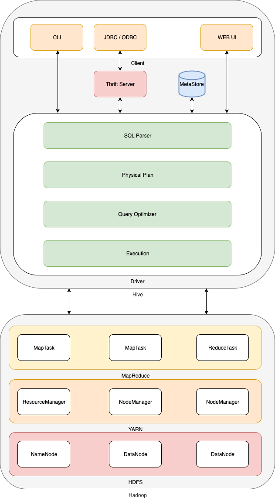
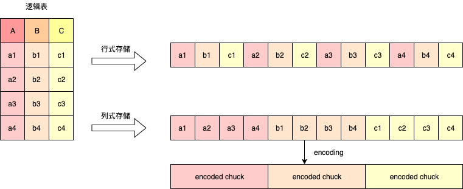

# 数据仓库

## 基本概念

- 数据仓库的英文名称为Data Warehouse，可简写为DW或DWH。
- 数据仓库的目的是构建**面向分析**的集成化数据环境，为企业提供决策支持（Decision Support）。它出于<font color=red>分析性报告和决策支持</font>的目的而创建。
- 数据仓库本身并不“生产”任何数据，同时自身也不需要“消费”任何的数据，数据来源于外部，并且开放给外部应用，这也是为什么叫“仓库”，而不叫“工厂”的原因。


## 主要特征

数据仓库是面向主题的（Subject-Oriented）、集成的（Integrated）、非易失的（Non-Volatile）和时变的（Time-Variant）数据集合，用以支持管理决策。

- 主题的（Subject-Oriented）

  数据仓库是一般从用户实际需求出发，将不同平台的数据源按设定主题进行划分整合，与传统的面向事务的操作型数据库不同，具有较高的抽象性。面向主题的数据组织方式，就是在较高层次对分析对象数据的一个完整、统一并一致的描述，能完整及统一地刻画各个分析对象所涉及的有关企业的各项数据，以及数据之间的联系。

- 集成的（Integrated）

  数据仓库中存储的数据大部分来源于传统的数据库，但并不是将原有数据简单的直接导入，而是需要进行预处理。这是因为事务型数据中的数据一般都是有噪声的、不完整的和数据形式不统一的。这些“脏数据”的直接导入将对在数据仓库基础上进行的数据挖掘造成混乱。“脏数据”在进入数据仓库之前必须经过<font color=red>抽取、清洗、转换</font>才能生成从面向事务转而面向主题的数据集合。数据集成是数据仓库建设中最重要，也是最为复杂的一步。

  - 数据进入数据仓库后、使用之前，必须经过加工与集成。
  - 对不同的数据来源进行统一数据结构和编码。统一原始数据中的所有矛盾之处，如字段的同名异义，异名同义，单位不统一，字长不一致等。
  - 将原始数据结构做一个从面向应用到面向主题的大转变。

- 非易失的（Non-Volatile）

  数据仓库中的数据主要为决策者分析提供数据依据。决策依据的数据是不允许进行修改的。即数据保存到数据仓库后，**用户仅能通过分析工具进行查询和分析，而不能或很少修改和删除**。数据的更新升级主要都在数据集成环节完成，过期的数据将在数据仓库中直接筛除。

  - 数据仓库中包括了大量的历史数据。
  - 数据经集成进入数据仓库后是极少或根本不更新的。

- 时变的（Time-Variant）

  数据仓库数据会随时间变化而定期更新，不可更新是针对应用而言，即用户分析处理时不更新数据。每隔一段固定的时间间隔后，抽取运行数据库系统中产生的数据，转换后集成到数据仓库中。随着时间的变化，数据以更高的综合层次被不断综合，以适应趋势分析的要求。当数据超过数据仓库的存储期限，或对分析无用时，从数据仓库中删除这些数据。关于数据仓库的结构和维护信息保存在数据仓库的元数据(Metadata)中，数据仓库维护工作由系统根据其中的定义自动进行或由系统管理员定期维护。

   

## 数据仓库和数据库的区别

- 数据库与数据仓库的区别实际讲的是OLTP 与 OLAP 的区别。 
- 操作型处理，叫<font color=red>联机事务处理 OLTP（On-Line Transaction Processing）</font>，也可以称面向交易的处理系统，它是针对具体业务在数据库联机的日常操作，通常对少数记录进行查询、修改。用户较为关心操作的响应时间、数据的安全性、完整性和并发支持的用户数等问题。传统的数据库系统作为数据管理的主要手段，主要用于操作型处理OLTP。 
- 分析型处理，叫<font color=red>联机分析处理 OLAP（On-Line Analytical Processing）</font>，一般针对**某些主题的历史数据**进行分析，支持管理决策。
- 数据仓库的出现，并不是要取代数据库。
  - 数据库是面向事务的设计，数据仓库是面向主题设计的。
  - 数据库一般存储业务数据，数据仓库存储的一般是**历史数据**。
  - **数据库**设计是尽量避免冗余，一般针对某一业务应用进行设计；比如一张简单的User表，记录用户名、密码等简单数据即可，符合业务应用，但是不符合分析；**数据仓库**在设计是有意引入<font color=red>冗余</font>，依照分析需求，分析维度、分析指标进行设计。
  - 数据库是为捕获数据而设计，数据仓库是为分析数据而设计。
    - 以银行业务为例。数据库是事务系统的数据平台，客户在银行做的每笔交易都会写入数据库，被记录下来，这里，可以简单地理解为用数据库记账。数据仓库是分析系统的数据平台，它从事务系统获取数据，并做汇总、加工，为决策者提供决策的依据。比如，某银行某分行一个月发生多少交易，该分行当前存款余额是多少。如果存款又多，消费交易又多，那么该地区就有必要设立ATM了。 
    - 显然，银行的交易量是巨大的，通常以百万甚至千万次来计算。事务系统是实时的，这就要求时效性，客户存一笔钱需要几十秒是无法忍受的，这就要求数据库只能存储很短一段时间的数据。而分析系统是事后的，它要提供**关注时间段内**所有的有效数据。这些数据是海量的，汇总计算起来也要慢一些，但是，只要能够提供有效的分析数据就达到目的了。 
  - 数据仓库，是在数据库已经大量存在的情况下，为了进一步挖掘数据资源、为了决策需要而产生的，它决不是所谓的“大型数据库”。


## 分层架构

### 四层架构

- ODS（Operational Data Store 原始数据层）存放原始数据，直接加载原始日志、数据，数据保持原貌不做处理。
- DWD（Data Warehouse Detail 明细数据层）结构和粒度与原始表保持一致，对ODS层数据进行清洗，如去除空值，脏数据，超过极限范围数据等。
- DWS（Data Warehouse service 服务数据层）以DWD为基础，进行轻度汇总。
- ADS（Application Data Store 数据应用层）为各种统计报表提供数据。


### 三层架构

- ODS（Operational Data Store 原始数据层，原始层）存放原始数据，直接加载原始日志、数据，数据保持原貌不做处理。

  - 和原始日志同步，也可以认为是原始日志的备份
  - 若后续计算数据有问题，可以通过原始数据来排查

- DW（Data Warehouse 明细数据层，中间层）存放数据仓库明细层的数据，这一层主要用于对数据进行整合和ETL处理之后存放的，可以在各个业务场景下共用的。

  - <font color=red>大表查询</font>

    这种情况就需要提前每天做一次规约聚合操作，将数据按照相应的维度进行一次细粒度的聚合，减少数据量。（表关联会产生笛卡尔积）

  - <font color=red>多表关联</font>

    在hive中，多表之间的关联是性能消耗最大的地方。因此，我们可以做一个大表的聚合关联，在这个时段给予这个聚合任务大量资源来完成，这样后续结果集查询的数据就会很简单，少去很多关联，直接查询这个大表即可，提高查询效率。（表关联会产生shuffle）

- RES（Result 数据应用层，结果层）为各种统计报表提供数据。也可称为APP、DM、DA层等。一般是从DW层查询计算之后将数据输出到关系型数据库中，由PHP或者Java web和前端合作展示到页面上。数仓工程师要在后续继续维护数据的准确性。


### 为什么要对数据仓库分层

  - <font color=red>用空间换时间</font>。通过大量的预处理来提升应用系统的用户体验（效率），因此数据仓库会存在大量**冗余**的数据；不分层的话，如果源业务系统的业务规则发生变化将会影响整个数据清洗过程，工作量巨大。
  - 把复杂问题简单化。通过数据分层管理可以简化数据清洗的过程，因为把原来一步的工作分到了多个步骤去完成，相当于把一个复杂的工作拆成了多个简单的工作，把一个大的黑盒变成了一个白盒，每一层的处理逻辑都相对简单和容易理解，这样我们比较容易保证每一个步骤的正确性，当数据发生错误的时候，往往我们只需要局部调整某个步骤即可。
  - 隔离原始数据。不论是数据异常，还是数据的敏感性，将原始数据和统计数据解耦。
  - 便于处理业务的变化。随着业务的变化，只需要调整底层的数据，对应用层对业务的调整零感知。
  - 可以横向扩展。中间层都是宽表，包含很多信息，但是这些信息在不同时期有着不同的业务需求，所以要可以增加，但是原则上不能删除字段，即便某个统计指标不在参与计算，但是不可删除。


## 数据仓库架构

- 数据采集层

  数据采集层的任务就是把数据从各种数据源中采集和存储到数据仓库上，期间有可能会做一些ETL（抽取extra，转化transfer，装载load ）操作。数据源种类可以有多种， 日志所占份额最大，存储在备份服务器上的数据库，如Mysql、Oracle。还有来自HTTP/FTP的数据，比如合作伙伴提供的接口所获取的数据，还有一些其他数据源，如Excel等需要手工录入的数据。

- 数据存储与分析

  HDFS是大数据环境下数据仓库/数据平台最完美的数据存储解决方案。离线数据分析与计算，也就是对实时性要求不高的部分，Hive是不错的选择。 我们通过hive作为元信息的表结构化管理，可以通过spark sql或者 impala，或者presto sql 去操作查询。

- 数据输出

  前面使用Hive、MR、Spark、SparkSQL分析和计算的结果，还是在HDFS上，但大多业务和应用不可能直接从HDFS上获取数据，那么就需要一个数据共享的地方，使得各业务和产品能方便的获取数据。 这里的数据共享，其实指的是前面数据分析与计算后的结果存放的地方，其实就是关系型数据库mysql或者其他NOSQL的数据库。一般都是采用mysql。

- 数据应用

  报表，业务系统，运营系统等公司系统所使用的数据，通常是数据集市层直接查询，一般也是已经统计汇总好的存放于数据集市层中通过直接操作SQL得到。


## 数据仓库建模

### 建模思想

Inmon和Kimball是最常见的两种架构。

Inmon主张**自上而下（从上游到下游）**的架构，它将数据仓库定义为整个企业级的集中存储。数据仓库存放着最低的详细级别的原子数据。维度数据集市只是在数据仓库完成后才创建的。因此，数据仓库是企业信息工厂（CIF）的中心，它为交付商业智能提供逻辑框架。

不同的OLTP数据集中到面向主题、集成的、不易失的和时间变化的结构中，用于以后的分析。且数据可以通过下钻到最细层，或者上卷到汇总层。数据集市应该是数据仓库的子集，每个数据集市是针对独立部门特殊设计的。

而Kimball正好与Inmon相反，Kimball架构是一种**自下而上（从下游到上游）**的架构，它认为数据仓库是一系列数据集市的集合。它首先建立最重要的业务单元或部门的数据集市。这些数据集市可以为透视组织数据提供一个较窄的视图，需要的时候，这些数据集市还可以与更大的数据仓库合并在一起。

Kimball将数据仓库定义为“一份针对查询和分析做特别结构化的事物数据拷贝。”Kimball的数据仓库结构就是著名的数据仓库总线。企业可以通过一系列维数相同的数据集市递增地构建数据仓库，通过使用一致的维度，能够共同看到不同数据集市中的信息，这表示它们拥有公共定义的元素。

**两种模式各有优势，Inmon模式适合开发进度慢，实施成本高，适合对设计科学性和规范性较高的企业，在业务模式较固定的行业应用较好，比如金融和电信等行业。Kimball 模式适合快速迭代，实施成本低，能够较快交付任务。这种模式非常适应互联网行业的高速发展，也适合中小型企业**。

### 维度建模

#### 事实表，维度表，实体表

- 事实表

  事实表其实质就是通过各种维度和一些指标值的组合来确定一个事实的，比如通过时间维度，地域组织维度，指标值可以去确定在某时某地的一些指标值怎么样的事实。事实表的每一条数据都是几条维度表的数据和指标值交汇而得到的。

- 维度表

  维度表可以看成是用户用来分析一个事实的窗口，它里面的数据应该是对事实的各个方面描述，比如时间维度表，它里面的数据就是一些日，周，月，季，年，日期等数据，维度表只能是事实表的一个分析角度。

- 实体表

  实体表就是一个实际对象的表，实体表它放的数据一定是一条条客观存在的事物数据，比如说设备 ，它就是客观存在的，所以可以将其设计一个实体表。

Kimball提出了维度建模方法，这个也是企业中最常见的方法，将表分为**事实表**和**维度表**。维度模型关注的重点是如何使最终用户访问数据仓库更容易，并有较高的性能。

<font color=red>事实表可以看成是日志和业务数据，包括维度字段，以及各个度量值；实体表是一种特殊的事实表；而维度表可以看成是字典表。他们之间通过主键和外键关联。</font>

在维度建模方法体系中，维度是描述事实的角度，如日期、渠道、服区id等，事实是要度量的指标，如注册人数、充值金额、登录次数等。

#### 星型模型，雪花模型，星座模型

- 星型模型

  一个事实表对应多个维度表，标准的星型模型只有一层。

- 雪花模型

  一个事实表对应多个维度表，一个维度表又可能包含多个维度表。

- 星座模型

  基于多个事实表，并且他们共享了某些维度表。

模型如何选择？星座模型只和业务需求有关系，同设计并无直接联系。星型模型是性能优先，而雪花模型是灵活优先。实际中，数据仓库更倾向于星型模型，尤其是hadoop体系，减少关联层级可以减少join操作，也就是减少shuffle操作。

### 范式建模

范式建模法主要由Inmon所提倡，主要运用于传统数仓之中，一般传统的数仓是建立在关系型数据库之上的，不是大数据平台下。它解决关系型数据库的数据存储，利用的一种技术层面上的方法。目前范式建模法大部分采用的是三范式建模法。

- 第一范式（1NF）：属性都是原子性的，即数据库表的每一列都是不可分割的原子数据项。
- 第二范式（2NF）：在1NF的基础上，实体的属性完全依赖于主关键字，不能存在仅依赖主关键字一部分的属性，也就是不存在局部依赖。
- 第三范式（3NF）：在2NF的基础上，任何非主属性不依赖于其它非主属性，也就是不存在传递依赖。

### 实体建模

在数据系统中，将数据抽象为“实体”、“属性”、“关系”来表示数据关联和事物描述，这种对数据的抽象建模通常被称为实体关系模型。

- 实体：通常为参与到过程中的主体，客观存在的，比如游戏道具、坐骑、等级、武器装备，此实体非数据库表的实体表。
- 属性：对主体的描述、修饰即为属性，比如游戏道具的属性有道具名称、道具类型、经验值、价值金币的额度、解封的等级等。
- 关系：现实的物理事件是依附于实体的，比如获得道具并放入背包事件，依附实体商品、货位，就会有“库存”的属性产生；用户购买道具，依附实体用户、道具，就会有“购买数量”、“金额”的属性产品。

当这些实体建立关系的时候需要根据主键来进行关联，关联的时候就会产生1对1、1对多、多对多的关系。


## ETL

数据仓库从各数据源获取数据及在数据仓库内的数据转换和流动都可以认为是ETL（抽取Extra, 转化Transfer, 装载Load）的过程，ETL是数据仓库的流水线，也可以认为是数据仓库的血液，它维系着数据仓库中数据的新陈代谢，而数据仓库日常的管理和维护工作的大部分精力就是保持ETL的正常和稳定。

- 抽取

  主要是针对各个业务系统及不同服务器的分散数据，充分理解数据定义后，规划需要的数据源及数据定义，制定可操作的数据源，制定增量抽取和缓慢渐变的规则。

- 清洗

  主要是针对系统的各个环节可能出现的数据二义性、重复、不完整、违反业务规则等数据质量问题，允许通过数据抽取设定的数据质量规则，将有问题的记录先剔除出来，根据实际情况调整相应的清洗操作。
  
- 转换

  主要是针对数据仓库建立的模型，通过一系列的转换来实现将数据从业务模型到分析模型，通过ETL工具可视化拖拽操作可以直接使用标准的内置代码片段功能、自定义脚本、函数、存储过程以及其他的扩展方式，实现了各种复杂的转换，并且支持自动分析日志，清楚的监控数据转换的状态并优化分析模型。

- 装载

  主要是将经过转换的数据装载到数据仓库里面，可以通过直连数据库的方式来进行数据装载，可以充分体现高效性。在应用的时候可以随时调整数据抽取工作的运行方式，可以灵活的集成到其他管理系统中。

目前有很多的ETL工具，比如SEDWA、kettle、OracleGoldengate、informatica、talend等等。这些工具主要是用于传统数仓。基于大数据平台的，少部分公司有用kettle的，其他的工具就很少有公司在用。

因为实际上对于ETL这个流程概念来讲，不同的业务场景有不同的操作流程，有些公司是在数据载入大数据平台之前进行这一步的，有些公司是在数据载入大数据平台之后才有ETL这个操作的，这个就要根据具体的实际场景，看在哪个阶段使用比较合适。


## 数据仓库的缓慢变化维

缓慢变化维度（slowly changing dimension, SCD）就是数据仓库维度表中，那些随时间变化比较不明显，但仍然会发生变化的维度。由于维度变化缓慢，且不知道究竟何时可能会发生变化（可能几个月或者几年有可能更新一次），所以我们在设计数据仓库的数据同步的时候，对于一些缓慢变化维度，就比较棘手，因为我们不知道该何时去同步这些变化了的维度。

### 重写覆盖属性值

当一个维度值的源发生变化，并且不需要在星型模式中保留变化历史时，通常采用新数据来覆盖旧数据 ，这个方法有个前提，那就是用户不关心这个数据的变化或者这个数据是错误数据 。这样的处理使属性所反映的总是最新的赋值 。

### 添加维度行（推荐）

保留事实的历史环境 ，并插入新的维度行 。

### 增加维度列

用不同的字段来保存不同的值，实际上就是在后面添加一个字段，这个字段用来保存变化后的当前值，而原来的值则被称为变化前的值，总的来说这种方法通过添加字段来保存变化后的痕迹 。

### 添加历史表

另外建一个表来保存历史记录，这种方式就是将历史数据与当前数据完全分开来，在维度中只保存当前的数据 。

### 混合模式之可预见的多重变化

### 非常规混合模型

给出一个版本号来标识数据是否为当前存储值，如果是，那么版本号为0；如果不是，那么版本号为非0。当插入数据的时候就会对之前的数据版本号进行修改，每插入一次，对应的历史记录的版本号就会增加一，这样用户就可以通过版本号来查询指定历史数据。

### 混合模式之不可预见的单重变化


## 数据仓库的元数据管理

元数据（Meta Data），主要记录数据仓库中模型的定义、各层级间的映射关系、监控数据仓库的数据状态及 ETL 的任务运行状态。一般会通过元数据资料库（Metadata Repository）来统一地存储和管理元数据，其主要目的是使数据仓库的设计、部署、操作和管理能达成协同和一致。元数据是数据仓库管理系统的重要组成部分，元数据管理是企业级数据仓库中的关键组件，贯穿了数据仓库的整个生命周期，使用元数据驱动数据仓库的开发，使数据仓库自动化，可视化。

### 元数据类型

元数据可分为技术元数据、业务元数据和管理过程元数据。

- 技术元数据为开发和管理数据仓库的 IT 人员使用，它描述了与数据仓库开发、管理和维护相关的数据，包括数据源信息、数据转换描述、数据仓库模型、数据清洗与更新规则、数据映射和访问权限等。主要包含以下作用
  - 数据仓库结构的描述，包括仓库模式、视图、维、层次结构和导出数据的定义，以及数据集市的位置和内容；
  - 业务系统、数据仓库和数据集市的体系结构和模式
  - 汇总用的算法，包括度量和维定义算法，数据粒度、主题领域、聚集、汇总、预定义的查询与报告；
  - 由操作环境到数据仓库环境的映射，包括源数据和它们的内容、数据分割、数据提取、清理、转换规则和数据刷新规则、安全（用户授权和存取控制）。
- 业务元数据为管理层和业务分析人员服务，从业务角度描述数据，包括商务术语、数据仓库中有什么数据、数据的位置和数据的可用性等，帮助业务人员更好地理解数据仓库中哪些数据是可用的以及如何使用。
  - 企业概念模型：这是业务元数据所应提供的重要的信息，它表示企业数据模型的高层信息、整个企业的业务概念和相互关系。以这个企业模型为基础，不懂数据库技术和SQL语句的业务人员对数据仓库中的数据也能做到心中有数。
  - 多维数据模型：这是企业概念模型的重要组成部分，它告诉业务分析人员在数据集市当中有哪些维、维的类别、数据立方体以及数据集市中的聚合规则。这里的数据立方体表示某主题领域业务事实表和维表的多维组织形式。
  - 业务概念模型和物理数据之间的依赖：以上提到的业务元数据只是表示出了数据的业务视图，这些业务视图与实际的数据仓库或数据库、多维数据库中的表、字段、维、层次等之间的对应关系也应该在元数据知识库中有所体现。
- 管理过程元数据指描述管理领域相关的概念、关系和规则的数据，主要包括管理流程、人员组织、角色职责等信息。

### 元数据功能

- 血缘分析：向上追溯元数据对象的数据来源。血缘分析可以帮助您轻松回答：'我正在查看的报告数据来源是什么？'以及'对当前分析的数据应用了哪些转换处理？'等问题。这样的机制及对这些问题的回答确保了对所分析的数据更高的信任水平，并有助于实现许多行业(包括医疗、金融、银行和制造业等)对所呈现数据的特殊监管及合规性要求。
- 影响分析：向下追溯元数据对象对下游的影响。影响分析可以让您轻松应对变更可能产生的影响，自动识别与其相关的依赖项和潜在的影响还可以跟踪所有对象及其依赖关系，最后我们还提供数据全生命周期的可视化显示。例如，如果您的某一信息系统中准备将“销售额”从包含税费更改为不包括税费，则SE-DWA将自动显示所有使用了“销售金额”字段，以便您可以确定有哪些工作需要完成，并且建议您在更改前完成该工作。
- 同步检查：检查源表到目标表的数据结构是否发生变更。
- 指标一致性分析：定期分析指标定义是否和实际情况一致。
- 实体关联查询：事实表与维度表的代理键自动关联。

### 元数据应用

- ETL自动化管理：使用元数据信息自动生成物理模型，ETL程序脚本，任务依赖关系和调度程序。
- 数据质量管理：使用数据质量规则元数据进行数据质量测量。数据质量根据设定的规则帮助您过滤出有问题的数据，并智能分析数据质量缺陷。
- 数据安全管理：使用元数据信息进行报表权限控制。可以方便查看用户和访问权限，并启用对象级和行级安全管理。对象级安全性确保通过身份验证的用户只能访问他们被授权查看的数据、表或列，其它数据则不可见。基于行的安全性会更进一步，可以限制特定的组成员只可以访问表中特定的数据。
- 数据标准管理：使用元数据信息生成标准的维度模型。
- 数据接口管理：使用元数据信息进行接口统一管理。多种数据源接入，并提供多种插件对接最流行的源系统。应该可以简单方便获取数据。
- 项目文档管理：使用元数据可以自动、方便的生成的健壮全面的项目文档，其以帮助您应对各种对于数据合规性要求。读取元数据模型，并生成pdf格式的描述文件。生成文档您查看每个对象的名称、设置、描述和代码。
- 数据语义管理：业务用户在自助服务分析中面临的挑战他们不了解数据仓库从而无法正确解释数据，使用元数据可以语义层建模，使用易于业务用户理解的描述来转换数据。


# Hive

## 概念

Hive是基于Hadoop的一个<font color=red>数据仓库工具</font>。

- 可以将结构化的数据文件映射为一张数据库表，并提供类SQL查询功能。
- 其本质是将SQL转换为MapReduce的任务进行运算，底层由HDFS来提供数据的存储支持，即Hive可以理解为一个将SQL转换为MapReduce任务的工具，甚至更进一步可以说Hive就是一个MapReduce的客户端。


## 与数据库区别

| 对比项       | Hive                    | RDBMS                  |
| ------------ | ----------------------- | ---------------------- |
| 查询语言     | HQL                     | SQL                    |
| 数据存储     | HDFS                    | Raw Device or local FS |
| 执行器       | MapReduce               | Executor               |
| 数据插入     | 支持批量导入/单条插入   | 支持批量导入/单条插入  |
| 数据操作     | 覆盖追加                | 行级更新删除           |
| 处理数据规模 | 大                      | 小                     |
| 执行延迟     | 高                      | 低                     |
| 分区         | 支持                    | 支持                   |
| 索引         | 0.8版本之后加入简单索引 | 支持复杂索引           |
| 扩展性       | 高（好）                | 有限（差）             |
| 数据加载模式 | 读时模式（快）          | 写时模式（慢）         |
| 应用场景     | 海量数据查询            | 实时查询               |

- Hive 具有 SQL 数据库的外表，但应用场景完全不同。
- Hive 只适合用来做海量离线数据统计分析，也就是数据仓库。


## 优缺点

- 优点
  - **操作接口采用类SQL语法**，提供快速开发的能力（简单、容易上手）。
  - **避免了去写MapReduce**，减少开发人员的学习成本。
  - **Hive支持用户自定义函数**，用户可以根据自己的需求来实现自己的函数。
- 缺点
  - **Hive 的查询延迟很严重**
  - **Hive 不支持事务**


## 架构原理




- 用户接口：Client
  - CLI（hive shell）
  - JDBC/ODBC（java访问hive）
  - WEBUI（浏览器访问hive，可以使用HUE）
- 元数据：Metastore
  - 元数据包括：表名、表所属的数据库（默认是default）、表的拥有者、列/分区字段、表的类型（是否是外部表）、表的数据所在目录等；
  - 默认存储在自带的derby数据库中，推荐使用MySQL存储Metastore
- Hadoop集群
  - 使用HDFS进行存储，使用MapReduce进行计算
- Driver：驱动器
  - 解析器（SQL Parser） 
    - 将SQL字符串转换成抽象语法树AST
    - 对AST进行语法分析，比如表是否存在、字段是否存在、SQL语义是否有误
  - 编译器（Physical Plan）：将AST编译生成逻辑执行计划
  - 优化器（Query Optimizer）：对逻辑执行计划进行优化
  - 执行器（Execution）：把逻辑执行计划转换成可以运行的物理计划。对于Hive来说默认就是MapReduce任务


## 交互方式

### Hive交互式shell

<font color=red>不推荐</font>

- 启动 hive CLI

```bash
# Hive CLI is deprecated and migration to Beeline is recommended.
hive
```


- 执行语句

```mysql
-- 列出数据库
show databases;

-- 退出
quit;
```


### JDBC服务

<font color=red>推荐</font>

- 启动 hiveserver2 服务

```bash
# 前台启动
hive --service hiveserver2

# nohup 不挂断的运行
# & 后台运行
# 0 – stdin (standard input) | 1 – stdout (standard output) | 2 – stderr (standard error) 
# 将2重定向到&1，&1再重定向到文件中
nohup hive --service hiveserver2 > /home/hadoop/hiveserver2log/hs2.log 2>&1 &   

# 检查后台服务，会有一个RunJar进程
jps
```


- beeline连接hiveserver2服务

```bash
# 启动客户端
beeline
```


- 连接数据库服务

```mysql
-- 输入用户名hadoop，密码hadoop(首次需要设置)
!connect jdbc:hive2://node03:10000

-- 列出数据库
show databases;

-- 查看帮助
help

-- 退出
!quit
```


### Hive命令

<font color=red>数仓搭建好后，执行脚本</font>

- 执行HQL语句

```bash
# 使用 –e 参数来直接执行hql语句
hive -e "show databases"
```


- 执行HQL脚本

创建脚本

```bash
vi myhive.hql
```


脚本内容

```mysql
create database if not exists myhive;
```


执行脚本

```bash
# 执行
hive -f myhive.hql

# 检查
hive -e "show databases"
```


## 数据类型

### 基本数据类型

|  类型名称  |              描述               |    举例    |
| :--------: | :-----------------------------: | :--------: |
|  boolean   |           true/false            |    true    |
|  tinyint   |        1字节的有符号整数        |     1      |
|  smallint  |        2字节的有符号整数        |     1      |
|  **int**   |        4字节的有符号整数        |     1      |
| **bigint** |        8字节的有符号整数        |     1      |
|   float    |        4字节单精度浮点数        |    1.0     |
| **double** |        8字节单精度浮点数        |    1.0     |
| **string** |       字符串（不设长度）        |   “abc”    |
|  varchar   | 字符串（1-65355长度，超长截断） |   “abc”    |
| timestamp  |             时间戳              | 1563157873 |
|    date    |              日期               |  20190715  |


### 复合数据类型

| 类型名称 |               描述               |                 定义                  |
| :------: | :------------------------------: | :-----------------------------------: |
|  array   | 一组有序的字段，字段类型必须相同 |           `col array<int>`            |
|   map    |         一组无序的键值对         |         `col map<string,int>`         |
|  struct  | 一组命名的字段，字段类型可以不同 | `col struct<a:string,b:int,c:double>` |

- array类型字段的元素访问方式

  准备数据 t_array.txt 

  ```txt
  1 zhangsan beijing,shanghai
  2 lisi shanghai,tianjin,wuhan
  ```

  

  建表

  ```mysql
  -- 建表
  -- field间空格分隔
  -- array用,分隔
  create table myhive.t_array(id string,name string,locations array<string>) 
  row format delimited 
  fields terminated by ' ' 
  collection items terminated by ',';
  
  -- 加载数据
  load data local inpath '/home/hadoop/hivedatas/t_array.txt' into table myhive.t_array;
  
  -- 查询
  select * from myhive.t_array;
  -- 通过下标获取元素
  select id,name,locations[0],locations[1] from myhive.t_array;
  -- 记录的数组元素若不存在，则为NULL
  select id,name,locations[0],locations[1],locations[2] from myhive.t_array;
  ```

  

- map类型字段的元素访问方式

  准备数据 t_map.txt

  ```txt
  1 name:zhangsan#age:30
  2 name:lisi#age:40
  ```

  

  建表

  ```mysql
  -- 建表
  -- field间空格分隔
  -- map中的每一个kv对以#分隔（本质是集合），kv以:分隔
  create table myhive.t_map(id string,info map<string,string>) 
  row format delimited 
  fields terminated by ' ' 
  collection items terminated by '#' 
  map keys terminated by ':';
  
  -- 加载数据
  load data local inpath '/home/hadoop/hivedatas/t_map.txt' into table myhive.t_map;
  
  -- 查询
  select * from myhive.t_map;
  -- 通过键获取值
  -- 只能单独访问map的k或v，不能直接访问集合kv对
  select id,info['name'],info['age'] from t_map;
  ```

  

- struct类型字段的元素访问方式

  准备数据 t_struct.txt 

  ```txt
  1 zhangsan:30:beijing
  2 lisi:40:shanghai
  ```

  

  建表

  ```mysql
  -- 建表
  create table myhive.t_struct(id string,info struct<name:string, age:int,address:String>)  row format delimited 
  fields terminated by ' ' 
  collection items terminated by ':' ;
  
  -- 加载数据
  load data local inpath '/home/hadoop/hivedatas/t_struct.txt' into table myhive.t_struct;
  
  -- 查询
  select * from myhive.t_struct;
  -- 类似对象获取属性方法
  select id,info.name,info.age,info.address from myhive.t_struct;
  ```

  

## DDL（Data Definition Language）

### 数据库DDL操作

#### 创建数据库

```mysql
-- 重复创建失败 Database test already exists
create database test;

-- 不存在才创建
-- 默认hdfs存储路径：/user/hive/warehouse/test.db
-- 在hdfs中数据库映射为目录
create database if not exists test;
```


#### 列出数据库

```mysql
-- 列出所有数据库
show databases;

-- 模糊查询数据库
show databases like '*t*';
```


#### 查询数据库信息

```mysql
-- 数据库信息
desc database test;

-- 数据库扩展信息
desc database extended test;
```


#### 切换数据库

```mysql
-- 切换到当前数据库
use test;
```


#### 删除数据库

```mysql
-- 删除存在数据库
-- 删除不存在的数据库失败 Database does not exist: test
drop database test;

-- 存在才删除
drop database if exists test;

-- 当数据库有表存在时，需要级联强制删除
-- 慎用
drop database if exists myhive cascade;
```


### 表DDL操作

#### 创建内部表

- 直接建表

```mysql
use myhive;
-- 在hdfs中表映射为目录
create table stu(id int, name string);

-- 可以通过 insert into 向hive表中插入数据
-- 但不建议这么做，因为每个 insert into 转换成MapReduce后会生成一个小文件
-- 在hdfs中表数据映射为文件
insert into stu(id,name) values(1,"zhangsan");
insert into stu(id,name) values(2,"lisi");

-- 查询表数据
select * from stu;
```


- 查询建表

```mysql
-- 通过 AS 查询语句完成建表，将子查询的结果存入新表
-- hdfs只有一个文件
create table if not exists myhive.stu1 as select id, name from stu;
```


- like建表

```mysql
-- 根据已存在表的结构建表，没有数据
create table if not exists myhive.stu2 like stu;
```


- 创建内部表并指定字段之间的分隔符，指定文件的存储格式，以及数据存放的位置

```mysql
-- 默认 \001（非打印字符）分隔 field
-- 自定义 \t 分隔 field
create table if not exists myhive.stu3(id int, name string)
row format delimited fields terminated by '\t'
stored as textfile
location '/user/stu3';

-- hdfs文件以\t分隔存储每行数据的各个字段
insert into myhive.stu3(id,name) values(1,"zhangsan");
```


#### 创建外部表

- 外部表加载hdfs其他路径下已存在的数据文件，因此外部表不会独占数据文件，当删除表时，不会删除相应的数据文件
- 创建外部表需要加 external 关键字
- location 字段可以指定，也可以不指定
  - 当不指定location时，默认存放在指定数据库位置下。若没有指定数据库，则保存在default数据库下
  - 当指定location时，使用location作为数据目录，数据库下不会再创建相应表的文件夹

```mysql
create external table myhive.teacher (t_id string, t_name string)
row format delimited fields terminated by '\t';
```


- 插入数据
  - 通过 insert into 方式<font color=red>不推荐</font>
  - 通过 load data 方式加载数据到内部表或外部表

```mysql
-- 加载本地文件
-- 拷贝
load data local inpath '/home/hadoop/hivedatas/teacher.csv' into table myhive.teacher;

-- 加载hdfs文件
-- 剪切
-- overwrite 覆盖原有数据；否则追加
load data inpath '/hivetest/teacher.csv' overwrite into table myhive.teacher;
```


- 内部表与外部表的互相转换
  - 内部表删除后，表的元数据和真实数据都被删除
  - 外部表删除后，仅仅只是把该表的元数据删除，真实数据还在，后期可以恢复
  - <font color=red>使用时机</font>
    - 内部表由于删除表的时候会同步删除HDFS的数据文件，所以确定如果一个表仅仅是你独占使用，其他人不使用的时候就可以创建内部表，如果一个表的文件数据其他人也要使用，那么就创建外部表
    - 外部表用在数据仓库的ODS层
    - 内部表用在数据仓库的DW层

```mysql
-- 内部表转换为外部表
-- EXTERNAL_TABLE
alter table stu set tblproperties('EXTERNAL'='TRUE');

-- 外部表转换为内部表
alter table teacher set tblproperties('EXTERNAL'='FALSE');
```


#### 创建分区表

- 如果hive当中所有的数据都存入到一个目录下，那么在使用MR计算程序的时候，读取整个目录下面的所有文件来进行计算（<font color=red>全量扫描，性能低</font>），就会变得特别慢，因为数据量太大了
- 实际工作中一般都是计算前一天的数据（日增），所以我们只需要将前一天的数据挑出来放到一个目录下面即可，专门去计算前一天的数据
- 这样就可以使用hive当中的分区表，通过<font color=red>分目录</font>的形式，将每一天的数据都分成为一个目录，然后我们计算数据的时候，通过指定前一天的目录即可只计算前一天的数据
- 在大数据中，最常用的一种思想就是分治，我们可以把大的文件切割划分成一个个的小文件，这样每次操作一个小的文件就会很容易了，同样的道理，在hive当中也是支持这种思想的，就是我们可以把大的数据，按照每天，或者每小时进行切分成一个个的小的文件，这样去操作小的文件就会容易得多


- 创建分区表

```mysql
-- 按month分区，不需要是表字段
-- 分区对应数据库表的一个字段，分区下所有数据的分区字段值相同
-- load data 之后才会出现分区文件夹
create table myhive.score(s_id string, c_id string, s_score int) 
partitioned by (month string) 
row format delimited fields terminated by '\t';

-- 按year、month和day分区
create table myhive.score1 (s_id string, c_id string, s_score int) 
partitioned by (year string, month string, day string) 
row format delimited fields terminated by '\t';
```


- 加载数据

```mysql
-- score
-- month=201806对应hdfs的文件夹名
load data local inpath '/home/hadoop/hivedatas/score.csv' into table myhive.score 
partition (month='201806');

-- score1
-- score1/year=2018/month=06/day=01
load data local inpath '/home/hadoop/hivedatas/score.csv' into table myhive.score1 
partition (year='2018', month='06', day='01');
```


- 查询表分区

````mysql
show partitions myhive.score;
````


- 添加表分区

```mysql
-- 添加之后就可以在hdfs看到相应的文件夹
alter table myhive.score add partition(month='201805');

-- 同时添加多个分区
alter table myhive.score add partition(month='201804') partition(month='201803');
```


- 删除表分区

```mysql
alter table myhive.score drop partition(month='201806');
```


- 综合举例

```mysql
-- hdsf 创建日期目录，每日增加日期文件夹和数据
hdfs -mkdir /hivetest/day=20180607
-- 上传数据
hdfs dfs -put score.csv /hivetest/day=20180607

-- 创建外部分区表，同时指定数据位置
-- 表删除后，实际数据不删除
create external table myhive.score2(s_id string, c_id string, s_score int) 
partitioned by (day string) 
row format delimited fields terminated by '\t' 
location '/hivetest';

-- 可以观察到虽然创建表成功，但没有创建相应的分区，也就是没有相应的MetaStore元数据
show partitions myhive.score2;
-- 表数据是空的
select * from myhive.score2;

-- 解决办法：1、添加表分区(繁琐)；2、metastore check repair命令自动添加元数据
msck repair table myhive.score2;

-- day=20180607
show partitions myhive.score2;
-- 数据加载成功
select * from myhive.score2;
```


#### 创建分桶表

- 分桶是相对分区进行更细粒度的划分
  - <font color=red>Hive表或分区表可进一步的分桶</font>
  - 分桶将整个数据内容按照某列取hash值，对桶的个数取模的方式决定该条记录存放在哪个桶（文件）当中。**所以必须进过一次MapReduce，也就是为什么分桶表的数据都是从结果集中以insert的方式导入**。

- 作用
  - 取样sampling更高效
  - 提升某些查询操作效率，例如map side join


- 开启参数支持

  - 系统根据表定义自动分桶（<font color=red>推荐</font>）

    ```mysql
    -- 开启对分桶表的支持
    -- set hive.enforce.bucketing; 可以查询是否支持分桶，默认是false
    set hive.enforce.bucketing=true;
    ```

  - 参数设定

    ```mysql
    -- 设置与桶相同的reduce个数（默认只有一个reduce）
    set mapreduce.job.reduces=4;
    -- 或
    -- set mapreduce.reduce.tasks = 4;
    
    -- 在后续插入数据时，select + cluster by 
    ```

    

- 创建分桶表

```mysql
-- 创建分桶表
-- 分桶字段是表的字段
create table myhive.user_buckets_demo(id int, name string)
clustered by(id) into 4 buckets 
row format delimited fields terminated by '\t';

-- 创建普通表
create table myhive.user_demo(id int, name string)
row format delimited fields terminated by '\t';
```


- 准备数据 buckets.txt

```txt
1	anzhulababy1
2	anzhulababy2
3	anzhulababy3
4	anzhulababy4
5	anzhulababy5
6	anzhulababy6
7	anzhulababy7
8	anzhulababy8
9	anzhulababy9
10	anzhulababy10
```


- 加载数据

```mysql
-- 普通表加载数据
load data local inpath '/home/hadoop/hivedatas/buckets.txt' overwrite into table myhive.user_demo;

-- 加载数据到分桶表
-- 可以在hdsf中观察user_buckets_demo表所属的文件夹下共有4个文件(对应4个ReduceTask)
insert into table myhive.user_buckets_demo select * from myhive.user_demo;
```


- 抽样查询分桶表的数据

TABLESAMPLE语法：`TABLESAMPLE (BUCKET x OUT OF y [ON colname])` 。其中，x表示从第几个桶开始采样数据，桶序号从1开始，y表示桶数，colname表示每一行被采样的列。

```mysql
-- 将user_demo以id作为采样列，划分为两个桶，返回第一个桶的数据
-- 假设x=1，如果桶数多于y，则每y桶取第一个；如果桶数小于y，则将桶数再按照y进行平均划分，然后再取第一个
select * from myhive.user_demo tablesample(bucket 1 out of 2 on id);

-- 以随机数作为采样列，因此每一次返回的数据不同
select * from myhive.user_demo tablesample(bucket 1 out of 2 on rand());

-- 显然，对 user_demo 采样，需对全表扫描。如果该表事先就是分桶表的话，采样效率会更高
-- user_buckets_demo 本身是分桶表，共有4桶
-- y 取值2，含义是分两桶，取第一桶采样数据。但表本身有4桶，共取两桶数据 4/2=2 作为采样数据，分别是第一桶和第三桶
-- 对数据除以4取余数，值为0，1，2，3
-- 第1桶 [0] 4 8
-- 第2桶 [1] 1 5 9
-- 第3桶 [2] 2 6 10
-- 第4桶 [3] 3 7
select * from myhive.user_buckets_demo tablesample(bucket 1 out of 2);

-- 4/8=1/2 取第一桶的1/2作为采样数据
select * from myhive.user_buckets_demo tablesample(bucket 1 out of 8);
```


#### 删除表

```mysql
drop table myhive.stu2;
```


#### 修改表结构信息

- 修改表名

```mysql
use myhive;
alter table teacher2 rename to teacher1;
```


- 增加列

```mysql
use myhive;
-- 已有记录的新增字段值为NULL
alter table stu1 add columns(address string,age int);
```


- 修改列

```mysql
use myhive;
alter table stu1 change column address address_id int;
```


#### 列出数据库表

```mysql
use myhive;

show tables;
```


#### 查询表结构信息

```mysql
-- 简要信息，只有字段名、类型和描述
desc myhive.stu;

-- 详细信息
-- MANAGED_TABLE 内部表
desc formatted myhive.stu;
```


## DML（Data Manipulation Language）

### 数据导入

#### 直接向表中插入数据

<font color=red>强烈不建议</font>

```mysql
create table myhive.score3 like score;
-- 生成MR，对应hdfs一个小文件
insert into table myhive.score3 partition(month ='201807') values ('001','002','100');
```


#### 通过load加载数据

<font color=red>重要</font>

```mysql
-- overwrite只覆盖指定分区数据
-- 不会生成MR
load data local inpath '/home/hadoop/hivedatas/score.csv' overwrite into table myhive.score3 partition(month='201806');
```


#### 通过查询加载数据

<font color=red>重要</font>

```mysql
create table myhive.score5 like score;
-- 生成MR，所有数据对应一个文件
-- overwrite覆盖原有数据
insert overwrite table myhive.score5 partition(month='201806') select s_id,c_id,s_score from myhive.score3;
```


#### 通过查询创建表并加载数据

```mysql
create table myhive.score6 as select * from score;
```


#### 创建表时指定location

```mysql
create external table myhive.score7 (s_id string,c_id string,s_score int) 
row format delimited fields terminated by '\t' 
location '/hivetest/score';
```


上传数据文件

```bash
# 上传文件到指定位置
hdfs dfs -put score.csv /hivetest/score
```


#### 通过导入导出的数据

```mysql
create table myhive.teacher2 like teacher;

-- hdfs目录结构：
-- /hivetest/teacher/_metadata
-- /hivetest/teacher/data/teacher.csv
export table myhive.teacher to '/hivetest/teacher';

-- 导入数据
import table myhive.teacher2 from '/hivetest/teacher';
```


### 数据导出

#### insert 导出

```mysql
-- 导出到本地
-- 生成MR，结果字段默认分隔为'\001'
insert overwrite local directory '/home/hadoop/hivedatas/stu' select * from myhive.stu1;

-- 格式化输出结果
insert overwrite local directory '/home/hadoop/hivedatas/stu2' row format delimited fields terminated by ',' select * from myhive.stu1;

-- 导出到hdfs
insert overwrite directory '/hivetest/export/stu' row format delimited fields terminated by  ','  select * from myhive.stu1;
```


#### Hive 命令

```mysql
-- 字段间以 \t 分隔
hive -e 'select * from myhive.stu1;' > /home/hadoop/hivedatas/student.txt
```


#### export导出到HDFS

```mysql
export table myhive.stu1 to '/hivetest/student';
```


### 静态分区

<font color=red>需手动指定分区</font>

- 创建分区表

```mysql
create table myhive.order_partition(
order_number string,
order_price  double,
order_time string)
partitioned BY(month string)
row format delimited fields terminated by '\t';
```


- 准备数据 order.txt

```txt
10001	100	2019-03-02
10002	200	2019-03-02
10003	300	2019-03-02
10004	400	2019-03-03
10005	500	2019-03-03
10006	600	2019-03-03
10007	700	2019-03-04
10008	800	2019-03-04
10009	900	2019-03-04
```


- 加载数据

```mysql
-- 加载数据时手动指定分区
-- 执行成功后，分区和数据全部建立
load data local inpath '/home/hadoop/hivedatas/order.txt' overwrite into table myhive.order_partition partition(month='2019-03');

-- 查询数据
select * from myhive.order_partition where month='2019-03';
```


### 动态分区

利用中间表<font color=red>数据导入时自动创建分区</font>

- 创建表

```mysql
-- 创建普通表
create table myhive.t_order(
order_number string,
order_price  double, 
order_time   string)
row format delimited fields terminated by '\t';

-- 创建目标分区表
create table myhive.order_dynamic_partition(
order_number string,
order_price  double)
partitioned BY(order_time string)
row format delimited fields terminated by '\t';
```


- 准备数据 order_partition.txt

**注意数据格式的规则正确性，否则会出现异常分区，导致查询数据出现问题**

```txt
10001	100	2019-03-02
10002	200	2019-03-02
10003	300	2019-03-02
10004	400	2019-03-03
10005	500	2019-03-03
10006	600	2019-03-03
10007	700	2019-03-04
10008	800	2019-03-04
10009	900	2019-03-04
```


- 加载数据

```mysql
-- 向普通表加载数据
load data local inpath '/home/hadoop/hivedatas/order_partition.txt' overwrite into table myhive.t_order;

-- 支持自动分区需设置参数
-- 自动分区
set hive.exec.dynamic.partition=true; 
-- 非严格模式
set hive.exec.dynamic.partition.mode=nonstrict; 

-- 加载数据
insert into table myhive.order_dynamic_partition partition(order_time) select order_number, order_price, order_time from t_order;

-- 查询数据
select * from myhive.order_dynamic_partition where order_time='2019-03-02';
select * from myhive.order_dynamic_partition where order_time='2019-03-03';
select * from myhive.order_dynamic_partition where order_time='2019-03-04';
```


### 查询数据

#### 基本

- SQL 语言大小写不敏感
- SQL 可以写在一行或者多行
- 关键字不能被缩写也不能分行
- 各子句一般要分行写
- 使用缩进提高语句的可读性


- 算术运算符

| 运算符   | 描述           |
| -------- | -------------- |
| A+B      | A和B 相加      |
| A-B      | A减去B         |
| A*B      | A和B 相乘      |
| A/B      | A除以B         |
| A%B      | A对B取余       |
| A&B      | A和B按位取与   |
| A&#124;B | A和B按位取或   |
| A^B      | A和B按位取异或 |
| ~A       | A按位取反      |


- 比较运算符

|         操作符          | 支持的数据类型 |                             描述                             |
| :---------------------: | :------------: | :----------------------------------------------------------: |
|           A=B           |  基本数据类型  |             如果A等于B则返回true，反之返回false              |
|          A<=>B          |  基本数据类型  | 如果A和B都为NULL，则返回true，其他的和等号（=）操作符的结果一致，如果任一为NULL则结果为NULL |
|       A<>B, A!=B        |  基本数据类型  | A或者B为NULL则返回NULL；如果A不等于B，则返回true，反之返回false |
|           A<B           |  基本数据类型  | A或者B为NULL，则返回NULL；如果A小于B，则返回true，反之返回false |
|          A<=B           |  基本数据类型  | A或者B为NULL，则返回NULL；如果A小于等于B，则返回true，反之返回false |
|           A>B           |  基本数据类型  | A或者B为NULL，则返回NULL；如果A大于B，则返回true，反之返回false |
|          A>=B           |  基本数据类型  | A或者B为NULL，则返回NULL；如果A大于等于B，则返回true，反之返回false |
| A [NOT] BETWEEN B AND C |  基本数据类型  | 如果A，B或者C任一为NULL，则结果为NULL。如果A的值大于等于B而且小于或等于C，则结果为true，反之为false。如果使用NOT关键字则可达到相反的效果。 |
|        A IS NULL        |  所有数据类型  |           如果A等于NULL，则返回true，反之返回false           |
|      A IS NOT NULL      |  所有数据类型  |          如果A不等于NULL，则返回true，反之返回false          |
|    IN(数值1, 数值2)     |  所有数据类型  |                  使用 IN运算显示列表中的值                   |
|     A [NOT] LIKE B      |  STRING 类型   | B是一个SQL下的简单正则表达式，如果A与其匹配的话，则返回true；反之返回false。B的表达式说明如下：‘x%’表示A必须以字母‘x’开头，‘%x’表示A必须以字母’x’结尾，而‘%x%’表示A包含有字母’x’,可以位于开头，结尾或者字符串中间。如果使用NOT关键字则可达到相反的效果。like不是正则，而是通配符 |
|  A RLIKE B, A REGEXP B  |  STRING 类型   | B是一个正则表达式，如果A与其匹配，则返回true；反之返回false。匹配使用的是JDK中的正则表达式接口实现的，因为正则也依据其中的规则。例如，正则表达式必须和整个字符串A相匹配，而不是只需与其字符串匹配。 |


- 逻辑运算符

|  操作符  |  操作  |                   描述                    |
| :------: | :----: | :---------------------------------------: |
| A AND  B | 逻辑并 |    如果A和B都是true则为true，否则false    |
| A  OR  B | 逻辑或 | 如果A或B或两者都是true则为true，否则false |
|  NOT  A  | 逻辑否 |      如果A为false则为true，否则false      |


- 查询

```mysql
-- 全表查询
select * from myhive.stu1;

-- 选择特定字段查询
select id,name from myhive.stu1;

-- 重命名字段
select id,name as stuName from myhive.stu1;
-- as可以省略
select id,name stuName from myhive.stu1;

-- 限制返回行数
select * from myhive.score limit 5;

-- 条件过滤
select * from myhive.score where s_score > 60;
```


- 函数

```mysql
-- 求总行数
select count(*) cnt from myhive.score;

-- 求某一字段的最大值
select max(s_score) from myhive.score;

-- 求某一字段的最小值
select min(s_score) from myhive.score;

-- 求字段值的总和
select sum(s_score) from myhive.score;

-- 求字段值的平均数
select avg(s_score) from myhive.score;
```


#### 分组

- Group By语句通常会和**聚合函数**一起使用，按照一个或者多个列对结果进行分组，然后对每个组执行聚合操作。
  - <font color=red>对多个字段同时进行group by</font>。当所有group by字段全部都相同时，才会被合并为一条记录。
    - 减少数据量（同一用户多次登录）
    - 可以满足更多的查询需求（针对不同维度进行分析）


- group by

```mysql
-- 先按s_id分组,在对字段s_score求平均数
select s_id, avg(s_score) from myhive.score group by s_id;
```


- having

  <font color=red>having 与 where 不同点</font>

  - where针对表中的列发挥作用，查询数据；having针对查询结果中的列发挥作用，筛选数据
  - where后面不能使用分组函数，而having后面可以使用分组函数
  - **having只用于group by分组统计语句**


```mysql
select s_id, avg(s_score) as avgScore from myhive.score group by s_id having avgScore > 60;
```


#### 连接

- Hive支持通常的SQL JOIN语句，但是只支持**等值**连接，不支持非等值连接。


- 表的别名
  - 使用别名可以简化查询
  - 使用表名前缀可以提高执行效率

```mysql
-- 创建表
create table myhive.course (c_id string, c_name string, t_id string) 
row format delimited fields terminated by '\t';

-- 加载数据
load data local inpath '/home/hadoop/hivedatas/course.csv' overwrite into table myhive.course;

-- join查询
select * from myhive.teacher t join myhive.course c on t.t_id = c.t_id;
```


- 内连接 inner join（简写：join）
  - 只有进行连接的两个表中都存在与连接条件相匹配的数据才会被保留下来

```mysql
use myhive;
select * from teacher t inner join course c on t.t_id = c.t_id;
```


- 左外连接 left outer join（left join）
  - join操作符左边表中符合**where**子句的所有记录将会被返回
  - 如果右边表的指定字段没有符合条件的值，就使用null值替代

```mysql
use myhive;
select * from teacher t left outer join course c on t.t_id = c.t_id;
```


- 右外连接 right outer join（right join）
  - join操作符右边表中符合**where**子句的所有记录将会被返回
  - 如果左边表的指定字段没有符合条件的值，就使用null值替代

```mysql
 use myhive;
 select * from teacher t right outer join course c on t.t_id = c.t_id;
```


- 满外连接 full outer join（full join）
  - 将会返回所有表中符合**where**语句条件的所有记录
  - 如果任一表的指定字段没有符合条件的值的话，那么就使用null值替代

```mysql
use myhive;
select * from teacher t full outer join course c on t.t_id = c.t_id;
```


- 多表连接

```mysql
use myhive;

select * from teacher t 
left join course c on t.t_id = c.t_id 
left join score s on c.c_id = s.c_id 
left join stu1 on s.s_id = stu1.id;
```


#### 排序

- order by 全局排序
  - <font color=red>全局排序，只有一个reduce</font>
  - asc (ascend) 升序 （默认）、desc (descend) 降序
  - order by 子句在select语句的结尾

```mysql
use myhive;

-- 降序
select * from score s order by s_score desc;

-- 聚合函数别名排序
select s_id, avg(s_score) avgscore from score group by s_id order by avgscore desc; 
```


- sort by 局部排序
  - <font color=red>每个reducer内部进行排序，对全局结果集来说不是排序</font>

```mysql
use myhive;

-- 设置参数
set mapreduce.job.reduces=3;

-- 3个ReduceTask内部有序，而对于整个数据结果是无序的
select * from score s sort by s.s_score;
```


- distribute by + sort by 分区排序（MR）
  - **类似MR中partition**，采用hash算法，在map端将查询的结果中指定字段的hash值相同的结果分发到对应的reduce文件中
  - 结合sort by使用
  - **distribute by** 语句要写在 **sort by** 语句之前

```mysql
use myhive;

set mapreduce.job.reduces=3;

-- 期望3个分区文件，且内部有序
insert overwrite local directory '/home/hadoop/hivedatas/distribute' row format delimited fields terminated by '\t' select * from score distribute by s_id sort by s_score;
```


- cluster by 桶排序
  - 当 distribute by 和 sort by 字段相同时，可以使用 cluster by 方式代替

```mysql
use myhive;

insert overwrite local directory '/home/hadoop/hivedatas/cluster' row format delimited fields terminated by '\t' select * from score cluster by s_score;
```


### 多维分析

#### grouping sets

```mysql
use game_center;

select channel_id,role_sex,count(1) as total_person from ods_role_create group by channel_id,role_sex grouping sets((channel_id,role_sex),(channel_id),(role_sex));

+-------------+-----------+---------------+--+
| channel_id  | role_sex  | total_person  |
+-------------+-----------+---------------+--+
| NULL        | 0         | 102692        |
| NULL        | 1         | 82487         |
| 1           | NULL      | 172018        |
| 1           | 0         | 94226         |
| 1           | 1         | 77792         |
| 2           | NULL      | 13161         |
| 2           | 0         | 8466          |
| 2           | 1         | 4695          |
+-------------+-----------+---------------+--+

# 等价于
select channel_id,role_sex,count(1) as total_person from ods_role_create group by channel_id,role_sex 
union all select channel_id,null as role_sex,count(1) as total_person from ods_role_create group by channel_id 
union all select null as channel_id,role_sex,count(1) as total_person from ods_role_create group by role_sex;
```


#### with cube

```mysql
use game_center;

select channel_id,role_sex,count(1) as total_person from ods_role_create group by channel_id,role_sex with cube;

+-------------+-----------+---------------+--+
| channel_id  | role_sex  | total_person  |
+-------------+-----------+---------------+--+
| NULL        | NULL      | 185179        |
| NULL        | 0         | 102692        |
| NULL        | 1         | 82487         |
| 1           | NULL      | 172018        |
| 1           | 0         | 94226         |
| 1           | 1         | 77792         |
| 2           | NULL      | 13161         |
| 2           | 0         | 8466          |
| 2           | 1         | 4695          |
+-------------+-----------+---------------+--+

# 等价于
select channel_id,role_sex,count(1) as total_person from ods_role_create group by channel_id,role_sex grouping sets ((channel_id,role_sex),(channel_id),(role_sex),());
```


#### with rollup

```mysql
use game_center;

# 从右至左递减维度分析
select channel_id,role_sex,count(1) as total_person from ods_role_create group by channel_id,role_sex with rollup;

+-------------+-----------+---------------+--+
| channel_id  | role_sex  | total_person  |
+-------------+-----------+---------------+--+
| NULL        | NULL      | 185179        |
| 1           | NULL      | 172018        |
| 1           | 0         | 94226         |
| 1           | 1         | 77792         |
| 2           | NULL      | 13161         |
| 2           | 0         | 8466          |
| 2           | 1         | 4695          |
+-------------+-----------+---------------+--+

# 等价于
select channel_id,role_sex,count(1) as total_person from ods_role_create group by channel_id,role_sex grouping sets ((channel_id,role_sex),(channel_id),());
```


## 参数传递

### 配置方式

- 配置文件 hive-site.xml

  - 用户自定义配置文件：$HIVE_CONF_DIR/hive-site.xml 
  - 默认配置文件：$HIVE_CONF_DIR/hive-default.xml 
  - 用户自定义配置会覆盖默认配置
  - **对本机启动的所有hive进程有效**

- 命令行参数 启动hive客户端的时候可以设置参数

  - `--hiveconf param=value` 
  - **对本次启动的Session有效（对于Server方式启动，则是所有请求的Sessions）**

- 参数声明 进入客户端以后设置的一些参数  set  

  - set param=value;

  - **作用域是session级的**

上述三种设定方式的优先级依次递增。即参数声明覆盖命令行参数，命令行参数覆盖配置文件设定。注意某些系统级的参数，例如log4j相关的设定，必须用前两种方式设定，因为那些参数的读取在Session建立以前已经完成了。

### 使用变量传递参数

- hive0.9以及之前的版本不支持传参
- hive1.0版本之后支持 `hive -f` 传递参数

- 在hive当中我们一般可以使用 `hivevar` 或 `hiveconf` 来进行参数的传递

#### hiveconf

- hive **执行上下文的属性**（配置参数），可覆盖覆盖hive-site.xml（hive-default.xml）中的参数值，如用户执行目录、日志打印级别、执行队列等。

- 传值

  ```bash
  hive --hiveconf key=value
  ```

- 使用

  ```bash
  # 使用hiveconf作为前缀
  ${hiveconf:key} 
  ```

  

#### hivevar

- hive **运行时的变量** 替换

- 传值

  ```bash
  hive --hivevar key=value
  ```

- 使用

  ```bash
  # 使用hivevar前缀
  ${hivevar:key}
  # 不使用前缀
  ${key}
  ```

  

#### define

- define与hivevar用途完全一样，简写 `-d`

## 自定义函数

### 开发程序

需要继承UDF类，同时需要提供evaluate方法，由hive框架反射调用用户自定义逻辑

```java
import org.apache.hadoop.hive.ql.exec.UDF;
import org.apache.hadoop.io.Text;

public class UpCaseUDF extends UDF {
    // 默认情况下UDF需要提供evaluate方法，hive默认调用
    public Text evaluate(Text text) {
        if (text == null)
            return null;

        return new Text(text.toString().toUpperCase());
    }
}
```


### 程序发布

上传程序到hive的任意目录

```bash
scp hadoop-hive-example-1.0-SNAPSHOT.jar hadoop@node03:/home/hadoop
```


### 使用自定义函数

#### 临时函数

注册临时函数只对当前session有效

```mysql
-- 向hive客户端添加jar，只对当前session有效
add jar /home/hadoop/hadoop-hive-example-1.0-SNAPSHOT.jar;

-- 注册自定义函数
create temporary function myupcase as 'com.sciatta.hadoop.hive.example.func.UpCaseUDF';

-- 查看是否注册成功
show functions like 'my*';

-- 测试
select myupcase('abc');
```


#### 永久函数

```mysql
use myhive;

-- 只对当前session有效
-- 在hive-site.xml配置hive.aux.jars.path使得jar永久有效
add jar /home/hadoop/hadoop-hive-example-1.0-SNAPSHOT.jar;

-- 查看添加的jar
list jars;

-- 注册永久函数
create function myupcase as 'com.sciatta.hadoop.hive.example.func.UpCaseUDF';

-- 测试
select myupcase('abc');

-- 退出后检查函数是否仍然存在
show functions like 'my*';

-- 删除永久函数
drop function myupcase;
```


## SerDe

- Serde是Serializer/Deserializer的简写。hive使用Serde进行行对象的序列化与反序列化。最后实现把文件内容映射到 hive 表中的字段数据类型。

- Hive 中内置org.apache.hadoop.hive.serde2库，内部封装了很多不同的SerDe类型。hive创建表时， 通过自定义的SerDe或使用Hive内置的SerDe类型指定数据的序列化和反序列化方式。

  ```mysql
  -- 使用 ROW FORMAT 参数说明SerDe的类型
  -- 如果 ROW FORMAT 没有指定 或者 指定了 ROW FORMAT DELIMITED就会使用native Serde
  CREATE [EXTERNAL] TABLE [IF NOT EXISTS] table_name 
  [(col_name data_type [COMMENT col_comment], ...)] [COMMENT table_comment] [PARTITIONED BY (col_name data_type [COMMENT col_comment], ...)] 
  [CLUSTERED BY (col_name, col_name, ...) 
  [SORTED BY (col_name [ASC|DESC], ...)] INTO num_buckets BUCKETS] 
  [ROW FORMAT row_format] 
  [STORED AS file_format] 
  [LOCATION hdfs_path]
  ```

- SerDe类型

  - Avro (Hive 0.9.1 and later) 
  - ORC (Hive 0.11 and later) 
  - RegEx 
  - Thrift 
  - Parquet (Hive 0.13 and later) 
  - CSV (Hive 0.14 and later) 
  - MultiDelimitSerDe 


## 数据压缩

### Map输出阶段压缩

减少MapTask和ReduceTask间的数据传输量

```mysql
-- 开启hive中间传输数据压缩功能
set hive.exec.compress.intermediate=true;

-- 开启mapreduce中map输出压缩功能
set mapreduce.map.output.compress=true;

-- 设置mapreduce中map输出数据的压缩方式
set mapreduce.map.output.compress.codec=org.apache.hadoop.io.compress.SnappyCodec;
```


### Reduce输出阶段压缩

```mysql
-- 开启hive最终输出数据压缩功能
set hive.exec.compress.output=true;

-- 开启mapreduce最终输出数据压缩
set mapreduce.output.fileoutputformat.compress=true;

-- 设置mapreduce最终数据输出压缩方式
set mapreduce.output.fileoutputformat.compress.codec=org.apache.hadoop.io.compress.SnappyCodec;

-- 设置mapreduce最终数据输出压缩为块压缩
set mapreduce.output.fileoutputformat.compress.type=BLOCK;
```


## 文件存储格式

### 存储方式

Hive支持的存储数据的格式主要有：

- 行式存储

  - TEXTFILE

    默认格式，数据不做压缩，磁盘开销大，数据解析开销大。可结合Gzip、Bzip2使用（系统自动检查，执行查询时自动解压），但使用这种方式，hive不会对数据进行切分，从而无法对数据进行并行操作。

  - SEQUENCEFILE

- 列式存储

  - ORC

    Orc（Optimized Row Columnar）是hive 0.11版里引入的新的存储格式。在读取文件时，会seek到文件尾部读PostScript，从里面解析到File Footer长度，再读FileFooter，从里面解析到各个Stripe信息，再读各个Stripe，即**从后往前读**。

    - 一个orc文件可以分为若干个Stripe，一个stripe可以分为三个部分
      - Index Data：一个轻量级的index，默认是每隔1W行做一个索引。这里做的索引只是记录某行的各字段在Row Data中的offset。
      - Row Data：存的是具体的数据，先取部分行，然后对这些行按列进行存储。对每个列进行了编码，分成多个Stream来存储。
      - Stripe Footer：存的是各个stripe的元数据信息。

    - 每个文件有一个File Footer，这里面存的是每个Stripe的行数，每个Column的数据类型信息等。
    - 每个文件的尾部是一个PostScript，这里面记录了整个文件的压缩类型以及FileFooter的长度信息等。

  - PARQUET

    Parquet是面向分析型业务的列式存储格式，由Twitter和Cloudera合作开发，2015年5月从Apache的孵化器里毕业成为Apache顶级项目。Parquet文件是以二进制方式存储的，所以是不可以直接读取的，文件中包括该文件的数据和元数据，因此Parquet格式文件是自解析的。通常情况下，在存储Parquet数据的时候会按照Block大小设置**行组**的大小，由于一般情况下每一个Mapper任务处理数据的最小单位是一个Block，这样可以把每一个行组由一个Mapper任务处理，增大任务执行并行度。


**行式存储的特点：** 查询满足条件的一整行数据的时候，列存储则需要去每个聚集的字段找到对应的每个列的值，行存储只需要找到其中一个值，其余的值都在相邻地方，所以此时行存储查询的速度更快。

**列式存储的特点：** 因为每个字段的数据聚集存储，在查询只需要少数几个字段的时候，能大大减少读取的数据量；每个字段的数据类型一定是相同的，列式存储可以针对性的设计更好的设计压缩算法。




### 主流文件存储格式对比实验

测试文件：19M	log.data

#### 压缩比

- TEXTFILE

  ```mysql
  -- 创建表
  use myhive;
  create table log_text (
  track_time string,
  url string,
  session_id string,
  referer string,
  ip string,
  end_user_id string,
  city_id string)
  ROW FORMAT DELIMITED FIELDS TERMINATED BY '\t'
  STORED AS TEXTFILE;
  
  -- 加载数据
  load data local inpath '/home/hadoop/hivedatas/log.data' into table log_text;
  ```

  通过命令 `hdfs dfs -du -h /user/hive/warehouse/myhive.db/log_text/log.data` 查看 18.1 M

- ORC

  默认使用zlib压缩

  ```mysql
  -- 创建表
  create table log_orc (
  track_time string,
  url string,
  session_id string,
  referer string,
  ip string,
  end_user_id string,
  city_id string)
  ROW FORMAT DELIMITED FIELDS TERMINATED BY '\t'
  STORED AS ORC;
  
  -- 加载数据
  insert into table log_orc select * from log_text;
  ```

  通过命令 `hdfs dfs -du -h /user/hive/warehouse/myhive.db/log_orc/000000_0` 查看 2.8 M

- PARQUET

  ```mysql
  -- 创建表
  create table log_parquet (
  track_time string,
  url string,
  session_id string,
  referer string,
  ip string,
  end_user_id string,
  city_id string)
  ROW FORMAT DELIMITED FIELDS TERMINATED BY '\t'
  STORED AS PARQUET;  
  
  -- 加载数据
  insert into table log_parquet select * from log_text;
  ```

  通过命令 `hdfs dfs -du -h /user/hive/warehouse/myhive.db/log_parquet/000000_0` 查看 13.1 M

总结：ORC > PARQUET > TEXTFILE

#### 查询速度

```mysql
-- 1 row selected (13.533 seconds)
select count(*) from log_text;

-- 1 row selected (13.03 seconds)
select count(*) from log_orc;

-- 1 row selected (14.266 seconds)
select count(*) from log_parquet;
```

总结：ORC > TEXTFILE > PARQUET

### ORC结合压缩对比试验

ORC支持三种压缩 ZLIB，SNAPPY 和 NONE。默认是 ZLIB。

ORC存储方式的压缩：

| Key                      | Default    | Notes                                                        |
| ------------------------ | ---------- | ------------------------------------------------------------ |
| orc.compress             | ZLIB       | high level   compression (one of NONE, ZLIB, SNAPPY)         |
| orc.compress.size        | 262,144    | number of bytes in   each compression chunk                  |
| orc.stripe.size          | 67,108,864 | number of bytes in   each stripe                             |
| orc.row.index.stride     | 10,000     | number of rows   between index entries (must be >= 1000)     |
| orc.create.index         | true       | whether to create row   indexes                              |
| orc.bloom.filter.columns | ""         | comma separated list of column names for which bloom filter   should be created |
| orc.bloom.filter.fpp     | 0.05       | false positive probability for bloom filter (must >0.0 and   <1.0) |

#### 非压缩

```mysql
-- 建表
create table log_orc_none(
track_time string,
url string,
session_id string,
referer string,
ip string,
end_user_id string,
city_id string)
ROW FORMAT DELIMITED FIELDS TERMINATED BY '\t'
STORED AS orc tblproperties ("orc.compress"="NONE");

-- 导入数据
insert into table log_orc_none select * from log_text;
```

占用空间：7.7 M

#### SNAPPY压缩

```mysql
-- 建表
create table log_orc_snappy(
track_time string,
url string,
session_id string,
referer string,
ip string,
end_user_id string,
city_id string)
ROW FORMAT DELIMITED FIELDS TERMINATED BY '\t'
STORED AS orc tblproperties ("orc.compress"="SNAPPY");

-- 导入数据
insert into table log_orc_snappy select * from log_text;
```

占用空间：3.8 M

#### ZLIB（默认）

占用空间：2.8 M

### 数据存储和压缩

<font color=red>在实际的项目开发当中，hive表的数据存储格式一 般选择：**orc** 或 parquet。压缩方式一般选择 **snappy**</font>。


## 数据仓库的拉链表

### 什么是拉链表

拉链表是针对数据仓库设计中**表存储数据的方式**而定义的，顾名思义，所谓拉链，就是记录历史。记录一个事物从开始，一直到当前状态的所有变化的信息。

在数据分析中，有时会需要维护一些历史状态，比如订单状态变化、评分变化等，为了保存下来这些状态变化的路径，可以通过拉链表实现。

### 使用场景

拉链表主要用于解决数仓当中一些**缓慢变化维**的数据，需要保存历史各个版本

- 数据量比较大，但业务要求每次需要查询全量历史，每天存储一份全量数据太占用存储空间
- 记录变更不大，比如只有状态和更新时间有变动，其它字段都不变

### 实现过程

- 在记录末尾增加start_date和end_date字段来实现。<font color=red>start_date表示该条记录的生命周期开始时间，end_date表示该条记录的生命周期结束时间</font>。

- 同一ID按时间排序后，如果有较新的记录，则当前记录的end_date等于较新记录的start_date-1；如果没有较新的记录，则当前记录的end_date等于一个默认值，比如9999-12-31，表示该条记录目前处于**有效状态**。

- 如果查询当前所有有效的记录，则 `select * from user where end_date = '9999-12-31'`。每一个交易记录应该只有唯一一条有效记录。

- 如果查询2017-01-02的历史快照（当天的交易订单情况，每一个交易应只有唯一记录），则 `select * from user where start_date <= '2017-01-02' and end_date >= '2017-01-02'`。（注意特殊日期9999-12-31）

  - `start_date <= '2017-01-02'` 

    - ~~大于2017-01-02，还没有产生交易~~
    - 等于2017-01-02，当天开始生命周期，可能是此日期创建交易，或有做过变更
    - 小于2017-01-02，快照之前就开始生命周期

  - `end_date >= '2017-01-02'` ，

    - ~~小于2017-01-02，快照之前已经结束生命周期，不需要展示~~
    - 等于2017-01-02，在此日期结束生命周期
    - 大于2017-01-02，可能不是最新的记录，如 `end_date = '2017-01-09'` ，必然会有至少一条记录的 `start_date = '2017-01-10'` ，此记录需要展示，也就是说在2017-01-02此交易状态未变化；也可能是最新记录，则此时 `end_date = '9999-12-31'`

  - 符合规则举例

    | start_date | end_date   | 说明                                                         |
    | ---------- | ---------- | ------------------------------------------------------------ |
    | 2017-01-01 | 2017-01-02 | 1月1日开始生命周期，1月2日结束生命周期                       |
    | 2017-01-01 | 2017-01-09 | 1月1日开始生命周期，1月2日状态未变化；但1月9日结束生命周期，但不影响快照展示 |
    | 2017-01-01 | 9999-12-31 | 1月1日开始生命周期，1月2日状态未变化，是最新记录             |

    01月02日开始生命周期情况，也有如上三种情况，分析方法相同。

### 举例

1. 以订单表为例
2. 只考虑实现，不考虑性能
3. 时间粒度：天 day；即每一个订单每天最多一条最新记录
4. 建模之前需要按照Kimball思想“四步走”战略

#### 准备数据

每一天的增量数据（modifiedtime作为条件）可以由sqoop导入到hive表中

1. orderid
2. createtime
3. **modifiedtime**
4. status

2016-08-20

```txt
1	2016-08-20	2016-08-20	创建
2	2016-08-20	2016-08-20	创建
3	2016-08-20	2016-08-20	创建
```

2016-08-21

```txt
1	2016-08-20	2016-08-21	支付
2	2016-08-20	2016-08-21	完成
4	2016-08-21	2016-08-21	创建
```

2016-08-22

```txt
1	2016-08-20	2016-08-22	完成
3	2016-08-20	2016-08-22	支付
4	2016-08-21	2016-08-22	支付
5	2016-08-22	2016-08-22	创建
```

#### 创建hive表

```mysql
create database if not exists chain_action;
use chain_action;

-- 临时表，导入每一天的增量数据
drop table if exists ods_orders_tmp;
CREATE TABLE ods_orders_tmp
(
    orderid      INT,
    createtime   STRING,
    modifiedtime STRING,
    status       STRING
) row format delimited fields terminated by '\t';

-- 全量表，按天分区
drop table if exists ods_orders_inc;
CREATE TABLE ods_orders_inc
(
    orderid      INT,
    createtime   STRING,
    modifiedtime STRING,
    status       STRING
) PARTITIONED BY (day STRING)
    row format delimited fields terminated by '\t';

-- 拉链表，保存全量数据
drop table if exists dw_orders_his;
CREATE TABLE dw_orders_his
(
    orderid       INT,
    createtime    STRING,
    modifiedtime  STRING,
    status        STRING,
    start_date STRING,
    end_date   STRING
) row format delimited fields terminated by '\t';
```

#### 数据脚本

chain_action.sh

```shell
#!/bin/bash

HIVEBIN=/bigdata/install/hive-1.1.0-cdh5.14.2/bin/hive

if [ -n "$1" ] ; then
	import_date=$1
else
	echo "请指定导入日期"
	exit 1
fi

sql="
use chain_action;

set hive.exec.dynamic.partition=true; 
set hive.exec.dynamic.partition.mode=nonstrict; 
set hive.exec.mode.local.auto=true;  
set hive.exec.mode.local.auto.inputbytes.max=262144;
set hive.exec.mode.local.auto.input.files.max=5;

-- 临时表加载数据，只保存当前导入的数据
load data local inpath '/home/hadoop/hivedatas/order_chain/${import_date}' overwrite into table ods_orders_tmp;

-- 全量表导入，按天分区
-- 包括：1、当天创建；2、当天修改之前创建的数据
insert overwrite table ods_orders_inc partition (day = '${import_date}') select orderid, createtime, modifiedtime, status from ods_orders_tmp where (createtime = '${import_date}' and modifiedtime = '${import_date}') OR modifiedtime = '${import_date}';

-- 导入拉链表前，先导入到拉链表临时表
drop table if exists dw_orders_his_tmp;

-- 计算拉链表临时表（dw_orders_his + ods_orders_inc）
-- union all 的第一个查询（作用是更新拉链表已有数据并且匹配增量数据，更新拉链表最后一条记录的声明周期结束日期），以dw_orders_his为准，和ods_orders_inc增量数据匹配，如果匹配表明数据被修改，因此dw_orders_his最后一条数据的end_date更新为导入日期-1（生命周期结束），不是最后一条数据的仍为原来日期；如果不匹配，即增量数据没有修改交易，则仍为原来日期
-- union all 的第二个查询（作用是更新最新交易生命周期开始和结束日期为最新交易记录），以ods_orders_inc为准，因为全部都是最新数据（有效期范围数据），所以end_date更新为9999-12-31，start_date为当天修改日期作为生命周期的开始日期
CREATE TABLE dw_orders_his_tmp AS
SELECT orderid,
       createtime,
       modifiedtime,
       status,
       start_date,
       end_date
FROM (
         SELECT a.orderid,
                a.createtime,
                a.modifiedtime,
                a.status,
                a.start_date,
                CASE
                    WHEN b.orderid IS NOT NULL AND a.end_date > '${import_date}' THEN date_add(b.modifiedtime,-1)
                    ELSE a.end_date END AS end_date
         FROM dw_orders_his a
                  left outer join (SELECT * FROM ods_orders_inc WHERE day = '${import_date}') b
                                  ON (a.orderid = b.orderid)
         UNION ALL
         SELECT orderid,
                createtime,
                modifiedtime,
                status,
                modifiedtime AS start_date,
                '9999-12-31' AS end_date
         FROM ods_orders_inc
         WHERE day = '${import_date}'
     ) x
ORDER BY orderid, start_date;

-- 灌入拉链表
INSERT overwrite TABLE dw_orders_his SELECT * FROM dw_orders_his_tmp;
"

$HIVEBIN -e "$sql"
```

#### 执行脚本

```shell
# 2016-08-20
sh chain_action.sh 2016-08-20

# 2016-08-21
sh chain_action.sh 2016-08-21

# 2016-08-22
sh chain_action.sh 2016-08-22
```

