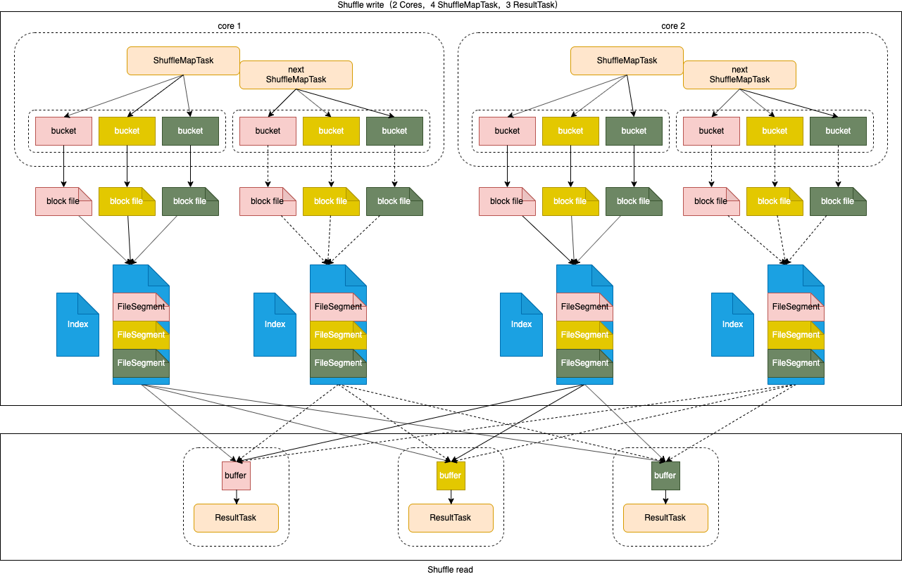

# 概述

Apache Spark™ 用于大规模数据处理的统一分析引擎。

- 速度

  使用最先进的DAG调度程序，查询优化程序和物理执行引擎，实现批处理和流数据的高性能处理。

  **相比MapReduce快的主要原因：**

  1. 基于内存

     涉及Job迭代，对于MapReduce需要将中间结果输出到HDFS，因此需要大量磁盘IO；而Spark将Job的输出结果可以保存在内存中，因此性能大大提高。需要注意的是，MapReduce和Spark都涉及到shuffle阶段，此阶段产生的数据都会涉及读写磁盘。

  2. 线程

     MapReduce的任务，以进程的方式独立运行于Yarn集群中；而Spark的任务是以线程的方式运行于进程中。线程的运行开销远低于进程。

- 易用

  可以快速通过 java、scala、python、R 和 SQL 等不同语言编写Spark程序。

- 通用

  Spark生态系统包括Spark SQL（离线分析）、Spark Streaming（实时计算）、MLib（机器学习） 和 GraphX（图计算） 无缝构建应用程序。

- 兼容

  Spark可以运行在 Hadoop（YARN集群）、Apache Mesos、Kubernetes、standalone（Spark集群） 或者 cloud上，同时可以访问各式数据源。其本质就是一个计算逻辑任务，可以提交到不同的可为其提供计算资源的平台上。

# 集群架构

## 术语

- Application

  构建在Spark上的用户程序，包含driver和集群上的executor。

- Application jar

  包含Spark用户程序的jar文件。<font color=red>注意jar文件不应包含依赖 Hadoop 或 Spark 的库，而是在运行时被添加</font>。

- Driver program

  运行 main() 函数的进程，创建SparkContext，Spark程序执行的入口。

- Cluster manager

  获取集群资源的外部服务。如：Spark standalone、Mesos、YARN

- Deploy mode

  以Dirver进程运行位置区分。“cluster”模式，在集群内部启动Driver；“Client”模式，在集群外部启动Driver。

- Worker node

  在集群中运行Application代码的任意一个节点。

- Executor

  在Worker节点运行Task的进程，将数据保存在内存或磁盘存储。每一个Application都有自己的Executor。

- Task

  发送到Executor的一个工作单元。以Executor进程内线程方式运行。

- Job

  由多个Task组成的一个并行计算，响应一个Spark action。也就是说一个action对于一个Job。

- Stage

  每一个Job划分为一组更小的Task集合称为Stage，Stage具有依赖关系。

## 程序运行

### spark-submit

#### 本地运行

```bash
bin/spark-submit \
--class org.apache.spark.examples.SparkPi \
--master local[2] \
--executor-memory 1G \
--total-executor-cores 2 \
examples/jars/spark-examples_2.11-2.3.3.jar \
10
```

#### 集群普通模式提交

```bash
# --class：指定包含main方法的主类
# --master：指定spark集群master地址
# --executor-memory：指定任务在运行的时候需要的每一个executor内存大小
# --total-executor-cores： 指定任务在运行的时候需要总的cpu核数
bin/spark-submit \
--class org.apache.spark.examples.SparkPi \
--master spark://node01:7077 \
--executor-memory 1G \
--total-executor-cores 2 \
examples/jars/spark-examples_2.11-2.3.3.jar \
10
```

#### 集群高可用模式提交

```bash
# 轮询 --master 列表找到 alive master
bin/spark-submit \
--class org.apache.spark.examples.SparkPi \
--master spark://node01:7077,node03:7077 \
--executor-memory 1G \
--total-executor-cores 2 \
examples/jars/spark-examples_2.11-2.3.3.jar \
10
```


### spark-shell

Spark shell 相当于一个Application，交互式 shell ，一般用于测试。

#### 本地运行

```bash
# 本地运行，2个线程参与计算
# 默认启动 SparkSubmit 进程
bin/spark-shell --master local[2]

# 读取本地文件进行单词统计
sc.textFile("file:///home/hadoop/sparkdatas/wordcount").flatMap(x=>x.split(" ")).map(x=>(x,1)).reduceByKey((x,y)=>x+y).collect

# 读取hdfs文件进行单词统计
# 可以直接统计目录下的所有文件
sc.textFile("/test/mr/wordcount/input/2").flatMap(_.split(",")).map((_,1)).reduceByKey(_+_).collect
```

#### 集群普通模式提交

```bash
# Spark shell 相当于一个 application
# --total-executor-cores 不会超过集群的CPU最大值
bin/spark-shell --master spark://node01:7077 --executor-memory 1G --total-executor-cores 4

sc.textFile("/test/mr/wordcount/input").flatMap(_.split(",")).map((_,1)).reduceByKey(_+_).collect
```


## 流程简述


1. 启动Spark集群，启动相应的Master和Worker进程，标记为Mater和Worker节点
2. Worker节点启动后，会向Master注册
3. 同时，Worker节点会定时向Master发送心跳，汇报资源使用情况
4. 运行Driver程序，向Master注册并申请计算资源
5. Master收到资源请求后，会调用Worker节点分配资源，也就是启动与资源描述一致的Executor进程
6. Worker节点向Master节点反馈Executor启动成功
7. Executor向Driver反向注册自己，并申请执行Task请求
8. Driver运行用户main方法，构建SparkContext，SparkContext内部依次构建DAG Scheduler和Task Scheduler

   - 按照RDD依赖关系构建DAG，然后将DAG发送给DAG Scheduler

   - DAG Scheduler将DAG按照宽依赖划分为多个stage，每个stage包含多个并发执行的task，然后将task封装到TaskSet集合中，发送给Task Scheduler

   - Task Scheduler收到TaskSet后，按照stage的依赖关系，按顺序将task发送给Executor进行执行
9. 所有task运行完成后，Driver向Master发送注销资源请求；Master通知Worker节点释放资源，也就是关闭Executor进程。最后，整个Job执行完成


## 资源参数剖析

- `--executor-memory`

  每一个Executor进程所需的内存大小；如果设置过小，小于Executor内Task处理分区的大小，Executor会将一部分数据存储到磁盘，当需要的时候，再从内存和磁盘中获取数据，这样就涉及到磁盘IO。大量磁盘IO操作，会导致应用性能降低。在实际工作中，` --executor-memory` 可以设置为10G/20G/30G等。

- `--total-executor-cores`

  任务运行需要总的cpu核数，它决定了任务的并行度。在实际工作中，`--total-executor-cores` 可以设置为30个/50个/100个等。


# Spark on YARN

可以把Spark程序提交到YARN中运行，此时Spark任务所需要的计算资源由YARN中的ResourceManager去分配。

- 环境要求
  - hadoop集群
  - 任意一台机器安装Spark
- Spark应用程序中的Driver分布
  - `yarn-client` 模式
    - Driver运行在Client端，应用程序运行结果会在客户端显示
    - 因为Driver要同Executor频繁通讯，如果有大量数据和线程时，可能会造成网络超时导致任务执行失败。所有任务的结果都会汇总到Driver端，可以在客户端直接显示任务的运行结果，因此一般用于开发测试
  - `yarn-cluster` 模式
    - Drive运行在YARN集群中，运行结果不会在客户端显示，客户端可以在启动应用程序后立即关闭
    - 将运行结果最终保存在外部存储介质（如HDFS、Redis、Mysql）中，客户端显示的仅是作为YARN的job的运行情况
    - 用于生产环境

## yarn-cluster

### 程序运行

- 提交任务

  ```bash
  spark-submit --class org.apache.spark.examples.SparkPi \
  --master yarn \
  --deploy-mode cluster \
  --driver-memory 1g \
  --executor-memory 1g \
  --executor-cores 1 \
  /bigdata/install/spark-2.3.3-bin-hadoop2.7/examples/jars/spark-examples_2.11-2.3.3.jar \
  10
  ```

- 如果出现虚拟内存不足

  vi yarn-site.xml

  ```xml
  <!--容器是否会执行物理内存限制 默认为True-->
  <property>
      <name>yarn.nodemanager.pmem-check-enabled</name>
      <value>false</value>
  </property>
  
  <!--容器是否会执行虚拟内存限制 默认为True-->
  <property>
      <name>yarn.nodemanager.vmem-check-enabled</name>
      <value>false</value>
  </property>
  ```


### 流程简述

 

  1. Client提交Application到YARN集群的ResourceManager
  2. ResourceManager向集群中的任意一个NodeManager请求启动容器并在容器中运行ApplicationMaster。其中ApplicationMaster就是Driver，对其进行初始化。此处的ApplicationMaster不仅负责资源申请，还负责任务调度
  3. ApplicationMaster向ResourceManager注册并申请计算资源
  4. ApplicationMaster申请到计算资源后，按照相应的NodeManager启动容器，在容器中运行Executor
  5. Executor向Driver反向注册自己并申请执行Task
  6. Driver执行main方法，构建SparkContext，经过一系列转换后，分阶段将Task发送到Executor执行
  7. Executor向Driver汇报Task运行状态和进度
  8. 当所有Task执行完毕后，ApplicationMaster向ResourceManager申请注销资源并关闭自己

## yarn-client

### 程序运行

- 提交任务

  ```bash
  spark-submit --class org.apache.spark.examples.SparkPi \
  --master yarn \
  --deploy-mode client \
  --driver-memory 1g \
  --executor-memory 1g \
  --executor-cores 1 \
  /bigdata/install/spark-2.3.3-bin-hadoop2.7/examples/jars/spark-examples_2.11-2.3.3.jar \
  10
  ```


### 流程简述


    1. Client初始化Driver，提交Application到YARN集群的ResourceManager
    2. ResourceManager向集群中的任意一个NodeManager请求启动容器并在容器中运行ApplicationMaster。此处的ApplicationMaster只负责资源申请，不负责任务调度
    3. ApplicationMaster向ResourceManager注册并申请计算资源
    4. ApplicationMaster申请到计算资源后，按照相应的NodeManager启动容器，在容器中运行Executor
    5. Executor向Driver反向注册自己并申请执行Task
    6. Driver执行main方法，构建SparkContext，经过一系列转换后，分阶段将Task发送到Executor执行
    7. Executor向Driver汇报Task运行状态和进度
    8. 当所有Task执行完毕后，Driver向ResourceManager申请注销资源并关闭自己

  


# RDD

## 概述

RDD（Resilient Distributed Dataset）叫做**弹性分布式数据集**，是Spark中最基本的数据抽象，它代表一个<font color=red>不可变、可分区、元素可并行计算的集合</font>。

* **Dataset**

  就是一个集合，存储很多数据

* **Distributed**
  内部的元素进行了分布式存储，方便于进行分布式计算

* **Resilient**

  表示弹性，RDD的数据可以保存在内存或者是磁盘中


### 属性

1. A list of partitions
   - 分区列表
   - 每一个分区包含了RDD的部分数据
   - Spark中的任务是以线程方式运行，一个分区对应一个Task线程
   - 用户可以在创建RDD时，指定分区个数；若没有指定，则采用默认值
   - RDD的分区数 = max(block数, defaultMinPartitions)
2. A function for computing each split
   - 一个计算每一个分区的函数
3. A list of dependencies on other RDDs
   - RDD的依赖关系列表
4. Optionally, a Partitioner for key-value RDDs (e.g. to say that the RDD is hash-partitioned)
   - 一个用于 key-value RDD 分区函数
   - 分区函数
     - HashPartitioner（默认） `key.hashcode % 分区数 = 分区号`
     - RangePartitioner
   - 只有对于 key-value 的 RDD `RDD[(String, Int)]` 并且产生shuffle，才会有Partitioner；非 key-value 的RDD `RDD[String]` 的 Parititioner 的值是None
5. Optionally, a list of preferred locations to compute each split on (e.g. block locations for an HDFS file)
   - 用于计算每个partition所在优先位置的一个列表
   - Spark任务在调度的时候会优先考虑存有数据的节点开启计算任务，减少数据的网络传输，提升计算效率

### 流程


假设一个300M的文件，默认每一个block的大小是128M，共有3个block。

- Spark的分区数是由文件block数量和defaultMinPartitions共同决定，取最大值。假设defaultMinPartitions是2，则分区数是3。
- rdd1是MapPartitionsRDD，作用于rdd1的flatMap函数，它将计算3个分区；rdd1没有分区函数
- rdd2是MapPartitionsRDD，作用于rdd2的map函数，它将计算3个分区；rdd2没有分区函数
- rdd3是MapPartitionsRDD，作用于rdd3的reduceByKey函数，它将计算3个分区；rdd3没有分区函数
- rdd4是ShuffledRDD，将数据写入到磁盘文件；rdd4有分区函数HashPartitioner。相当于ReduceTask，其数量取决于HashPartitioner的分区数，而默认情况下HashPartitioner的分区数就是上一步RDD的分区数

### 算子分类

- transformation（转换）
  - 根据已经存在的rdd转换生成一个新的rdd，它是<font color=red>延迟加载</font>，不会立即执行
  - 如 map / flatMap / reduceByKey 等
- action（动作）
  - 它会真正触发任务的运行，将rdd的计算的结果数据返回给Driver端，或者是保存结果数据到外部存储介质中
  - 如 collect / saveAsTextFile 等


## 依赖关系

### 宽窄依赖

- 窄依赖（narrow dependency）
  - 窄依赖指的是每一个父RDD的Partition最多被子RDD的一个Partition使用
  - 算子：map/flatMap/filter/union
  - 窄依赖不会产生shuffle
- 宽依赖（wide dependency）
  - 宽依赖指的是子RDD的多个Partition会依赖同一个父RDD的Partition
  - 算子：reduceByKey/sortByKey/groupBy/groupByKey/join
  - 宽依赖会产生shuffle
  - join分为宽依赖和窄依赖，如果RDD有相同的partitioner，那么将不会引起shuffle，这种join是窄依赖，反之就是宽依赖

### Lineage 血统

- RDD只支持粗粒度转换，即只记录单个块上执行的单个操作
- 将创建RDD的一系列Lineage（即血统）记录下来，以便恢复丢失的分区
- RDD的Lineage会记录RDD的元数据信息和转换行为，Lineage保存了RDD的依赖关系，当该RDD的部分分区数据丢失时，它可以根据这些信息来重新运算和恢复丢失的数据分区

### stage

#### 什么是stage

- 一个Job会被拆分为多组Task，每组任务被称为一个stage

- stage表示不同的调度阶段，一个spark job会对应产生很多个stage

  - stage类型

    - ShuffleMapStage

      shuffle之前的所有transformation的Stage叫ShuffleMapStage。它对应的task是shuffleMapTask。

    - ResultStage

      shuffle之后操作的Stage叫ResultStage。它对应的task是ResultTask。

#### 为什么划分stage

根据RDD之间依赖关系的不同将DAG划分成不同的stage

- 对于窄依赖，partition的转换处理在一个stage中完成计算
- 对于宽依赖，由于有Shuffle的存在，只能在parent RDD处理完成后，才能开始接下来的计算

由于划分完stage之后，在同一个stage中只有窄依赖，没有宽依赖，可以实现流水线计算，<font color=red>stage中的每一个分区对应一个task，在同一个stage中就有很多可以并行运行的task</font>。

#### 如何划分stage

1. 根据rdd的算子操作顺序生成DAG有向无环图，接下里从最后一个rdd往前推，创建一个新的stage，把该rdd加入到该stage中，它是最后一个stage
2. 在往前推的过程中运行遇到了窄依赖就把该rdd加入到本stage中，如果遇到了宽依赖，就从宽依赖切开，那么最后一个stage也就结束了
3. 重新创建一个新的stage，按照第二个步骤继续往前推，一直到最开始的rdd，整个划分stage也就结束了

#### stage间关系

- 划分完stage之后，每一个stage中有很多可以并行运行的task，后续会把每一个stage中的task封装在一个taskSet集合中，最后把一个一个的taskSet集合提交到worker节点上的executor进程中运行

- rdd与rdd之间存在依赖关系，stage与stage之间也存在依赖关系，前面stage中的task先运行，运行完成了再运行后面stage中的task，也就是说后面stage中的task输入数据是前面stage中task的输出结果数据


## 缓存机制

可以把一个rdd的数据缓存起来，后续有其他的job需要用到该rdd的结果数据，可以直接从缓存中获取得到，避免了重复计算。缓存加快后续对该数据的访问操作。

### cache和persist

#### 区别

对RDD设置缓存可以调用rdd的2个方法：cache 和 persist 。

调用上面2个方法都可以对rdd的数据设置缓存，但不是立即就触发缓存执行，后面需要有action才会触发缓存的执行。

- cache

  默认是把数据缓存在内存中，其本质就是调用persist方法

- persist

  可以把数据缓存在内存或者是磁盘，有丰富的缓存级别，这些缓存级别都被定义在StorageLevel这个object中

#### 设置缓存时机

- 某个rdd的数据后续会被多次使用

  默认情况下多次对一个rdd执行算子操作， rdd都会对这个rdd及之前的父rdd全部重新计算一次。 这种情况在实际开发代码的时候会经常遇到，但是我们一定要避免一个rdd重复计算多次，否则会导致性能急剧降低。因此，可以把多次使用到的rdd，也就是公共rdd进行持久化，避免后续需要时需要再次重新计算，提升效率。

- 为了获取得到一个rdd的结果数据，经过了大量的算子操作或者是计算逻辑比较复杂

####清除缓存

- 自动清除

  一个Application应用程序结束之后，对应的缓存数据也就自动清除

- 手动清除

  调用rdd的unpersist方法


### checkpoint机制

#### 同cache和persist区别

- cache是把数据缓存在内存中，访问速度很快，但是宕机或进程异常终止时会导致数据容易丢失；persist则可以把数据缓存在磁盘上，可以保证一定数据的安全有效，当由于用户的误操作或磁盘损坏，也会导致数据丢失。
- checkpoint提供了一种相对而言更加可靠的数据持久化方式。它是把数据保存在分布式文件系统，如HDFS。这里就是利用了HDFS高可用性，高容错性（多副本）来最大程度保证数据的安全性。
  - 对checkpoint在使用的时候进行优化，在调用checkpoint操作之前，可以先做一个cache操作，缓存对应rdd的结果数据，后续就可以直接从cache中获取到rdd的数据写入到指定checkpoint目录中
  - Application运行完成后对应的checkpoint数据不会消失

#### 设置checkpoint

```scala
// 设置checkpoint目录
sc.setCheckpointDir("hdfs://node01:8020/checkpoint") 

// 调用rdd的checkpoint方法
rdd.checkpoint

// 调用action触发
rdd.collect
```


## shuffle原理

在 Spark 1.2 以前，默认的shuffle计算引擎是HashShuffleManager。HashShuffleManager有着一个非常严重的弊端，就是会产生大量的中间磁盘文件，进而大量的磁盘IO操作影响性能。

因此，在 Spark 1.2 以后的版本中，默认的ShuffleManager改成了SortShuffleManager。SortShuffleManager相较于HashShuffleManager来说，有了一定的改进。主要就在于每个Task在进行shuffle操作时，虽然也会产生较多的临时磁盘文件，但是最后会将所有的临时文件合并成一个磁盘文件，因此每个Task就只有一个磁盘文件。在下一个stage的ResultTask拉取自己的数据时，只要根据索引读取每个磁盘文件中的部分数据即可。

### HashShuffle

#### 优化之前


在Shuffle write阶段，ShuffleMapTask会先将数据写到bucket缓存，当缓存写满之后刷写到block磁盘文件。数据经过HashPartitioner操作，将相同key的数据写入到相同的bucket缓存中。每个ShuffleMapTask会生成多少个磁盘文件？主要是由下一个阶段的Task数量决定，假设下一个阶段是3个ResultTask，每个ShuffleMapTask生成3个block文件，共12个block文件（`ShuffleMapTask * ResultTask`）。

在Shuffle read阶段，ResultTask将上一阶段计算的结果中相同key的数据从各个节点通过网络将数据拉取到自己所在的节点，然后对key进行聚合等操作。每一个ResultTask都有一个buffer缓存，每次都拉取buffer大小的缓存，然后进行聚合等操作。

缺点：

1. 在磁盘上会产生海量的小文件，建立通信和拉取数据的次数变多，此时会产生大量耗时低效的磁盘和网络IO 操作。
2. 在数据处理过程中会产生大量的对象保存文件操作句柄和临时信息，会导致堆内存不足，频繁GC会导致卡顿无法响应，严重时会和内存泄露一样出现OOM（Out of memory ）问题。


#### 优化之后


优化之后，同一个core同样会将数据经过HashPartitioner后，写入到ResultTask数量的buffer中。但后续的Task会共用同一份buffer。这样，假设下一个阶段是3个ResultTask，每一个core生成3个block文件，共6个block文件。（`Cores * ResultTask`）。

缺点：

1. 如果Reducer端的并行任务或者数据分片过多，则Cores * ResultTask依旧过大，也会产生很多小文件。

### SortShuffle

#### 普通模式


在该模式下，数据会先写入一个数据结构，聚合算子写入Map，一边通过Map局部聚合，一边写入内存。Join算子写入ArrayList直接写入内存中。然后需要判断是否达到阈值（5M），如果达到就会将内存数据结构的数据写入到磁盘，清空内存数据结构。

在溢写磁盘前，会根据PartitionID和key的hash值进行排序，排序过后的数据会分批（默认批次为10000条数据）写入到磁盘文件中。每次溢写都会产生一个磁盘文件，也就是说一个ShuffleMapTask会产生多个临时文件。

最后在每个ShuffleMapTask中，将所有的临时文件合并，此过程将所有临时文件读取出来，一次写入到最终文件。也就是说一个Task的所有数据都在这一个data文件中，同时单独生成一份index索引文件，标识下游各个Task的数据在文件中的索引范围。另外，这个SortShuffle同Executor核数没有关系，即同并发度没有关系，每一个ShuffleMapTask都会产生data文件和index文件。

假设第一个stage 50个task，那么无论下游有几个task，需要50*2=100个磁盘文件（`2 * ShuffleMapTask`）。

优点：

1. 小文件明显变少了，一个ShuffleMapTask只生成一个data和一个index文件。文件整体有序，加上索引文件的辅助，查找变快，虽然排序浪费一些性能，但是查找变快很多
2. 减少Writer缓存所占用的内存大小，而且同时避免GC的风险和频率。

#### bypass模式



bypass运行机制的触发条件如下：

1. ResultTask数量小于spark.shuffle.sort.bypassMergeThreshold参数的值，默认值200。
2. 不是聚合类的shuffle算子（比如reduceByKey）。

此时task会为每个reduce端的task都创建一个临时磁盘文件，并将数据按key进行hash然后根据key的hash值，将key写入对应的磁盘文件之中。当然，写入磁盘文件时也是先写入内存缓冲，缓冲写满之后再溢写到磁盘文件。最后，同样会将所有临时磁盘文件都合并成一个磁盘文件，并创建一个单独的索引文件。

该过程的磁盘写机制其实跟未经优化的HashShuffleManager是一模一样的，因为都要创建数量惊人的磁盘文件，只是在最后会做一个磁盘文件的合并而已。因此少量的最终磁盘文件，也让该机制相对未经优化的HashShuffleManager来说，shuffle read的性能会更好。

而该机制与普通SortShuffleManager运行机制的不同在于：

1. 磁盘写机制不同；
2. 不会进行排序。也就是说，启用该机制的最大好处在于，shuffle write过程中，不需要进行数据的排序操作，也就节省掉了这部分的性能开销。

### 参数调优

spark.shuffle.file.buffer

- 默认值：32k
- 参数说明：该参数用于设置shuffle write task的BufferedOutputStream的buffer缓冲大小。将数据写到磁盘文件之前，会先写入buffer缓冲中，待缓冲写满之后，才会溢写到磁盘。
- 调优建议：如果作业可用的内存资源较为充足的话，可以适当增加这个参数的大小（比如64k），从而减少shuffle write过程中溢写磁盘文件的次数，也就可以减少磁盘IO次数，进而提升性能。在实践中发现，合理调节该参数，性能会有1%~5%的提升。

spark.reducer.maxSizeInFlight

- 默认值：48m
- 参数说明：该参数用于设置shuffle read task的buffer缓冲大小，而这个buffer缓冲决定了每次能够拉取多少数据。
- 调优建议：如果作业可用的内存资源较为充足的话，可以适当增加这个参数的大小（比如96m），从而减少拉取数据的次数，也就可以减少网络传输的次数，进而提升性能。在实践中发现，合理调节该参数，性能会有1%~5%的提升。

spark.shuffle.io.maxRetries

- 默认值：3
- 参数说明：shuffle read task从shuffle write task所在节点拉取属于自己的数据时，如果因为网络异常导致拉取失败，是会自动进行重试的。该参数就代表了可以重试的最大次数。如果在指定次数之内拉取还是没有成功，就可能会导致作业执行失败。
- 调优建议：对于那些包含了特别耗时的shuffle操作的作业，建议增加重试最大次数（比如60次），以避免由于JVM的full gc或者网络不稳定等因素导致的数据拉取失败。在实践中发现，对于针对超大数据量（数十亿~上百亿）的shuffle过程，调节该参数可以大幅度提升稳定性。

spark.shuffle.io.retryWait

- 默认值：5s
- 参数说明：具体解释同上，该参数代表了每次重试拉取数据的等待间隔，默认是5s。
- 调优建议：建议加大间隔时长（比如60s），以增加shuffle操作的稳定性。

spark.shuffle.memoryFraction（Spark1.6）

- 默认值：0.2
- 参数说明：该参数代表了Executor内存中，分配给shuffle read task进行聚合操作的内存比例，默认是20%。
- 调优建议：如果内存充足，而且很少使用持久化操作，建议调高这个比例，给shuffle read的聚合操作更多内存，以避免由于内存不足导致聚合过程中频繁读写磁盘。在实践中发现，合理调节该参数可以将性能提升10%左右。

spark.shuffle.manager

- 默认值：sort
- 参数说明：该参数用于设置ShuffleManager的类型。Spark 1.5以后，有三个可选项：hash、sort和tungsten-sort。HashShuffleManager是Spark 1.2以前的默认选项，但是Spark 1.2以及之后的版本默认都是SortShuffleManager了。Spark1.6以后把hash方式给移除了，tungsten-sort与sort类似，但是使用了tungsten计划中的堆外内存管理机制，内存使用效率更高。
- 调优建议：由于SortShuffleManager默认会对数据进行排序，因此如果你的业务逻辑中需要该排序机制的话，则使用默认的SortShuffleManager就可以；而如果业务逻辑不需要对数据进行排序，那么建议参考几个参数调优，通过bypass机制或优化的HashShuffleManager来避免排序操作，同时提供较好的磁盘读写性能。这里要注意的是，tungsten-sort要慎用，因为之前发现了一些相应的bug。

spark.shuffle.sort.bypassMergeThreshold

- 默认值：200
- 参数说明：当ShuffleManager为SortShuffleManager时，如果shuffle read task的数量小于这个阈值（默认是200），则shuffle write过程中不会进行排序操作，而是直接按照未经优化的HashShuffleManager的方式去写数据，但是最后会将每个task产生的所有临时磁盘文件都合并成一个文件，并会创建单独的索引文件。
- 调优建议：当你使用SortShuffleManager时，如果的确不需要排序操作，那么建议将这个参数调大一些，大于shuffle read task的数量。那么此时就会自动启用bypass机制，map-side就不会进行排序了，减少了排序的性能开销。但是这种方式下，依然会产生大量的磁盘文件，因此shuffle write性能有待提高。

# spark中数据倾斜的解决方案

## 方案一：使用Hive ETL预处理数据

- 方案适用场景

  导致数据倾斜的是Hive表。如果该Hive表中的数据本身很不均匀（比如某个key对应了100万数据，其他key才对应了10条数据），而且业务场景需要频繁使用Spark对Hive表执行某个分析操作，那么比较适合使用这种技术方案。

- 方案实现思路

  此时可以评估一下，是否可以通过Hive来进行数据预处理（即通过Hive ETL预先对数据按照key进行聚合，或者是预先和其他表进行join），然后在Spark作业中针对的数据源就不是原来的Hive表了，而是预处理后的Hive表。此时由于数据已经预先进行过聚合或join操作了，那么在Spark作业中也就不需要使用原先的shuffle类算子执行这类操作了。

- 方案实现原理

  这种方案从根源上解决了数据倾斜，因为彻底避免了在Spark中执行shuffle类算子，那么肯定就不会有数据倾斜的问题了。但是这里也要提醒一下大家，这种方式属于治标不治本。因为毕竟数据本身就存在分布不均匀的问题，所以Hive ETL中进行group by或者join等shuffle操作时，还是会出现数据倾斜，导致Hive ETL的速度很慢。我们只是把数据倾斜的发生提前到了Hive ETL中，避免Spark程序发生数据倾斜而已。


- 方案优点

  实现起来简单便捷，效果还非常好，完全规避掉了数据倾斜，Spark作业的性能会大幅度提升。


- 方案缺点

  治标不治本，Hive ETL中还是会发生数据倾斜。

- 方案实践经验

  在一些Java系统与Spark结合使用的项目中，会出现Java代码频繁调用Spark作业的场景，而且对Spark作业的执行性能要求很高，就比较适合使用这种方案。将数据倾斜提前到上游的Hive ETL，每天仅执行一次，只有那一次是比较慢的，而之后每次Java调用Spark作业时，执行速度都会很快，能够提供更好的用户体验。

- 项目实践经验

  有一个交互式用户行为分析系统中使用了这种方案，该系统主要是允许用户通过Java Web系统提交数据分析统计任务，后端通过Java提交Spark作业进行数据分析统计。要求Spark作业速度必须要快，尽量在10分钟以内，否则速度太慢，用户体验会很差。所以我们将有些Spark作业的shuffle操作提前到了Hive ETL中，从而让Spark直接使用预处理的Hive中间表，尽可能地减少Spark的shuffle操作，大幅度提升了性能，将部分作业的性能提升了6倍以上。

## 方案二：过滤少数导致倾斜的key

- 方案适用场景

  如果发现导致倾斜的key就少数几个，而且对计算本身的影响并不大的话，那么很适合使用这种方案。比如99%的key就对应10条数据，但是只有一个key对应了100万数据，从而导致了数据倾斜。

- 方案实现思路

  如果我们判断那少数几个数据量特别多的key，对作业的执行和计算结果不是特别重要的话，那么干脆就直接过滤掉那少数几个key。比如，在Spark SQL中可以使用where子句过滤掉这些key或者在Spark Core中对RDD执行filter算子过滤掉这些key。如果需要每次作业执行时，动态判定哪些key的数据量最多然后再进行过滤，那么可以使用sample算子对RDD进行采样，然后计算出每个key的数量，取数据量最多的key过滤掉即可。

- 方案实现原理

  将导致数据倾斜的key给过滤掉之后，这些key就不会参与计算了，自然不可能产生数据倾斜。

- 方案优点

  实现简单，而且效果也很好，可以完全规避掉数据倾斜。

- 方案缺点

- 方案实践经验

  在项目中我们也采用过这种方案解决数据倾斜。有一次发现某一天Spark作业在运行的时候突然OOM了，追查之后发现，是Hive表中的某一个key在那天数据异常，导致数据量暴增。因此就采取每次执行前先进行采样，计算出样本中数据量最大的几个key之后，直接在程序中将那些key给过滤掉。

## 方案三：提高shuffle操作的并行度（效果差）

- 方案适用场景

  如果我们必须要对数据倾斜迎难而上，那么建议优先使用这种方案，因为这是处理数据倾斜最简单的一种方案。

- 方案实现思路

  在对RDD执行shuffle算子时，给shuffle算子传入一个参数，比如reduceByKey(1000)，该参数就设置了这个shuffle算子执行时shuffle read task的数量。对于Spark SQL中的shuffle类语句，比如group by、join等，需要设置一个参数，即spark.sql.shuffle.partitions，该参数代表了shuffle read task的并行度，该值默认是200，对于很多场景来说都有点过小。

- 方案实现原理

  增加shuffle read task的数量，可以让原本分配给一个task的多个key分配给多个task，从而让每个task处理比原来更少的数据。举例来说，如果原本有5个key，每个key对应10条数据，这5个key都是分配给一个task的，那么这个task就要处理50条数据。而增加了shuffle read task以后，每个task就分配到一个key，即每个task就处理10条数据，那么自然每个task的执行时间都会变短了。

- 方案优点

  实现起来比较简单，可以有效缓解和减轻数据倾斜的影响。

- 方案缺点

  只是缓解了数据倾斜而已，没有彻底根除问题，根据实践经验来看，其效果有限。

- 方案实践经验

  该方案通常无法彻底解决数据倾斜，因为如果出现一些极端情况，比如某个key对应的数据量有100万，那么无论你的task数量增加到多少，这个对应着100万数据的key肯定还是会分配到一个task中去处理，因此注定还是会发生数据倾斜的。所以这种方案只能说是在发现数据倾斜时尝试使用的第一种手段，尝试去用最简单的方法缓解数据倾斜而已，或者是和其他方案结合起来使用。

## 方案四：两阶段聚合（局部聚合+全局聚合）

- 方案适用场景

  对RDD执行reduceByKey等聚合类shuffle算子或者在Spark SQL中使用group by语句进行分组聚合时，比较适用这种方案。

- 方案实现思路

  这个方案的核心实现思路就是进行两阶段聚合。第一次是局部聚合，先给每个key都打上一个随机数，比如10以内的随机数，此时原先一样的key就变成不一样的了，比如(hello, 1) (hello, 1) (hello, 1) (hello, 1)，就会变成(1_hello, 1) (1_hello, 1) (2_hello, 1) (2_hello, 1)。接着对打上随机数后的数据，执行reduceByKey等聚合操作，进行局部聚合，那么局部聚合结果，就会变成了(1_hello, 2) (2_hello, 2)。然后将各个key的前缀给去掉，就会变成(hello, 2)(hello, 2)，再次进行全局聚合操作，就可以得到最终结果了，比如(hello, 4)。

- 方案实现原理

  将原本相同的key通过附加随机前缀的方式，变成多个不同的key，就可以让原本被一个task处理的数据分散到多个task上去做局部聚合，进而解决单个task处理数据量过多的问题。接着去除掉随机前缀，再次进行全局聚合，就可以得到最终的结果。

- 方案优点

  对于聚合类的shuffle操作导致的数据倾斜，效果是非常不错的。通常都可以解决掉数据倾斜，或者至少是大幅度缓解数据倾斜，将Spark作业的性能提升数倍以上。

- 方案缺点

  仅仅适用于聚合类的shuffle操作，适用范围相对较窄。如果是join类的shuffle操作，还得用其他的解决方案。

## 方案五：将reduce join转为map join

- 方案适用场景

  在对RDD使用join类操作，或者是在Spark SQL中使用join语句时，而且join操作中的一个RDD或表的数据量比较小（比如几百M或者一两G），比较适用此方案。

- 方案实现思路

  不使用join算子进行连接操作，而使用Broadcast变量与map类算子实现join操作，进而完全规避掉shuffle类的操作，彻底避免数据倾斜的发生和出现。将较小RDD中的数据直接通过collect算子拉取到Driver端的内存中来，然后对其创建一个Broadcast变量；接着对另外一个RDD执行map类算子，在算子函数内，从Broadcast变量中获取较小RDD的全量数据，与当前RDD的每一条数据按照连接key进行比对，如果连接key相同的话，那么就将两个RDD的数据用你需要的方式连接起来。

- 方案实现原理

  普通的join是会走shuffle过程的，而一旦shuffle，就相当于会将相同key的数据拉取到一个shuffle read task中再进行join，此时就是reduce join。但是如果一个RDD是比较小的，则可以采用广播小RDD全量数据+map算子来实现与join同样的效果，也就是map join，此时就不会发生shuffle操作，也就不会发生数据倾斜。

- 方案优点

  对join操作导致的数据倾斜，效果非常好，因为根本就不会发生shuffle，也就根本不会发生数据倾斜。

- 方案缺点

  适用场景较少，因为这个方案**只适用于一个大表和一个小表**的情况。毕竟我们需要将小表进行广播，此时会比较消耗内存资源，driver和每个Executor内存中都会驻留一份小RDD的全量数据。如果我们广播出去的RDD数据比较大，比如10G以上，那么就可能发生内存溢出了。因此并不适合两个都是大表的情况。

## 方案六：采样倾斜key并分拆join操作

- 方案适用场景

  两个RDD/Hive表进行join的时候，如果数据量都比较大，无法采用方案五，那么此时可以看一下两个RDD/Hive表中的key分布情况。如果出现数据倾斜，是因为<font color=red>其中某一个RDD/Hive表中的少数几个key的数据量过大，而另一个RDD/Hive表中的所有key都分布比较均匀</font>，那么采用这个解决方案是比较合适的。

- 方案实现思路

  - 对包含少数几个数据量过大的key的那个RDD，通过**sample算子**采样出一份样本来（作用是减少分析数据量，但又可以基本代表整个数据集），然后统计一下每个key的数量，计算出来数据量最大的是哪几个key。
  - 然后将这几个key对应的数据从原来的RDD中拆分出来，形成一个单独的RDD，并给每个key都打上n以内的随机数作为前缀，而不会导致倾斜的大部分key形成另外一个RDD。

  - 接着将需要join的另一个RDD，也过滤出来那几个倾斜key对应的数据并形成一个单独的RDD，**将每条数据膨胀成n条数据，这n条数据都按顺序附加一个0~n的前缀**（保证随机前缀的独立RDD可以和膨胀n倍的独立RDDjoin时，结果同原来相同；但却可以使原相同key的数据均匀分布在多个task中），不会导致倾斜的大部分key也形成另外一个RDD。

    - 如果join右侧过滤倾斜key对应的数据比较大的时候，可以使用膨胀数据方法

    - 如果比较小的时候，可以使用方案五Broadcast变量方法
  - 再将附加了随机前缀的独立RDD与另一个膨胀n倍的独立RDD进行join，此时就可以将原先相同的key打散成n份，分散到多个task中去进行join了。
  - 而另外两个普通的RDD就照常join即可。

  - 最后将两次join的结果使用union算子合并起来即可，就是最终的join结果。

- 方案实现原理

  对于join导致的数据倾斜，如果只是某几个key导致了倾斜，可以将少数几个key分拆成独立RDD，并附加随机前缀打散成n份去进行join，此时这几个key对应的数据就不会集中在少数几个task上，而是分散到多个task进行join了。

- 方案优点

  对于join导致的数据倾斜，如果只是某几个key导致了倾斜，采用该方式可以用最有效的方式打散key进行join。而且只需要针对少数倾斜key对应的数据进行扩容n倍，不需要对全量数据进行扩容。避免了占用过多内存。

- 方案缺点

  如果导致倾斜的key特别多的话，比如成千上万个key都导致数据倾斜，那么这种方式也不适合。

## 方案七：使用随机前缀和扩容RDD进行join

- 方案适用场景

  如果在进行join操作时，RDD中有大量的key导致数据倾斜，那么进行分拆key也没什么意义，此时就只能使用这一种方案来解决问题了。

- 方案实现思路

  - 该方案的实现思路基本和方案六类似，首先查看RDD/Hive表中的数据分布情况，找到那个造成数据倾斜的RDD/Hive表，比如有多个key都对应了超过1万条数据。

  - 然后将该RDD的每条数据都打上一个n以内的随机前缀。

  - 同时对另外一个正常的RDD进行扩容，将每条数据都扩容成n条数据，扩容出来的每条数据都依次打上一个0~n的前缀。

  - 最后将两个处理后的RDD进行join即可。
    

- 方案实现原理

  将原先一样的key通过附加随机前缀变成不一样的key，然后就可以将这些处理后的“不同key”分散到多个task中去处理，而不是让一个task处理大量的相同key。该方案与方案六的不同之处就在于，上一种方案是尽量只对少数倾斜key对应的数据进行特殊处理，由于处理过程需要扩容RDD，因此上一种方案扩容RDD后对内存的占用并不大；而这一种方案是针对有大量倾斜key的情况，无法将部分key拆分出来进行单独处理，因此只能对整个RDD进行数据扩容，对内存资源要求很高。

- 方案优点

  对join类型的数据倾斜基本都可以处理，而且效果也相对比较显著，性能提升效果非常不错。

- 方案缺点

  该方案更多的是缓解数据倾斜，而不是彻底避免数据倾斜。而且需要对整个RDD进行扩容，对内存资源要求很高。

- 方案实践经验

  曾经开发一个数据需求的时候，发现一个join导致了数据倾斜。优化之前，作业的执行时间大约是60分钟左右；使用该方案优化之后，执行时间缩短到10分钟左右，性能提升了6倍。

