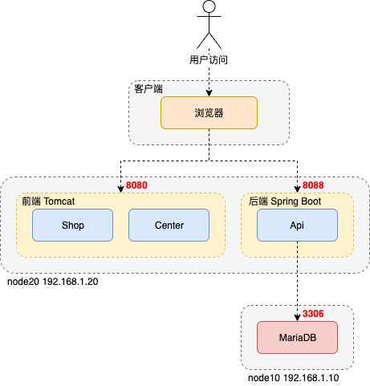
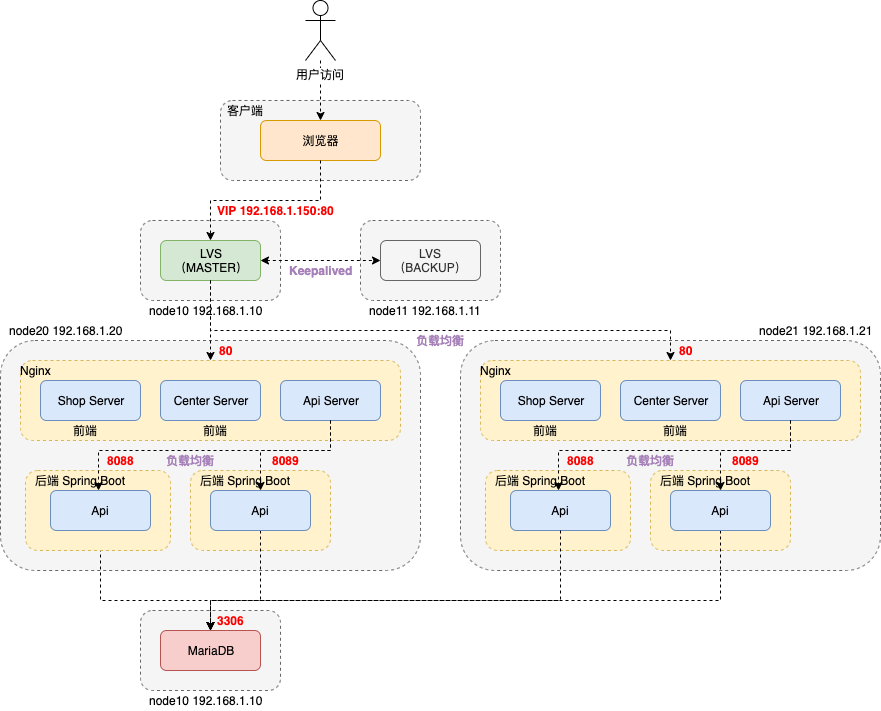

# 单体

## 系统架构




## 机器规划

| IP           | 主机名 | 说明                                                         | 端口 |
| ------------ | ------ | ------------------------------------------------------------ | ---- |
| 192.168.1.10 | node10 | 提供MariaDB服务                                              | 3306 |
| 192.168.1.20 | node20 | tomcat-frontend 提供静态页面服务                             | 8080 |
|              |        | tomcat-api以War方式 或 openmall-api-1.0-SNAPSHOT.jar以Jar方式提供应用服务 | 8088 |


## 环境准备

### ip设置

```shell
vi /etc/sysconfig/network-scripts/ifcfg-ens33

# 192.168.1.10
BOOTPROTO="static"
IPADDR=192.168.1.10
NETMASK=255.255.255.0
GATEWAY=192.168.1.1
DNS1=192.168.1.1

# 192.168.1.20
BOOTPROTO="static"
IPADDR=192.168.1.20
NETMASK=255.255.255.0
GATEWAY=192.168.1.1
DNS1=192.168.1.1

# 重启网卡使得配置生效
service network restart
```


### 安装系统软件

远程登录 `ssh root@192.168.1.10`

``` shell
# ifconfig、netstat命令
sudo yum -y install net-tools

# 时间同步
sudo yum -y install ntpdate

# wget
sudo yum -y install wget
```


### 关闭防火墙

root用户下执行

```shell
systemctl stop firewalld
systemctl disable firewalld
```


### 关闭selinux

root用户下执行

```shell
vi /etc/selinux/config

SELINUX=disabled
```


### 更改主机名

```shell
vi /etc/hostname

# 192.168.1.10
node10

# 192.168.1.20
node20
```


### 更改主机名与IP地址映射

```shell
vi /etc/hosts

192.168.1.10 node10
192.168.1.20 node20
```


### 同步时间

定时同步阿里云服务器时间

```shell
crontab -e

*/1 * * * * /usr/sbin/ntpdate time1.aliyun.com
```


### 添加用户

```shell
# 添加用户
useradd openmall
passwd openmall

# 为普通用户添加sudo权限
visudo

openmall  ALL=(ALL)       ALL
```


### 定义统一目录

```bash
# root 用户执行
mkdir -p /openmall/software # 软件压缩包存放目录
mkdir -p /openmall/install # 软件解压后存放目录
chown -R openmall:openmall /openmall # 将文件夹权限更改为openmall用户
```


## 服务配置

### node10

#### 安装MariaDB

```shell
# 递归创建目录
mkdir -p /openmall/software/MariaDB-10.4.8.stable-CentOS7.x

# 上传安装包
scp * openmall@192.168.1.10:/openmall/software/MariaDB-10.4.8.stable-CentOS7.x

# 安装依赖环境包
sudo yum -y install rsync nmap lsof perl-DBI nc
sudo rpm -ivh jemalloc-3.6.0-1.el7.x86_64.rpm
sudo rpm -ivh jemalloc-devel-3.6.0-1.el7.x86_64.rpm

# 卸载冲突的mariadb-libs
sudo rpm -qa | grep mariadb-libs
sudo rpm -ev --nodeps mariadb-libs-5.5.60-1.el7_5.x86_64

# 安装 boost-devel 依赖环境
sudo yum -y install boost-devel.x86_64

# 导入MariaDB的key
sudo rpm --import http://yum.mariadb.org/RPM-GPG-KEY-MariaDB

# 安装 galera 环境
sudo rpm -ivh galera-4-26.4.2-1.rhel7.el7.centos.x86_64.rpm

# 安装MariaDB的核心包
sudo rpm -ivh MariaDB-common-10.4.8-1.el7.centos.x86_64.rpm MariaDB-compat-10.4.8-1.el7.centos.x86_64.rpm MariaDB-client-10.4.8-1.el7.centos.x86_64.rpm MariaDB-server-10.4.8-1.el7.centos.x86_64.rpm

# 启动mysql服务
service mysql start

# 安全设置
su root	# 注意要切换到root用户下设置
mysql_secure_installation

Enter current password for root (enter for none) 直接回车
Switch to unix_socket authentication n
Change the root password y
Remove anonymous users y
Disallow root login remotely n
Remove test database and access to it y
Reload privilege tables now y 

# 配置远程连接权限
mysql -u root -p

grant all privileges on *.* to 'root'@'%' identified by 'root';
flush privileges;


# mysql服务命令
# 启动
systemctl start mysql
# 开机时启动
systemctl enable mysql

# 停止
systemctl stop mysql
# 开机时禁用
systemctl disable mysql

# 显示状态
systemctl status mysql
# 显示是否开机启动
systemctl is-enabled mysql
# 显示已启动的服务列表
systemctl list-unit-files|grep enabled
# 显示启动失败的服务列表
systemctl --failed

# 重启
systemctl restart mysql
```


### node20

#### 安装JDK

```shell
# 递归创建目录
mkdir -p /openmall/software/java

# 上传安装包
scp jdk-8u191-linux-x64.tar.gz openmall@192.168.1.20:/openmall/software/java

# 检查jdk版本
java -version

# 检查安装的openjdk
rpm -qa | grep openjdk -i
# 删除openjdk安装包
rpm -e --nodeps

# 创建目录
mkdir -p /openmall/install/java

# 解压
tar -zxvf /openmall/software/java/jdk-8u191-linux-x64.tar.gz -C /openmall/install/java

#添加以下配置内容，配置jdk环境变量
sudo vi /etc/profile

# jdk
export JAVA_HOME=/openmall/install/java/jdk1.8.0_191
export PATH=:$JAVA_HOME/bin:$PATH

# 立即生效
source /etc/profile
```


#### 安装Tomcat

- 若应用服务以SpringBoot的JAR方式发布，则不需要启动tomcat-api

```shell
# 递归创建目录
mkdir -p /openmall/software/tomcat

# 上传安装包
scp apache-tomcat-9.0.24.tar.gz openmall@192.168.1.20:/openmall/software/tomcat

# 创建目录
mkdir -p /openmall/install/tomcat

# 解压
tar -zxvf /openmall/software/tomcat/apache-tomcat-9.0.24.tar.gz -C /openmall/install/tomcat

mv apache-tomcat-9.0.24 tomcat-frontend
cp -r tomcat-frontend tomcat-api

# 启动 tomcat-frontend
cd /openmall/install/tomcat/tomcat-frontend
bin/startup.sh

# 启动 tomcat-api
cd /openmall/install/tomcat/tomcat-api
# 修改server.sh端口号 8080->8088 8009->8089 8005->8085
bin/startup.sh
```


#### 发布静态页面

```shell
# 上传静态页面
scp -r center openmall@192.168.1.20:/openmall/install/tomcat/tomcat-frontend/webapps
scp -r shop openmall@192.168.1.20:/openmall/install/tomcat/tomcat-frontend/webapps
```


#### 发布应用服务

- 以WAR方式发布

  ```shell
  # 上传应用服务
  scp -r openmall-api.war openmall@192.168.1.20:/openmall/install/tomcat/tomcat-api/webapps
  ```

- 以JAR方式发布

  ```shell
  # 上传应用服务
  scp -r openmall-api-1.0-SNAPSHOT.jar openmall@192.168.1.20:/openmall/install/openmall
  
  # 运行
  java -jar openmall-api-1.0-SNAPSHOT.jar
  ```

  

# 集群

## 系统架构

### 单机Nginx

对外提供静态页面和应用服务负载均衡。

- 无法解决Nginx单点故障的问题


### 双机主备Nginx+Keepalived

Keepalived负责HA（High Availability）高可用，解决Nginx单点故障问题。

- 主Nginx提供服务，备Nginx无法同时对外提供服务，造成资源浪费


### 双主热备Nginx+Keepalived+DNS轮询

两组Keepalived使得Nginx互为主备，同时通过DNS轮询实现双主负载均衡。

- Nginx工作在OSI协议模型第7层，负载压力有限


### 集群Nginx+LVS+Keepalived+DNS

Nginx组成集群应对海量请求压力；LVS工作在OSI协议模型第4层，可以承担的负载压力很高，充当Nginx集群的调度者；LVS和Keepalived结合，实现LVS的高可用；LVS的Master和Backup可以互为主备，通过DNS轮询充分利用LVS双主机器资源。

- 如果LVS Master宕机，VIP会漂移到LVS Backup，由其响应客户端请求；
- 如果其中一台Nginx宕机，这台Nginx会被移除集群；当恢复时，可以动态添加到集群中。




## 机器规划

| IP           | VIP                      | 主机名 | 说明                                                  | 端口 |
| ------------ | ------------------------ | ------ | ----------------------------------------------------- | ---- |
| 192.168.1.10 |                          | node10 | 提供MariaDB服务                                       | 3306 |
|              | 192.168.1.150（ens33:1） | node10 | LVS Master                                            | 80   |
| 192.168.1.11 | 192.168.1.150（ens33:1） | node11 | LVS Backup                                            | 80   |
| 192.168.1.20 | 192.168.1.150（lo:1）    | node20 | Nginx 提供静态页面、应用服务负载均衡、LVS Real Server | 80   |
|              |                          |        | openmall-api以Jar方式提供应用服务                     | 8088 |
|              |                          |        | openmall-api以Jar方式提供应用服务                     | 8089 |
| 192.168.1.21 | 192.168.1.150（lo:1）    | node21 | Nginx 提供静态页面、应用服务负载均衡、LVS Real Server | 80   |
|              |                          |        | openmall-api以Jar方式提供应用服务                     | 8088 |
|              |                          |        | openmall-api以Jar方式提供应用服务                     | 8089 |


## 环境准备

### ip设置

```shell
sudo vi /etc/sysconfig/network-scripts/ifcfg-ens33

# 192.168.1.11
BOOTPROTO="static"
IPADDR=192.168.1.11
NETMASK=255.255.255.0
GATEWAY=192.168.1.1
DNS1=192.168.1.1

# 192.168.1.21
BOOTPROTO="static"
IPADDR=192.168.1.21
NETMASK=255.255.255.0
GATEWAY=192.168.1.1
DNS1=192.168.1.1

# 重启网卡使得配置生效
service network restart
```


### 更改主机名

```shell
sudo vi /etc/hostname

# 192.168.1.11
node11

# 192.168.1.21
node21
```


### 更改主机名与IP地址映射

```shell
sudo vi /etc/hosts

192.168.1.10 node10
192.168.1.11 node11
192.168.1.20 node20
192.168.1.21 node21
```


## 服务配置

### node10

先搭建单体node10服务配置

#### 安装Keepalived

```shell
# 递归创建目录
mkdir -p /openmall/software/keepalived
scp -r keepalived-2.0.18.tar.gz openmall@node10:/openmall/software/keepalived	#$

# 解压
tar -zxvf keepalived-2.0.18.tar.gz

# 安装gcc环境
sudo yum install -y gcc-c++
# SSL 安全的加密的套接字协议层，用于HTTP安全传输，也就是https
sudo yum install -y openssl openssl-devel
# support IPv6 with IPVS
sudo yum install -y libnl libnl-devel

# 配置
# prefix keepalived安装的位置
# sysconf keepalived核心配置文件所在位置(固定位置)，改成其他位置keepalived启动失败，/var/log/messages中会报错
cd /openmall/software/keepalived/keepalived-2.0.18
./configure --prefix=/openmall/install/keepalived --sysconf=/etc

# 安装
make
sudo make install

# 查找
whereis keepalived

# 将keepallived注册为系统服务
cd /openmall/software/keepalived/keepalived-2.0.18/keepalived/etc

# 配置
sudo cp init.d/keepalived /etc/init.d/
sudo cp sysconfig/keepalived /etc/sysconfig/

# 启动keepalived
service keepalived start

# 停止keepalived
service keepalived stop
# 重启keepalived
service keepalived restart
```


#### 配置LVS-DR模式

```shell
# 关闭网络配置管理器
systemctl stop NetworkManager 
systemctl disable NetworkManager

# 拷贝并且创建子接口
cd /etc/sysconfig/network-scripts
sudo cp ifcfg-ens33 ifcfg-ens33:1

# 修改子接口配置
sudo vi ifcfg-ens33:1

# 删除所有配置，添加以下配置
DEVICE="ens33:1"
ONBOOT="yes"
BOOTPROTO="static"
IPADDR=192.168.1.150
NETMASK=255.255.255.0

# 重启网络服务
# lo 本地回环接口，用于收发系统内网络数据
# ens33 虚拟网卡接口，用于收发系统外网络数据
systemctl restart network

# ipvs属于系统内核，安装ipvs集群管理工具
sudo yum install -y ipvsadm

# 检测
sudo ipvsadm -Ln
```


#### 配置Keppalived

-  ps -ef | grep keepalived 查看keepalived 进程

```shell
sudo vi /etc/keepalived/keepalived.conf


! Configuration File for keepalived

global_defs {
		# 节点唯一标识 
		router_id LVS_10
}

vrrp_instance VI_1 {
		# 主节点
		state MASTER
    # 该实例绑定的网卡
    interface ens33
    # 保证主备节点一致
    virtual_router_id 50
    # 权重，master权重一般高于backup，如果有多个，那就是选举，谁的权重高，谁就当选
    priority 100
    # 主备之间同步检查时间间隔，单位秒
    advert_int 1
    # 认证权限密码，防止非法节点进入
    authentication {
        auth_type PASS
        auth_pass 1111
    }
    # 虚拟ip，可以有多个
    virtual_ipaddress {
        192.168.1.150
    }
}

# 配置集群地址访问的VIP和端口，端口和Nginx保持一致
virtual_server 192.168.1.150 80 {
    # 健康检查的时间  单位 秒
    delay_loop 6
    # 配置负载均衡的算法 默认是轮询  rr:轮询
    lb_algo rr
    # 设置lvs的模式  NAT|TUN|DR
    lb_kind DR
    # 客户端到同一台真实服务器的超时时间
    persistence_timeout 10
    protocol TCP

    # 负载均衡的真实服务器
    real_server 192.168.1.20 80 {
				# 轮询的默认权重配比设置为1
        weight 1
        # 设置健康检查
        TCP_CHECK {
          # 检查80端口
					connect_port 80
          # 超时时间
          connect_time 2s
          # 重试次数
          connect_retry 2
          # 间隔时间3s
          connect_before_retry 3
        }
		}
		
    real_server 192.168.1.21 80 {
        weight 1
        TCP_CHECK {
					connect_port 80
					connect_time 2s
					connect_retry 2
					connect_before_retry 3
        }
    } 
}


# 启动keepalived服务
systemctl start keepalived

# 查看集群列表
# L 显示virtual server表
# n 显示IP
sudo ipvsadm -Ln

# C 清除virtual server表
sudo ipvsadm -C

# 查看集群状态
sudo ipvsadm -Ln --stats

# 查看持久化连接
sudo ipvsadm -Ln --persistent-conn

# 查看连接请求过期时间以及请求源ip和目标ip
sudo ipvsadm -Lnc

# 查看过期时间(tcp tcpfin udp)
sudo ipvsadm -Ln --timeout

# 设置过期时间(连接空闲等待时间)，用于测试（tcp tcpfin udp）
sudo ipvsadm --set 1 1 1
```


### node11

#### 安装Keepalived


#### 配置LVS-DR模式


#### 配置Keppalived

```shell
sudo vi /etc/keepalived/keepalived.conf


! Configuration File for keepalived

global_defs {
		# 节点唯一标识 
		router_id LVS_11
}

vrrp_instance VI_1 {
		# 备份节点
		state BACKUP
    interface ens33
    virtual_router_id 50
    # 权重
    priority 50
    advert_int 1
    authentication {
        auth_type PASS
        auth_pass 1111
    }
    virtual_ipaddress {
        192.168.1.150
    }
}

virtual_server 192.168.1.150 80 {
    delay_loop 6
    lb_algo rr
    lb_kind DR
    persistence_timeout 10
    protocol TCP

    real_server 192.168.1.20 80 {
        weight 1
        TCP_CHECK {
          connect_port 80
          connect_time 2s
          connect_retry 2
          connect_before_retry 3
        }
		}
		
    real_server 192.168.1.21 80 {
        weight 1
        TCP_CHECK {
					connect_port 80
					connect_time 2s
					connect_retry 2
					connect_before_retry 3
        }
    } 
}


# 启动keepalived服务
systemctl start keepalived
```


### node20

先搭建单体node20服务配置

#### 配置LVS虚拟IP

```shell
# 关闭网络配置管理器
systemctl stop NetworkManager 
systemctl disable NetworkManager

# 拷贝并且创建子接口
cd /etc/sysconfig/network-scripts
sudo cp ifcfg-lo ifcfg-lo:1

# 修改子接口配置
sudo vi ifcfg-lo:1

DEVICE=lo:1
IPADDR=192.168.1.150
NETMASK=255.255.255.255

systemctl restart network
```


#### 配置ARP响应级别与通告行为

- arp-ignore：ARP响应级别（处理请求）

  - 0：只要本机配置了ip，就能响应请求

  - 1：请求的目标地址到达对应的网络接口，才会响应请求

- arp-announce：ARP通告行为（返回响应）
  - 0：本机上任何网络接口都向外通告，所有的网卡都能接受到通告
  - 1：尽可能避免本网卡与不匹配的目标进行通告
  - 2：只在本网卡通告

```shell
sudo vi /etc/sysctl.conf

# configration for lvs
net.ipv4.conf.all.arp_ignore = 1
net.ipv4.conf.default.arp_ignore = 1
net.ipv4.conf.lo.arp_ignore = 1

net.ipv4.conf.all.arp_announce = 2
net.ipv4.conf.default.arp_announce = 2
net.ipv4.conf.lo.arp_announce = 2

# 刷新配置文件
sudo sysctl -p

# 增加主机路由，用于接收数据报文，当有请求到本机后，会交给lo去处理
sudo route add -host 192.168.1.150 dev lo:1

# 检测
route -n

# 开机启动，防止丢失
su
echo "route add -host 192.168.1.150 dev lo:1" >> /etc/rc.local
```


#### 安装Nginx

- `netstat -tunlp` 查看端口监听状态
- `ps -ef | grep nginx` 查看master（root）和worker（nobody）进程
- `mkdir -p` 递归创建目录
- `scp -r` 递归传输目录文件
- `tar -zxvf` 解压缩

```shell
# 递归创建目录
mkdir -p /openmall/software/nginx

# 上传安装包
scp -r nginx-1.16.1.tar.gz openmall@192.168.1.20:/openmall/software/nginx	#$

# 安装gcc环境
sudo yum install -y gcc-c++
# 安装PCRE库，用于解析正则表达式
sudo yum install -y pcre pcre-devel
# zlib压缩和解压缩依赖
sudo yum install -y zlib zlib-devel
# SSL 安全的加密的套接字协议层，用于HTTP安全传输，也就是https
sudo yum install -y openssl openssl-devel

# 解压源码
tar -zxvf nginx-1.16.1.tar.gz

# 编译前创建目录
mkdir -p /var/temp/nginx 
mkdir -p /openmall/install/nginx/logs

# 修改拥有者
sudo chown openmall /var/temp/nginx

# 在nginx目录，输入如下命令进行配置，目的是为了创建makefile文件
cd /openmall/software/nginx/nginx-1.16.1

./configure --prefix=/openmall/install/nginx --pid-path=/openmall/install/nginx/logs/nginx.pid --lock-path=/var/lock/nginx.lock --error-log-path=/openmall/install/nginx/logs/error.log --http-log-path=/openmall/install/nginx/logs/access.log --with-http_ssl_module --with-http_stub_status_module --with-http_gzip_static_module --http-client-body-temp-path=/var/temp/nginx/client --http-proxy-temp-path=/var/temp/nginx/proxy --http-fastcgi-temp-path=/var/temp/nginx/fastcgi --http-uwsgi-temp-path=/var/temp/nginx/uwsgi --http-scgi-temp-path=/var/temp/nginx/scgi
# --prefix 指定nginx安装目录
# --pid-path 指向nginx的pid
# --lock-path 锁定安装文件，防止被恶意篡改或误操作
# --error-log-path 错误日志
# --http-log-path http日志
# --with-http_gzip_static_module 启用gzip模块，在线实时压缩输出数据流
# --http-client-body-temp-path 设定客户端请求的临时目录
# --http-proxy-temp-path 设定http代理临时目录
# --http-fastcgi-temp-path 设定fastcgi临时目录
# --http-uwsgi-temp-path 设定uwsgi临时目录
# --http-scgi-temp-path 设定scgi临时目录

# make编译
make

# 安装
sudo make install

# 启动
cd /openmall/install/nginx
sudo sbin/nginx

# 停止
sudo sbin/nginx -s stop
# 等待用户完成请求，之后再停止
sudo sbin/nginx -s quit

# 重新加载
sudo sbin/nginx -s reload

# 测试配置文件
sbin/nginx -t
# 帮助
sbin/nginx -?
# 查看安装时的配置信息
sbin/nginx -V
```


#### 配置Nginx日志切割

- 创建一个shell可执行文件 `cut_my_log.sh`

  ```shell
  # 创建文件
  cd /openmall/install/nginx/sbin
  vi cut_nginx_log.sh
  
  
  #!/bin/bash
  
  #日志所处位置
  LOG_PATH="/openmall/install/nginx/logs"
  #日志切割的时间表达式拼接 +%Y-%m-%d+%H:%M 年月日时分
  RECORD_TIME=$(date -d "yesterday" +%Y-%m-%d)
  #nginx指定的进程
  PID=/openmall/install/nginx/logs/nginx.pid
  #把当前的日志文件重命名为带时间的日志
  mv ${LOG_PATH}/access.log ${LOG_PATH}/access.${RECORD_TIME}.log
  mv ${LOG_PATH}/error.log ${LOG_PATH}/error.${RECORD_TIME}.log
  #向Nginx主进程发送信号，用于重新打开日志文件
  kill -USR1 `cat $PID`
  
  
  # 添加可执行权限
  chmod +x cut_nginx_log.sh
  
  # 手动执行
  ./cut_nginx_log.sh
  ```

- 定时执行

  - Cron表达式分为5或6个域，每个域代表一个含义

    |          | 分   | 时   | 日   | 月   | 星期几 | 年（可选）     |
    | -------- | ---- | ---- | ---- | ---- | ------ | -------------- |
    | 取值范围 | 0-59 | 0-23 | 1-31 | 1-12 | 1-7    | 2019/2020/2021 |

  ```shell
  # 定时任务
  yum install -y crontabs
  
  # 添加定时任务，每日凌晨1点执行
  crontab -e
  # 新行创建
  0 1 * * * /openmall/install/nginx/sbin/cut_nginx_log.sh
  # 保存
  :wq
  
  # 查看定时任务
  sudo crontab -l
  
  # 重启定时任务
  service crond restart
  ```


#### 配置Nginx

- nginx.conf

  ```shell
  user  root;
  worker_processes  2;
  
  error_log  logs/error.log;
  
  pid        logs/nginx.pid;
  
  events {
      use epoll;
      worker_connections  1024;
  }
  
  http {
      include       mime.types;
      default_type  application/octet-stream;
  
      log_format  main  '$remote_addr - $remote_user [$time_local] "$request" '
                        '$status $body_bytes_sent "$http_referer" '
                        '"$http_user_agent" "$http_x_forwarded_for"';
  
      access_log  logs/access.log  main;
  
      sendfile        on;
      tcp_nopush     on;
  
      keepalive_timeout  65;
      
      include	openmall/frontend.conf;
      include openmall/backend.conf;
  }
  ```

- openmall/frontend.conf

  - 静态页面配置

  ```shell
  server {
          listen       80;
          server_name  shop.openmall.sciatta.com;
  
          location / {
              root   /openmall/install/openmall/shop;
              index  index.html;
          }
  }
  
  server {
          listen       80;
          server_name  center.openmall.sciatta.com;
          
          location / {
              root   /openmall/install/openmall/center;
              index  index.html;
          }
  }
  ```

  

- openmall/backend.conf

    - 应用服务负载均衡配置
    
    ```shell
    upstream api.openmall.sciatta.com {
    				server node20:8088 weight=2;
            server node20:8089 weight=3;
    }
    
    server {
            listen       80;
            server_name  api.openmall.sciatta.com;
            
            location / {
                proxy_pass http://api.openmall.sciatta.com; 
            }
    }
    ```
    
    

#### 发布静态页面

```shell
scp -r shop openmall@node20:/openmall/install/openmall	#$
scp -r center openmall@node20:/openmall/install/openmall	#$

# 检测配置文件
# 否则会出现 open() "...nginx.pid" failed (13: Permission denied)
sudo sbin/nginx -t

# 运行nginx
sudo sbin/nginx
```


#### 发布应用服务

- netstat -tunlp 查看网络端口
- ip addr 查看IP

```shell
# 上传应用服务
scp -r openmall-api-1.0-SNAPSHOT.jar openmall@node20:/openmall/install/openmall/api20.1	#$
scp -r openmall-api-1.0-SNAPSHOT.jar openmall@node20:/openmall/install/openmall/api20.2	#$

# 运行api20.1
cd /openmall/install/openmall/api20.1

nohup java -jar \
-Dserver.port=8088 \
-Dspring.profiles.active=test \
-Dopenmall.sid=20.1 \
-Dopenmall.log.file-path=/openmall/install/openmall/api20.1/logs \
openmall-api-1.0-SNAPSHOT.jar >/dev/null 2>&1 &

# 运行api20.2
cd /openmall/install/openmall/api20.2

nohup java -jar \
-Dserver.port=8089 \
-Dspring.profiles.active=test \
-Dopenmall.sid=20.2 \
-Dopenmall.log.file-path=/openmall/install/openmall/api20.2/logs \
openmall-api-1.0-SNAPSHOT.jar >/dev/null 2>&1 &
```


### node21

#### 配置LVS虚拟IP


#### 配置ARP响应级别与通告行为


#### 安装Nginx


#### 配置Nginx日志切割


#### 配置Nginx

openmall/backend.conf

- 应用服务负载均衡配置

```shell
upstream api.openmall.sciatta.com {
				server node21:8088 weight=2;
        server node21:8089 weight=3;
}

server {
        listen       80;
        server_name  api.openmall.sciatta.com;
        
        location / {
            proxy_pass http://api.openmall.sciatta.com; 
        }
}
```


#### 发布静态页面


#### 发布应用服务

```shell
# 上传应用服务
scp -r openmall-api-1.0-SNAPSHOT.jar openmall@node20:/openmall/install/openmall/api21.1	#$
scp -r openmall-api-1.0-SNAPSHOT.jar openmall@node20:/openmall/install/openmall/api21.2	#$

# 运行api21.1
cd /openmall/install/openmall/api21.1

nohup java -jar \
-Dserver.port=8088 \
-Dspring.profiles.active=test \
-Dopenmall.sid=21.1 \
-Dopenmall.log.file-path=/openmall/install/openmall/api21.1/logs \
openmall-api-1.0-SNAPSHOT.jar >/dev/null 2>&1 &

# 运行api21.2
cd /openmall/install/openmall/api21.2

nohup java -jar \
-Dserver.port=8089 \
-Dspring.profiles.active=test \
-Dopenmall.sid=21.2 \
-Dopenmall.log.file-path=/openmall/install/openmall/api21.2/logs \
openmall-api-1.0-SNAPSHOT.jar >/dev/null 2>&1 &
```


## 系统测试

### node10宕机

测试主备切换，当主机node10宕机后，VIP会漂移到备份机node11；当主机恢复后，因为其权重高于备份机，VIP会重新漂移到主机。


### node20宕机

测试Nginx集群中某一台宕机。当node20宕机后，node20被踢出集群；当node20恢复后，node20被重新加入到集群。


# 分布式

## 系统架构


## 机器规划

| IP           | VIP                      | 主机名 | 说明                                                  | 端口 |
| ------------ | ------------------------ | ------ | ----------------------------------------------------- | ---- |
| 192.168.1.10 |                          | node10 | 提供MariaDB服务                                       | 3306 |
|              | 192.168.1.150（ens33:1） |        | LVS Master                                            | 80   |
|              |                          |        | Redis cluster                                         | 6379 |
| 192.168.1.11 | 192.168.1.150（ens33:1） | node11 | LVS Backup                                            | 80   |
|              |                          |        | Redis cluster                                         | 6379 |
| 192.168.1.12 |                          | node12 | Redis cluster                                         | 6379 |
| 192.168.1.20 | 192.168.1.150（lo:1）    | node20 | Nginx 提供静态页面、应用服务负载均衡、LVS Real Server | 80   |
|              |                          |        | openmall-api以Jar方式提供应用服务                     | 8088 |
|              |                          |        | openmall-api以Jar方式提供应用服务                     | 8089 |
|              |                          |        | Redis cluster                                         | 6379 |
| 192.168.1.21 | 192.168.1.150（lo:1）    | node21 | Nginx 提供静态页面、应用服务负载均衡、LVS Real Server | 80   |
|              |                          |        | openmall-api以Jar方式提供应用服务                     | 8088 |
|              |                          |        | openmall-api以Jar方式提供应用服务                     | 8089 |
|              |                          |        | Redis cluster                                         | 6379 |
| 192.168.1.22 |                          | node22 | Redis cluster                                         | 6379 |


## 环境准备

### ip设置

```shell
sudo vi /etc/sysconfig/network-scripts/ifcfg-ens33

# 192.168.1.12
BOOTPROTO="static"
IPADDR=192.168.1.12
NETMASK=255.255.255.0
GATEWAY=192.168.1.1
DNS1=192.168.1.1

# 192.168.1.22
BOOTPROTO="static"
IPADDR=192.168.1.22
NETMASK=255.255.255.0
GATEWAY=192.168.1.1
DNS1=192.168.1.1

# 重启网卡使得配置生效
service network restart
```


### 更改主机名

```shell
sudo vi /etc/hostname

# 192.168.1.12
node12

# 192.168.1.22
node22
```


### 更改主机名与IP地址映射

```shell
sudo vi /etc/hosts

192.168.1.10 node10
192.168.1.11 node11
192.168.1.12 node12
192.168.1.20 node20
192.168.1.21 node21
192.168.1.22 node22
```


## 服务配置

### node10

先搭建集群node10服务配置

#### 安装Redis

```shell
# 编译
mkdir -p /openmall/software/redis
scp -r redis-5.0.5.tar.gz openmall@node10:/openmall/software/redis	#$

cd /openmall/software/redis
tar -zxvf redis-5.0.5.tar.gz

sudo yum install -y gcc-c++

cd /openmall/software/redis/redis-5.0.5
make

make PREFIX=/openmall/install/redis install	# PREFIX改变安装目录

# 拷贝配置文件
cd /openmall/install/redis
mkdir -p /openmall/install/redis/etc

cp /openmall/software/redis/redis-5.0.5/redis.conf /openmall/install/redis/etc

# 启动 redis server
# 启动前需要配置redis.conf
bin/redis-server etc/redis.conf

# 停止 redis server
bin/redis-cli -a openmall shutdown

# 进入客户端
# -a server密码
bin/redis-cli -a openmall

####
# 输入密码
author pwd
# 设置缓存
set key value 
# 获得缓存
get key 
# 删除缓存
del key 
# 查看server是否启动
redis-cli -a password ping
####
```


#### 配置Redis集群

- 注意创建集群时，需要使用ip，否则会出现 `ERR Invalid node address specified: node10:6379`

```shell
# 创建工作目录
mkdir -p /openmall/install/redis/working

# 在node10上配置 redis.conf
# 一般配置
daemonize yes	# enable daemon
dir /openmall/install/redis/working	# redis woring dir
bind 0.0.0.0	# enable remote connect
requirepass openmall	# password
# 集群配置
cluster-enabled yes	# enable cluster
cluster-config-file nodes-6379.conf	# cluster using
cluster-node-timeout 5000	# master timeout
appendonly yes # enable aof

# 向集群分发redis
scp -r redis openmall@node11:/openmall/install
scp -r redis openmall@node12:/openmall/install
scp -r redis openmall@node20:/openmall/install
scp -r redis openmall@node21:/openmall/install
scp -r redis openmall@node22:/openmall/install

# 6台机器分别启动
cd /openmall/install/redis
bin/redis-server etc/redis.conf

# 在node10上创建集群
bin/redis-cli -a openmall --cluster create 192.168.1.10:6379 192.168.1.11:6379 192.168.1.12:6379 192.168.1.20:6379 192.168.1.21:6379 192.168.1.22:6379 --cluster-replicas 1

# 检查集群
bin/redis-cli -a openmall --cluster check 192.168.1.10:6379
```


### node11

先搭建集群node11服务配置


### node12


### node20

先搭建集群node20服务配置


### node21

先搭建集群node21服务配置


### node22

